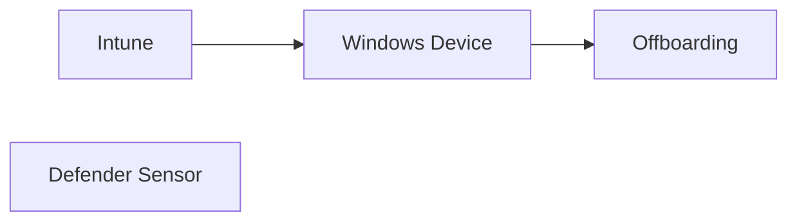
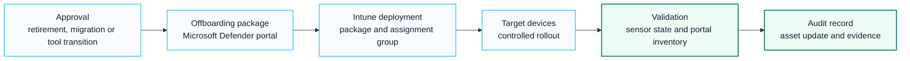

# Microsoft Defender for Endpoint Windows Offboarding

## Executive Summary

This guide explains how to remove Windows endpoints from Microsoft Defender for Endpoint using Intune deployment.

Offboarding should be performed in a controlled manner to maintain security visibility and audit integrity.

The process should be connected to device retirement, tenant migration, security tool transition and asset inventory updates. Uncontrolled offboarding can create unmanaged endpoint risk.

## 한국어 요약

Microsoft Defender for Endpoint Windows Offboarding은 Windows device를 Defender for Endpoint 관리 범위에서 제거하는 절차입니다.

Device retirement, tenant migration, security tool transition 상황에서 사용되며, Intune deployment, validation, asset update, audit record를 함께 관리해야 합니다.

---

## Common Use Cases

- Device Retirement
- Device Replacement
- Lab Environment Cleanup
- Tenant Migration
- Security Tool Transition

---

## Architecture

```mermaid
flowchart LR

    INTUNE[Intune]
    DEVICE[Windows Device]
    MDE[Defender Sensor]

    INTUNE --> DEVICE
    DEVICE --> REMOVE[Offboarding]
```

---

## Offboarding Workflow

```mermaid
flowchart LR
  Approval["Approval<br/>retirement, migration or tool transition"]:::step
  Package["Offboarding package<br/>Microsoft Defender portal"]:::step
  Intune["Intune deployment<br/>package and assignment group"]:::step
  Device["Target devices<br/>controlled rollout"]:::step
  Validate["Validation<br/>sensor state and portal inventory"]:::result
  Record["Audit record<br/>asset update and evidence"]:::result

  Approval --> Package --> Intune --> Device --> Validate --> Record

  classDef step fill:#f8fbff,stroke:#38bdf8,color:#102033,stroke-width:1.4px
  classDef result fill:#ecfdf5,stroke:#0f766e,color:#102033,stroke-width:1.8px
```

---

## Validation

Verify:

- Device no longer reporting
- Sensor removed
- Defender Portal inventory updated

---

## Operational Considerations

| Area | Consideration |
|---------|---------|
| Compliance | Preserve required audit records |
| Security | Avoid unmanaged device state |
| Timing | Coordinate with device lifecycle |
| Documentation | Maintain offboarding records |

---

## Deliverables

- Offboarding Procedure
- Deployment Package
- Validation Report
- Asset Update Record

## Decision Checklist

| Decision | Recommended Question |
|---|---|
| Scope | Which devices are approved for offboarding? |
| Timing | Is offboarding aligned with retirement, migration or tool transition? |
| Security gap | What protects the device after Defender offboarding? |
| Validation | How is sensor removal and portal inventory update confirmed? |
| Evidence | Which records are retained for audit or asset management? |

## Common Risks

- Offboarding active production devices by mistake
- Removing Defender before replacement protection is ready
- Failing to update asset inventory
- Not validating portal reporting after package deployment

## 검색 키워드

- Microsoft Defender for Endpoint offboarding
- MDE Windows offboarding
- Intune offboarding package
- Defender sensor removal
- Defender for Endpoint 제거

## Validation Evidence

| Evidence | Purpose |
|---|---|
| Offboarding approval | Confirms the device is approved for retirement or tool transition |
| Intune assignment group | Shows the offboarding package was scoped correctly |
| Defender portal inventory | Verifies device state after offboarding |
| Asset record update | Confirms CMDB or device inventory is aligned |

## Related Documents

- [Defender for Endpoint](../security/defender-for-endpoint)
- [Microsoft Defender Validation with Atomic Red Team](./mde-atomic-red-team)
- [Security Modernization Program](../projects/security-modernization-program)
- [Contact and Asset Request](../contact)

## Contact / Asset Request

For a Defender offboarding runbook, validation report or asset handover checklist, use [Contact and Asset Request](../contact).
