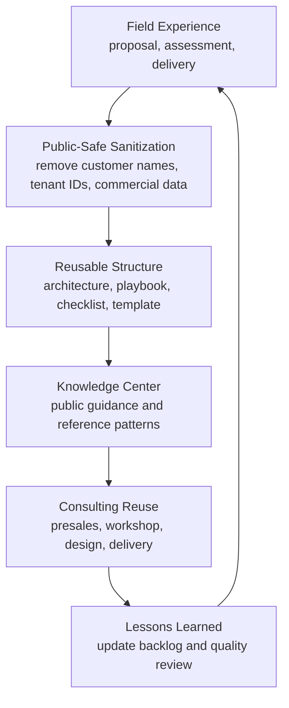
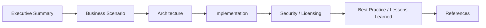

# Knowledge Center

Microsoft Enterprise Consulting Platform의 핵심 기술 지식 허브입니다.

이 영역은 단순한 기술 메모가 아니라 실제 고객 제안, architecture design, implementation, governance, 운영 handover에 바로 재사용할 수 있는 Enterprise Knowledge Base로 구성됩니다.

## Knowledge Operating Model

---

## Knowledge Domains

| Domain | Purpose | Primary Audience |
|---|---|---|
| Microsoft 365 | Modern Work, collaboration, governance 설계 | IT Manager, Collaboration Lead |
| Azure | Cloud infrastructure, Landing Zone, cost control 설계 | Cloud Architect, Infra Manager |
| Security | Zero Trust, identity, device, data protection 설계 | CISO, Security Manager |
| Copilot | Copilot readiness, adoption, governance 설계 | CIO, Digital Innovation Lead |
| Migration | Tenant, mail, file, Google Workspace 전환 | Migration PM, IT Operations |
| Licensing | E3/E5/Business Premium/F3 license optimization | CIO, Procurement, IT Finance |

---

## Standard Article Framework

모든 문서는 아래 구조를 기준으로 작성합니다.

| Section | Description |
|---|---|
| Executive Summary | 핵심 결론과 business impact |
| Business Scenario | 고객 상황, pain point, requirement |
| Architecture | 권장 architecture와 design principle |
| Implementation | 구축 절차, configuration 기준, operating model |
| Licensing | 필요한 license와 제약사항 |
| Security | security consideration과 control 방안 |
| Best Practice | 실제 project 기반 권장사항 |
| Troubleshooting | 자주 발생하는 문제와 해결 방법 |
| Lessons Learned | project delivery 경험 기반 교훈 |
| References | Microsoft official documentation 및 참고 링크 |

---

## Recommended Starting Points

### Microsoft 365

Microsoft 365 영역은 기업의 collaboration, security, governance, license optimization을 다룹니다.

- E3 vs E5 comparison
- SharePoint / OneDrive governance
- Teams operating policy
- Exchange Online security policy
- Conditional Access design
- Purview Information Protection

### Security

Security 영역은 Zero Trust 기반의 identity, device, data, access control 설계를 다룹니다.

- Entra ID
- Conditional Access
- Intune
- Defender
- Purview DLP
- Sensitivity Label
- Microsoft Information Protection

### Copilot

Copilot 영역은 기술 배포뿐 아니라 adoption, change management, governance까지 함께 다룹니다.

- Copilot Readiness
- Data Security Readiness
- User Enablement
- Champion Program
- Prompt Library
- Adoption KPI

### Migration

Migration 영역은 고객 환경 전환 시 필요한 실무 기준을 제공합니다.

- Google Workspace to Microsoft 365
- Tenant-to-Tenant Migration
- NAS / File Server to SharePoint
- Exchange Hybrid Migration
- Domain Cutover
- Migration Risk Management

---

## Consulting Usage Model

Knowledge Center의 문서는 아래 업무에 재사용할 수 있도록 작성됩니다.

| Use Case | Usage |
|---|---|
| Presales | 고객 meeting 전 사전 설명 자료 작성 |
| Proposal | proposal, SOW, WBS 작성 |
| Assessment | 고객 현황 진단 checklist 구성 |
| Architecture | To-Be architecture 설계 |
| Delivery | implementation project 수행 기준 |
| Executive Reporting | executive report 핵심 메시지 구성 |

---

## Quality Standard

이 Knowledge Center는 다음 기준을 따릅니다.

- Microsoft Learn 수준의 technical accuracy
- Microsoft consulting 수준의 document structure
- 실제 고객 project에 적용 가능한 practicality
- license 포함 여부와 제약사항 명확화
- security, operation, cost 관점 동시 반영
- 고객명은 사용하지 않고 industry 기준으로 일반화

---

## Next Recommended Document

먼저 아래 문서부터 확인하는 것을 권장합니다.

- [Microsoft 365 Overview](../microsoft365/overview.md)
- [Security Overview](../security/overview.md)
- [Licensing Overview](../licensing/overview.md)
