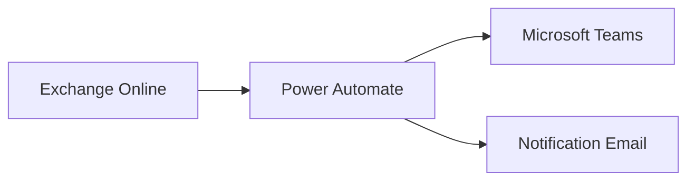
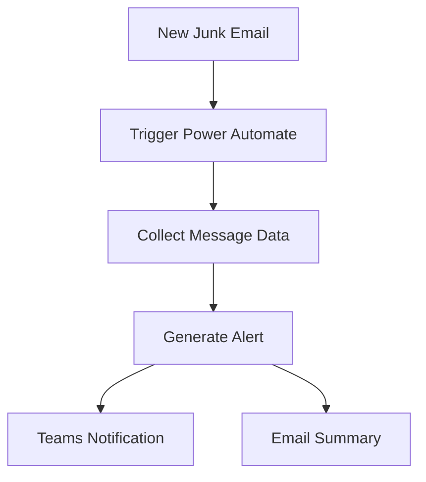

# Power Automate Junk Mail Alert

## Executive Summary

This guide describes how Power Automate can monitor Exchange Online Junk Email folders and generate automated notifications.

The objective is to improve visibility of potentially malicious email activity and reduce missed security events.

---

# Business Scenario

Users often fail to review Junk Email folders.

Important emails may be incorrectly classified.

Organizations require:

- Junk email visibility
- Alert notification
- Security monitoring
- User awareness
- Reporting

---

# Solution Architecture



---

# Workflow Overview



---

# Trigger Design

## Exchange Online Trigger

When a new email arrives in:

```text
Junk Email
```

folder.

---

# Notification Content

Recommended fields:

| Field | Description |
|----------|----------|
| Sender | Email sender |
| Subject | Mail subject |
| Time | Received time |
| Recipient | Target user |
| Category | Spam classification |

---

# Teams Alert Example

```text
New Junk Mail Detected

Sender:
external@domain.com

Subject:
Invoice Update

Received:
09:00 AM

User:
user@company.com
```

---

# Advanced Enhancements

## Security Correlation

Integrate with:

- Microsoft Defender
- Sentinel
- Purview

---

## Escalation Workflow

High-risk senders can trigger:

- SOC notification
- Security incident
- Ticket creation

---

# Operational Benefits

- Faster awareness
- Reduced missed messages
- Security visibility
- User productivity

---

# Governance Considerations

| Area | Recommendation |
|---------|---------|
| Alert Frequency | Daily summary |
| Noise Reduction | Filtering rules |
| Security Review | Monthly |
| Ownership | Service Desk |

---

# Deliverables

- Power Automate Flow
- Teams Notification Template
- Email Template
- Operational Guide
- Monitoring Dashboard