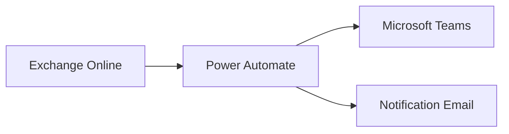
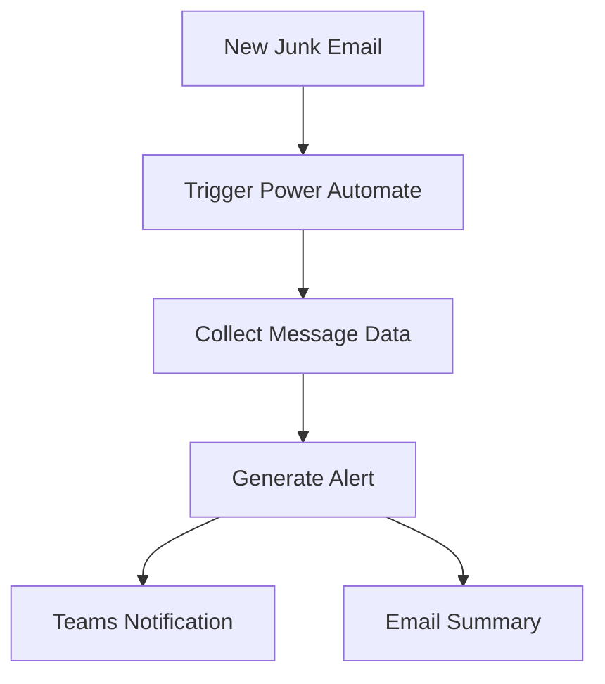

# Power Automate Junk Mail Alert

## Executive Summary

This guide describes how Power Automate can monitor Exchange Online Junk Email folders and generate automated notifications.

The objective is to improve visibility of potentially malicious email activity and reduce missed security events.

---

## Business Scenario

Users often fail to review Junk Email folders.

Important emails may be incorrectly classified.

Organizations require:

- Junk email visibility
- Alert notification
- Security monitoring
- User awareness
- Reporting

---

## Solution Architecture


```mermaid
flowchart LR

EXO[Exchange Online]
FLOW[Power Automate]
TEAMS[Microsoft Teams]
MAIL[Notification Email]

EXO --> FLOW
FLOW --> TEAMS
FLOW --> MAIL
```

---

## Workflow Overview


```mermaid
flowchart TD

A[New Junk Email]
B[Trigger Power Automate]
C[Collect Message Data]
D[Generate Alert]
E[Teams Notification]
F[Email Summary]

A --> B
B --> C
C --> D
D --> E
D --> F
```

---

## Trigger Design

## Exchange Online Trigger

When a new email arrives in:

```text
Junk Email
```

folder.

---

## Notification Content

Recommended fields:

| Field | Description |
|----------|----------|
| Sender | Email sender |
| Subject | Mail subject |
| Time | Received time |
| Recipient | Target user |
| Category | Spam classification |

---

## Teams Alert Example

```text
New Junk Mail Detected

Sender:
external@domain.com

Subject:
Invoice Update

Received:
09:00 AM

User:
user@company.com
```

---

## Advanced Enhancements

## Security Correlation

Integrate with:

- Microsoft Defender
- Sentinel
- Purview

---

## Escalation Workflow

High-risk senders can trigger:

- SOC notification
- Security incident
- Ticket creation

---

## Operational Benefits

- Faster awareness
- Reduced missed messages
- Security visibility
- User productivity

---

## Governance Considerations

| Area | Recommendation |
|---------|---------|
| Alert Frequency | Daily summary |
| Noise Reduction | Filtering rules |
| Security Review | Monthly |
| Ownership | Service Desk |

---

## Deliverables

- Power Automate Flow
- Teams Notification Template
- Email Template
- Operational Guide
- Monitoring Dashboard

---

## 한국어 요약

이 문서는 Exchange Online의 Junk Email 폴더를 Power Automate로 모니터링하고, Teams 또는 Email로 알림을 보내는 운영 자동화 패턴을 설명합니다.

핵심은 모든 Junk Mail을 무조건 경보화하는 것이 아니라, 보안팀과 서비스데스크가 확인해야 하는 조건을 정의하고 noise를 줄이는 것입니다. 운영 환경에서는 sender, recipient, subject, received time, spam confidence, attachment 여부, URL 포함 여부를 기준으로 alert rule을 조정해야 합니다.

## Operational Checklist

| Checkpoint | Validation Question |
|---|---|
| Trigger scope | 어떤 사용자 또는 공유 사서함의 Junk Email 폴더를 감시할 것인가? |
| Alert rule | 모든 메일을 알릴 것인가, 특정 조건만 알릴 것인가? |
| Recipient | Teams channel, service desk mailbox, SOC queue 중 어디로 보낼 것인가? |
| Noise control | daily summary, high-risk only, VIP user only 같은 제한 조건이 필요한가? |
| Evidence | sender, subject, received time, recipient, URL, attachment 정보를 남기는가? |
| Ownership | Flow owner, backup owner, failure notification owner가 정의되어 있는가? |

## Related Documents

- [Exchange Online Message Search and Purge](./exchange-online-message-recall-purge)
- [Defender for Office 365](../security/defender-for-office365)
- [Power Automate Junk Mail Alert](./powerautomate-junkmail-alert)
- [Contact and Asset Request](../contact)

## Search Keywords

이 문서는 다음 검색 의도에 답합니다.

- Power Automate Junk Mail alert
- Exchange Online Junk Email monitoring
- Microsoft 365 security automation
- Defender for Office 365 alert workflow
- Teams notification for suspicious email
- Power Automate 보안 알림
- Exchange Online 정크 메일 모니터링
- Microsoft 365 보안 자동화

## Contact / Asset Request

실제 고객 환경에 적용할 때는 tenant policy, mailbox scope, Defender signal, Teams channel 운영 기준을 함께 검토해야 합니다. Power Automate Flow 예시나 운영 알림 템플릿이 필요하면 [Contact and Asset Request](../contact)를 통해 요청할 수 있습니다.
