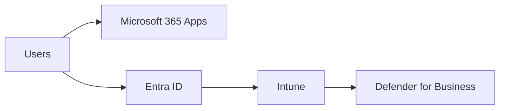

# Microsoft 365 Business Premium

## Executive Summary

Microsoft 365 Business Premium is a strong option for small and mid-sized organizations that need productivity, identity protection, endpoint management and baseline security in one package.

It is often suitable when the organization wants Microsoft 365, Intune, Defender for Business and Entra ID capabilities without moving immediately to enterprise E3 or E5 licensing.

## 한국어 요약

Microsoft 365 Business Premium은 Microsoft 365 Apps, Exchange Online, Teams, SharePoint, OneDrive, Entra ID, Intune, Defender for Business를 하나의 실무 패키지로 묶어 검토할 수 있는 라이선스입니다.

단순히 메일과 Office를 쓰기 위한 라이선스가 아니라, 중소·중견 조직이 MFA, Conditional Access, 디바이스 관리, endpoint protection, 기본 보안 운영 체계를 빠르게 갖추기 위한 출발점으로 보는 것이 좋습니다.

핵심 판단은 “Business Premium으로 충분한가?”가 아니라 “현재 필요한 보안, 관리, 규정 준수, 운영 범위가 Business Premium의 경계 안에 있는가?”입니다.

## Business Scenario

- Modernize email and collaboration
- Manage Windows and mobile devices
- Establish MFA and Conditional Access
- Improve endpoint security
- Standardize cloud productivity for growing teams

## Architecture

## Implementation

1. Confirm user count and license eligibility.
2. Enable MFA and identity baseline.
3. Configure Intune enrollment and compliance policy.
4. Deploy Microsoft 365 Apps.
5. Enable Defender for Business.
6. Review external sharing and data protection settings.

## Licensing

Business Premium is generally designed for organizations up to the Microsoft SMB licensing limit. If the customer needs advanced compliance, enterprise voice, large-scale governance or E5 security, compare against E3/E5.

## When Business Premium Is Enough

Business Premium is usually a practical fit when the organization needs:

- Microsoft 365 productivity and collaboration as the main platform
- baseline identity security with MFA and Conditional Access
- Intune-based device enrollment, compliance policy and app protection
- endpoint protection through Defender for Business
- a simpler operating model than full enterprise E3/E5
- a cost-conscious license path for a controlled Microsoft 365 rollout

## When To Compare Against E3 Or E5

Compare Business Premium with E3 or E5 when the customer has one or more of these requirements:

| Requirement | Why It Matters |
|---|---|
| Advanced compliance | Purview, retention, eDiscovery, DLP and audit requirements may exceed the Business Premium boundary. |
| Enterprise security operations | Defender XDR, advanced hunting and security operations integration may require E5-level capabilities. |
| Large-scale governance | Large tenants often need more advanced policy, reporting, delegation and operational controls. |
| Complex voice or meeting requirements | Enterprise voice and advanced meeting scenarios may require additional licensing decisions. |
| Regulated industry control evidence | Finance, healthcare, public sector or manufacturing environments often require more formal evidence packs. |

## Security

- Enforce MFA for all users.
- Use Conditional Access templates carefully.
- Manage devices through Intune.
- Enable endpoint protection and security baselines.
- Review admin roles and emergency access accounts.

## Decision Checklist

| Question | Recommended Review |
|---|---|
| User count and license eligibility | Confirm Microsoft licensing boundaries before designing the final bill of materials. |
| Identity readiness | Check MFA, admin roles, emergency access, guest access and Conditional Access requirements. |
| Device management scope | Confirm Windows, macOS, iOS, Android and BYOD policy expectations. |
| Security baseline | Decide which Microsoft security baseline, Defender configuration and alert ownership model will be used. |
| Data protection | Review external sharing, sensitivity, retention and DLP requirements before assuming Business Premium is enough. |
| Operations model | Assign ownership for user onboarding, device compliance, security alerts and policy exceptions. |

## Field Reference Pattern

In retail, manufacturing and professional service environments, Business Premium is often used as a pragmatic modernization step: replace fragmented email and endpoint tools, standardize Microsoft 365 collaboration, enable MFA, and introduce Intune/Defender controls without creating an enterprise-scale program on day one.

The strongest results come when licensing, security baseline, device policy and operations handover are designed together.

## Lessons Learned

Business Premium can deliver strong value when implemented as a full security and management platform. If it is used only for email and Office apps, much of the package value is left unused.

## 검색 키워드

- Microsoft 365 Business Premium
- Business Premium E3 E5 비교
- Microsoft 365 중소기업 보안
- Intune Business Premium
- Defender for Business
- Entra ID Conditional Access
- Microsoft 365 라이선스 전략
- Microsoft 365 보안 baseline

## Related Documents

- [License Advisor](../toolkit/license-advisor)
- [Licensing Overview](./overview)
- [Security Reference Architecture](../architecture/security-reference-architecture)
- [Microsoft 365 Reference Architecture](../architecture/m365-reference-architecture)
