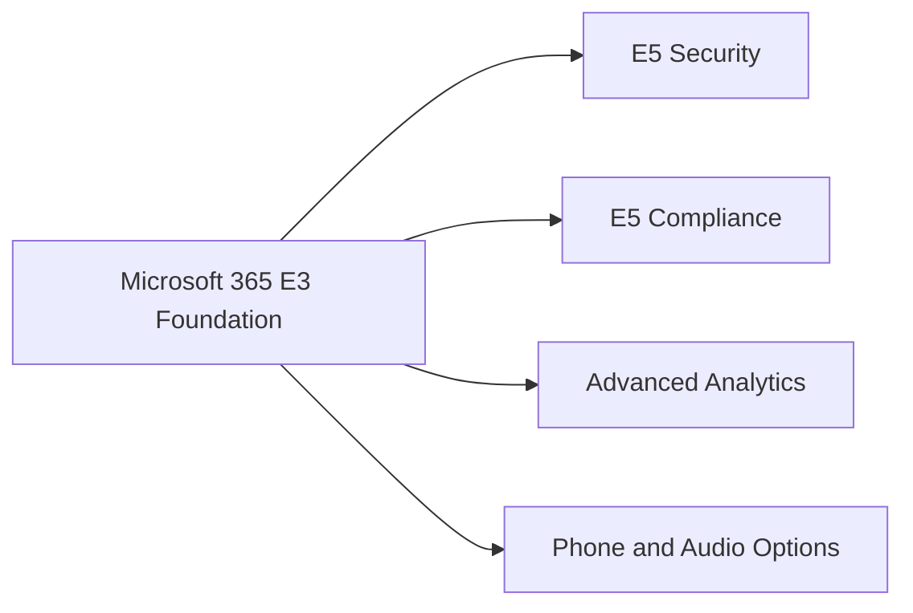

# Microsoft 365 E3 vs E5

## Executive Summary

Microsoft 365 E3 provides the enterprise productivity, identity, device and collaboration foundation. Microsoft 365 E5 adds advanced security, compliance, analytics and voice capabilities that are often required for regulated or security-sensitive environments.

The right decision should be based on control requirements, not only feature comparison.

## Business Scenario

- E3 fit: standard enterprise productivity, device management and baseline governance
- E5 fit: advanced threat protection, compliance, eDiscovery, DLP, insider risk and XDR
- Mixed fit: E5 for high-risk users, administrators or regulated departments

## Architecture

## Evaluation Criteria

| Area | E3-Oriented | E5-Oriented |
|---|---|---|
| Endpoint | Intune baseline | Advanced Defender capabilities |
| Email Security | Standard controls | Defender for Office 365 advanced scenarios |
| Compliance | Basic retention and audit | Advanced eDiscovery, DLP, Insider Risk |
| Identity | Entra ID baseline | Advanced identity and risk controls |
| Operations | IT administration | SOC and compliance operations |

## Implementation

1. Capture required controls.
2. Map each control to E3, E5 or add-on licensing.
3. Identify high-risk user groups.
4. Build cost scenarios for E3-only, E5-only and mixed models.
5. Validate security and compliance gaps with stakeholders.

## Lessons Learned

The best licensing proposal explains risk reduction and operational value. A feature table alone rarely convinces finance or executive stakeholders.
