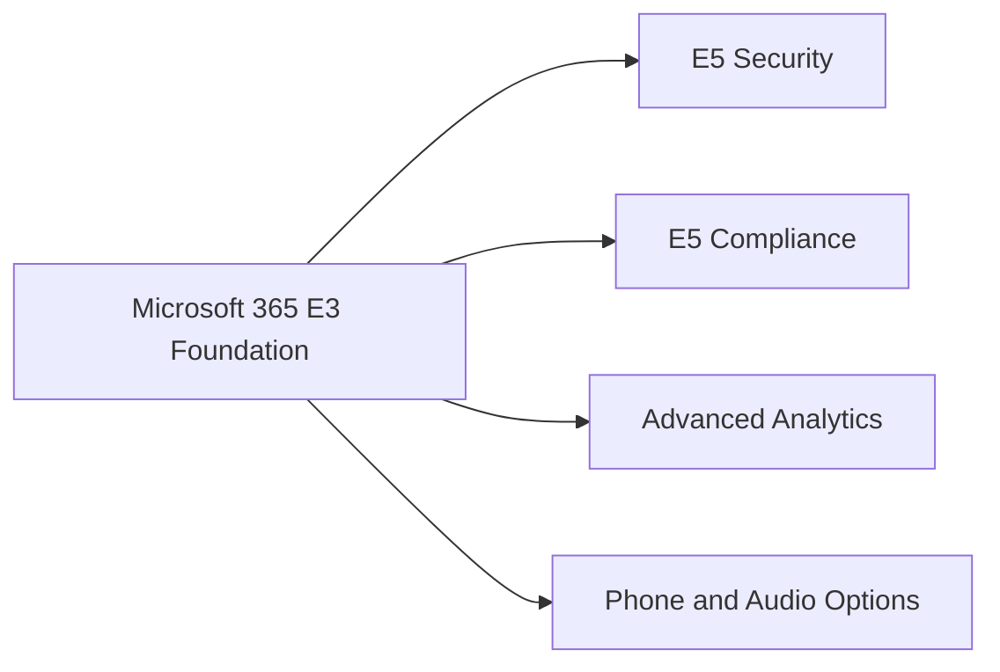

# Microsoft 365 E3 vs E5

  

    <small>PERSONA</small>
    <strong>E3 baseline users</strong>
    Use E3 when productivity and baseline governance are the primary requirement.
  

  

    <small>CAPABILITY</small>
    <strong>E5 advanced controls</strong>
    Use E5 when advanced security, compliance, analytics and automation controls are required.
  

  

    <small>DECISION</small>
    <strong>Hybrid licensing model</strong>
    Many enterprises need mixed assignment by persona, risk and workload maturity.
  

## Executive Summary

Microsoft 365 E3 provides the enterprise productivity, identity, device and collaboration foundation. Microsoft 365 E5 adds advanced security, compliance, analytics and voice capabilities that are often required for regulated or security-sensitive environments.

The right decision should be based on control requirements, not only feature comparison.

## 한국어 요약

Microsoft 365 E3와 E5의 차이는 “기능이 더 많다”의 문제가 아니라 보안, 컴플라이언스, 데이터 보호, 위협 대응, 감사 대응 수준의 차이입니다.

E3는 enterprise productivity와 기본 identity/device/collaboration foundation을 제공합니다. E5는 Defender, Purview, advanced compliance, analytics, XDR 중심의 고급 통제와 운영 역량을 강화합니다. 따라서 E5 도입은 비용 증가가 아니라 risk reduction, audit readiness, security operation maturity 관점에서 설명되어야 합니다.

## Business Scenario

- E3 fit: standard enterprise productivity, device management and baseline governance
- E5 fit: advanced threat protection, compliance, eDiscovery, DLP, insider risk and XDR
- Mixed fit: E5 for high-risk users, administrators or regulated departments

## Architecture

## Evaluation Criteria

| Area | E3-Oriented | E5-Oriented |
|---|---|---|
| Endpoint | Intune baseline | Advanced Defender capabilities |
| Email Security | Standard controls | Defender for Office 365 advanced scenarios |
| Compliance | Basic retention and audit | Advanced eDiscovery, DLP, Insider Risk |
| Identity | Entra ID baseline | Advanced identity and risk controls |
| Operations | IT administration | SOC and compliance operations |

## Decision Checklist

| Question | Why It Matters |
|---|---|
| Are advanced threat protection requirements mandatory? | Determines Defender and XDR value |
| Is DLP, eDiscovery or insider risk required? | Determines Purview and compliance need |
| Are administrators, executives or regulated users exposed to higher risk? | Supports mixed E3/E5 assignment |
| Is the security team ready to operate E5 signals? | Prevents buying controls that are not used |
| Can the business measure value beyond feature access? | Helps finance and executive approval |

## Recommended Licensing Patterns

| Pattern | Description |
|---|---|
| E3 foundation | Use E3 as the standard productivity and governance baseline |
| E5 for privileged users | Assign E5 to administrators, security team, executives and high-risk groups |
| E5 for regulated departments | Apply E5 to finance, legal, compliance or sensitive data teams |
| E5 security-first | Adopt E5 where XDR, Defender, DLP and audit readiness are primary drivers |
| Phased E5 expansion | Start with pilot groups, validate value, then expand by risk and business priority |

## Implementation

1. Capture required controls.
2. Map each control to E3, E5 or add-on licensing.
3. Identify high-risk user groups.
4. Build cost scenarios for E3-only, E5-only and mixed models.
5. Validate security and compliance gaps with stakeholders.

## Executive Positioning

Use this positioning when explaining E5:

> E5 should be evaluated as a security, compliance and operational risk reduction investment, not only as a bundle of additional product features.

Avoid this positioning:

> E5 is better because it includes more Microsoft features.

## Lessons Learned

The best licensing proposal explains risk reduction and operational value. A feature table alone rarely convinces finance or executive stakeholders.

## 검색 키워드

- Microsoft 365 E3 vs E5
- E3 E5 decision guide
- Microsoft 365 E5 security value
- Defender Purview E5 licensing
- Microsoft 365 E3 E5 비교
- E5 보안 컴플라이언스
- Microsoft 365 라이선스 의사결정

## Contact / Asset Request

For license-to-capability maps, persona matrices, feature comparison workbooks or executive license decision packs, use [Contact and Asset Request](../contact).
