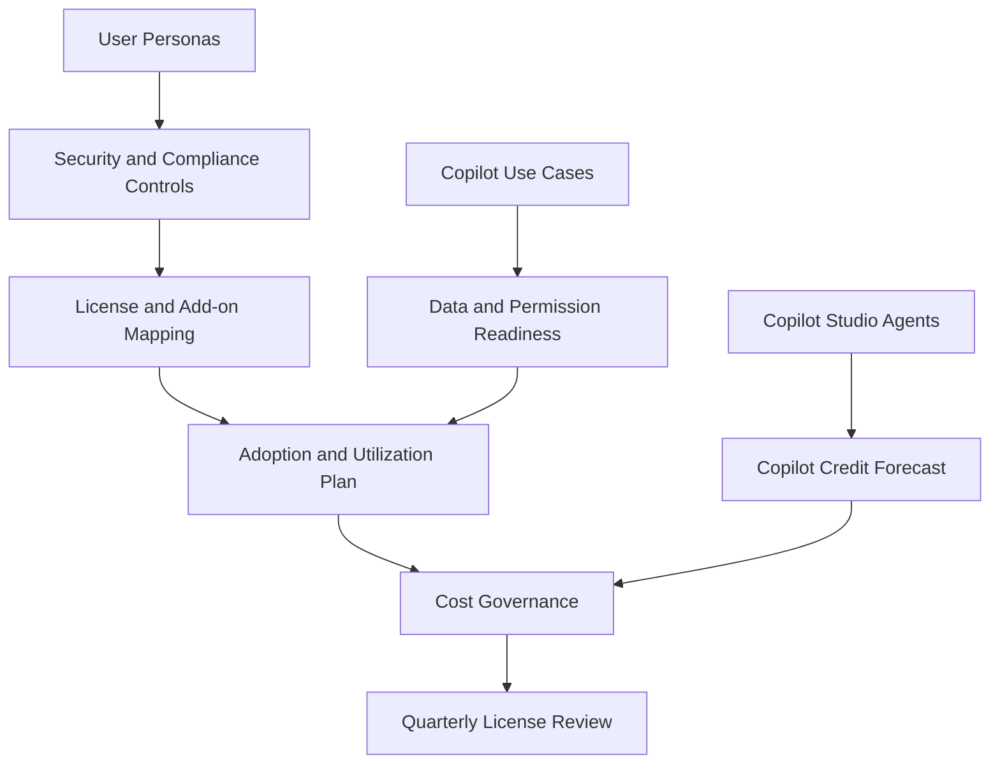

# July 2026 Microsoft Licensing Update

## Executive Summary

Microsoft licensing decisions in 2026 should be treated as a business architecture decision, not a product SKU comparison.

Recent market guidance indicates that Microsoft 365 commercial subscription pricing is changing effective July 1, 2026, while Copilot pricing requires separate value governance. This means customers should prepare renewal, procurement and adoption conversations with a clear link between cost, security capability, AI readiness and measurable business outcomes.

The practical consulting message is simple: do not approve a license increase or Copilot expansion without a utilization model, control mapping and adoption plan.

## 한국어 요약

2026년 Microsoft licensing 검토는 단순 가격 비교가 아니라 CFO, CIO, CISO가 함께 보는 의사결정 주제입니다.

특히 2026년 7월 1일 기준 Microsoft 365 commercial subscription 가격 변화가 논의되는 상황에서는 기존 license 수량을 그대로 갱신하기보다, 사용자 유형별 필요 기능, 보안/컴플라이언스 통제, Copilot readiness, 실제 사용률을 함께 검토해야 합니다.

핵심은 “얼마나 올랐는가”가 아니라 “증가한 비용이 어떤 위험을 줄이고, 어떤 업무 가치를 만들며, 어떤 AI 활용 기반을 제공하는가”입니다.

## What Changed For Planning

| Area | Planning Impact |
|---|---|
| Microsoft 365 commercial pricing | renewal scenarios should include baseline, optimized and strategic options |
| Security and management value | E3, E5 and add-ons should be justified by controls, not feature names |
| Copilot licensing | assignment should be linked to use cases, readiness and value tracking |
| Copilot Studio and agents | agent consumption and Copilot Credits must be forecast before scale-out |
| Procurement review | finance needs utilization, reclaim and adoption evidence |

## Executive Conversation Model

Use the following model when preparing a July 2026 licensing discussion.

| Question | Evidence Required | Output |
|---|---|---|
| Which users need which capabilities? | persona, workload, risk and compliance mapping | role-based license model |
| Which security controls are mandatory? | Defender, Purview, Entra ID, Intune and audit requirements | control-to-license matrix |
| Which Copilot users are ready? | data readiness, permission review, training and business scenario | phased Copilot assignment plan |
| Which licenses are underused? | assignment, usage and feature consumption data | reclaim and reallocation plan |
| Which costs are variable? | Copilot Studio, agent, connector and Azure consumption estimates | cost governance dashboard |

## Recommended License Architecture

## Renewal Readiness Checklist

- Export current license assignment and usage data.
- Identify unused, duplicate or misassigned licenses.
- Segment users by role, workload, risk level and Copilot readiness.
- Map required controls to Microsoft 365 E3, E5, Business Premium and add-ons.
- Separate mandatory security controls from optional productivity features.
- Build a Copilot assignment plan based on use case value, not executive interest alone.
- Forecast Copilot Studio and agent consumption before approving broad agent rollout.
- Define reclaim, reallocation and quarterly review rules.

## CFO-Ready Output

A strong licensing recommendation should include:

- current spend baseline
- optimized spend scenario
- strategic AI and security scenario
- risk reduction rationale
- license reclaim opportunity
- Copilot adoption and ROI assumptions
- agent consumption governance model

## Customer Success Pattern

| Industry | Situation | Practical Pattern |
|---|---|---|
| Finance | strict security and audit requirements | justify E5 or compliance add-ons with control evidence |
| Manufacturing | mixed office, field and plant users | separate knowledge workers, frontline users and privileged admins |
| Retail | cost-sensitive broad user base | start with license reclaim and Business Premium/E3 segmentation |
| SaaS | security-sensitive external collaboration | connect Conditional Access, Defender, Purview and guest governance to licensing |

## Common Mistakes

| Mistake | Why It Fails |
|---|---|
| Treating renewal as a price negotiation only | misses security, compliance and AI readiness value |
| Assigning Copilot broadly before readiness | creates cost without measurable business impact |
| Ignoring add-on sprawl | increases operational complexity and procurement confusion |
| Not tracking utilization | weakens future CFO and procurement review |
| Separating license review from architecture | hides whether required controls are actually enabled |

## Recommended Next Steps

1. Run a license assignment and utilization review.
2. Build a control-to-license matrix.
3. Define Copilot-ready user personas.
4. Estimate Copilot Studio and agent consumption.
5. Prepare a CFO-ready renewal scenario deck.
6. Establish a quarterly license governance rhythm.

## References

- [Microsoft Copilot Studio licensing and access](https://learn.microsoft.com/en-us/microsoft-copilot-studio/requirements-licensing)
- [Microsoft Copilot Studio agent usage estimator](https://microsoft.github.io/copilot-studio-agent-usage-estimator/)
- [Copilot Studio overview](https://learn.microsoft.com/en-us/microsoft-copilot-studio/fundamentals-what-is-copilot-studio)

## Related Pages

- [Licensing Overview](./overview)
- [Microsoft 365 Licensing](../microsoft365/licensing)
- [E3 vs E5](./e3-vs-e5)
- [Copilot ROI Framework](../copilot/roi-framework)
- [Copilot Studio 2026 Platform Update](../copilot/copilot-studio-2026-platform-update)

