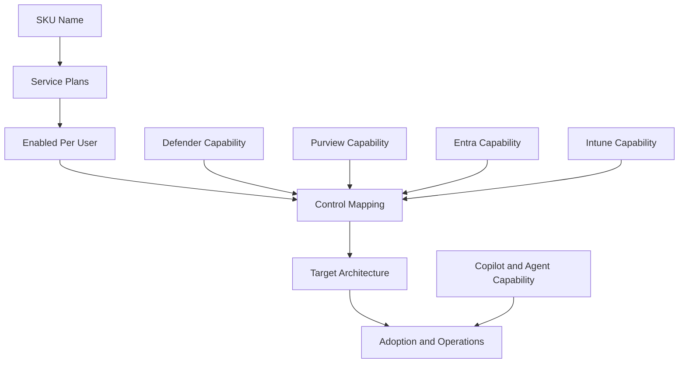

# Microsoft Licensing Feature Update

## Executive Summary

Microsoft licensing decisions should be reviewed as a feature entitlement and control-mapping exercise.

The important question is not "how much did the SKU change?" The important question is "which capabilities are actually included, which service plans are enabled, and which security or AI controls can now be designed without an additional product assumption?"

This is especially important when comparing Office 365 E3, Microsoft 365 E3, Microsoft 365 E5, Microsoft Defender, Microsoft Purview, Microsoft Entra, Intune, Microsoft 365 Copilot and Copilot Studio.

## 한국어 요약

Microsoft licensing 검토에서 가장 중요한 것은 가격 변화가 아니라 포함 기능의 변화입니다.

예를 들어 고객이 "E3를 사용 중"이라고 말하더라도 그것이 Office 365 E3인지, Microsoft 365 E3인지에 따라 포함되는 security, device management, identity, compliance capability가 달라질 수 있습니다. 또한 Microsoft 문서에서는 Microsoft 365 E3 같은 일부 subscription에 Defender for Office 365 Plan 1이 포함될 수 있다고 설명하므로, 단순 SKU 이름만 보고 아키텍처를 판단하면 위험합니다.

따라서 license 검토는 SKU 이름이 아니라 service plan identifier, 포함 기능, 실제 enable 상태, 보안 정책 적용 가능 여부를 기준으로 수행해야 합니다.

## Feature Change Watch

| Area | What To Check | Architecture Impact |
|---|---|---|
| Office 365 E3 vs Microsoft 365 E3 | service plans included and enabled | same "E3" label can mean different security and device control capability |
| Defender for Office 365 Plan 1 | Safe Links, Safe Attachments, anti-phishing, real-time detections | email and collaboration security baseline may be stronger than assumed |
| Defender for Office 365 Plan 2 | Threat Explorer, AIR, attack simulation, advanced investigation | SOC and response automation design changes |
| Purview capability | information protection, audit, DLP, retention, eDiscovery | compliance architecture depends on enabled service plans |
| Entra capability | P1/P2, Conditional Access, identity governance, privileged identity | identity control mapping must follow actual entitlement |
| Intune and endpoint | MDM, app protection, compliance, Defender integration | endpoint governance depends on Microsoft 365 plan family |
| Copilot Studio | tenant license, user license, Copilot Credits, agent capacity | agent program must include maker access and consumption governance |

## Why SKU Names Are Not Enough

The Microsoft 365 admin center, PowerShell and Microsoft Graph can show the same product using different identifiers.

For example, Office 365 E3 can appear as a friendly product name, as the `ENTERPRISEPACK` string ID, or as a GUID in Graph. The real design work starts when the architect reviews the service plans included in that SKU and confirms whether the required service plans are enabled for the target users.

## E3 Review Pattern

Use this pattern when a customer says they have "E3".

| Question | Why It Matters |
|---|---|
| Is it Office 365 E3 or Microsoft 365 E3? | Microsoft 365 E3 includes additional identity, endpoint and security capabilities compared with Office 365 productivity-only positioning. |
| Which service plans are enabled? | A purchased license does not guarantee every service plan is enabled for every user. |
| Is Defender for Office 365 Plan 1 included or separately licensed? | Email security architecture changes if Safe Links, Safe Attachments and impersonation protection are available. |
| Is Microsoft Defender for Endpoint Plan 1 included? | Endpoint protection baseline changes if MDE P1 capability is available. |
| Which Purview features are available? | DLP, retention, audit and information protection depend on actual plan capability. |
| Are add-ons overlapping with bundled capability? | Some add-ons may no longer be needed if the bundled entitlement already covers the control. |

## Defender Feature Decision

| Capability Layer | Practical Meaning |
|---|---|
| Built-in security for cloud mailboxes | baseline anti-malware, anti-spam, anti-phishing, quarantine, submissions, message trace |
| Defender for Office 365 Plan 1 | Safe Links, Safe Attachments, impersonation protection, real-time detections, user tags and Teams protection features |
| Defender for Office 365 Plan 2 | Threat Explorer, attack simulation training, Threat Trackers, AIR and advanced hunting/investigation patterns |

## Copilot Studio Licensing And Feature Shift

Copilot Studio should be reviewed across two dimensions:

1. Maker access: tenant license and Copilot Studio User License.
2. Runtime and scale: billed sessions, Copilot Credits, agent type, orchestration, knowledge and tools.

The platform itself has also changed. New agent experience, Microsoft IQ, Work IQ, reusable skills, memory, computer use, agent inventory, Entra agent identities, A2A and automated evaluations now affect governance design.

## Recommended License Architecture

## Review Checklist

- Export subscribed SKU and service plan information from Microsoft 365 admin center, PowerShell or Microsoft Graph.
- Confirm whether the customer means Office 365 E3, Microsoft 365 E3, Microsoft 365 E5, Business Premium or add-on bundles.
- Review service plan enabled state for representative user groups.
- Map Defender, Purview, Entra ID, Intune and Copilot capabilities to required security controls.
- Identify add-ons that duplicate bundled capability.
- Identify missing features that block the target architecture.
- Confirm Copilot Studio maker licensing, tenant licensing and consumption governance.
- Document the final license-to-control matrix for CIO/CISO/CFO review.

## Customer Success Pattern

| Industry | Situation | Practical Pattern |
|---|---|---|
| Finance | strong email security and audit requirement | verify Defender for Office 365 Plan 1/Plan 2, audit and Purview entitlement before recommending add-ons |
| Manufacturing | office, plant and frontline user mix | separate Office 365 E3, Microsoft 365 E3, frontline and privileged admin groups |
| Retail | broad user base with cost sensitivity | remove duplicate add-ons only after confirming bundled service plans are enabled |
| SaaS | external collaboration and data protection | map Entra, Defender, Purview and DLP controls to actual service plans |
| Enterprise AI | Copilot Studio and agent scale-out | combine maker license, tenant capacity, Copilot Credits and agent governance model |

## Common Mistakes

| Mistake | Better Approach |
|---|---|
| Comparing only SKU names | compare service plans and enabled states |
| Treating E3 as one universal capability set | distinguish Office 365 E3, Microsoft 365 E3 and add-on bundles |
| Assuming purchased means enabled | verify user-level service plan enablement |
| Recommending add-ons before entitlement review | check bundled features first |
| Ignoring Copilot Studio runtime consumption | forecast Copilot Credits and billed sessions before scale-out |
| Treating Defender Plan 1 and Plan 2 as similar | separate prevention/detection from advanced investigation and automation |

## Recommended Next Steps

1. Build a service plan inventory.
2. Identify the customer's real E3/E5/Business Premium mix.
3. Map each required control to an included or missing feature.
4. Validate Defender, Purview, Entra and Intune entitlement before add-on recommendations.
5. Update Copilot Studio governance for new agent experience, Microsoft IQ, skills, memory, computer use, A2A, agent inventory and Entra agent identities.
6. Produce an executive license-to-control matrix.

## References

- [Microsoft 365 and Office 365 plan options](https://learn.microsoft.com/en-us/office365/servicedescriptions/office-365-platform-service-description/office-365-plan-options)
- [Product names and service plan identifiers for licensing](https://learn.microsoft.com/en-us/entra/identity/users/licensing-service-plan-reference)
- [Microsoft Defender for Office 365 overview](https://learn.microsoft.com/en-us/defender-office-365/mdo-about)
- [Copilot Studio licensing and access](https://learn.microsoft.com/en-us/microsoft-copilot-studio/requirements-licensing)
- [What's new in Copilot Studio](https://learn.microsoft.com/en-us/microsoft-copilot-studio/whats-new)

## Related Pages

- [Licensing Overview](./overview)
- [Microsoft 365 Licensing](../microsoft365/licensing)
- [E3 vs E5](./e3-vs-e5)
- [Copilot ROI Framework](../copilot/roi-framework)
- [Copilot Studio 2026 Platform Update](../copilot/copilot-studio-2026-platform-update)
