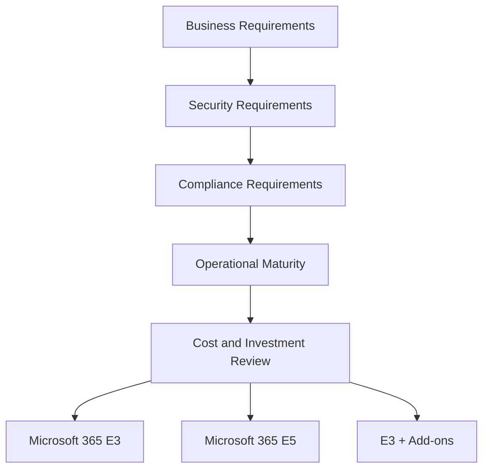
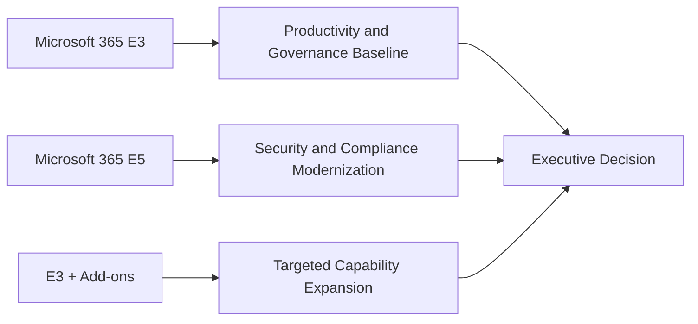

---
id: e3-vs-e5
title: Microsoft 365 E3 vs E5 Enterprise Decision Guide
sidebar_label: E3 vs E5 Decision Guide
---

# Microsoft 365 E3 vs E5 Enterprise Decision Guide

## Executive Summary

Microsoft 365 E3 and E5 selection should not be evaluated only by license price.

The decision should be based on security maturity, compliance requirements, operational risk, regulatory exposure, and business transformation objectives.

In most enterprise environments, Microsoft 365 E3 provides a strong productivity and governance baseline, while Microsoft 365 E5 becomes necessary when the organization requires advanced security, identity protection, compliance, analytics, and Zero Trust capabilities.

---

## Decision Framework

---

## Executive Decision Summary

| Decision Area | Microsoft 365 E3 | Microsoft 365 E5 |
|---|---|---|
| Productivity | Strong | Strong |
| Collaboration | Strong | Strong |
| Basic Compliance | Available | Enhanced |
| Advanced Security | Limited | Strong |
| Identity Protection | Limited | Strong |
| Advanced Threat Protection | Limited | Strong |
| Advanced Compliance | Limited | Strong |
| Analytics | Limited | Strong |
| Zero Trust Readiness | Baseline | Advanced |

---

## When E3 Is Appropriate

Microsoft 365 E3 is generally appropriate when the organization requires:

- Enterprise productivity
- Office desktop applications
- Exchange Online
- Teams collaboration
- SharePoint and OneDrive
- Baseline information governance
- Standard security controls
- Cost-efficient enterprise modernization

Typical E3 scenarios:

| Scenario | Fit |
|---|---|
| Collaboration modernization | High |
| Exchange Online migration | High |
| SharePoint / Teams adoption | High |
| Basic governance | Medium |
| Advanced security transformation | Low |
| Regulated industry compliance | Medium to Low |

---

## When E5 Is Appropriate

Microsoft 365 E5 is generally appropriate when the organization requires:

- Advanced identity protection
- Privileged access management
- Advanced endpoint protection
- Advanced email protection
- Defender XDR
- Advanced compliance
- Insider risk management
- Advanced eDiscovery
- Power BI Pro
- Zero Trust implementation

Typical E5 scenarios:

| Scenario | Fit |
|---|---|
| Zero Trust security program | High |
| SOC modernization | High |
| Regulated industry compliance | High |
| Advanced DLP and data protection | High |
| Copilot security readiness | High |
| Basic collaboration only | Low |

---

## E3 vs E5 Capability View

| Area | E3 Position | E5 Position |
|---|---|---|
| Identity | Baseline identity and access | Advanced identity protection and privileged access |
| Endpoint | Basic management and protection baseline | Advanced endpoint detection and response |
| Email Security | Standard protection | Advanced threat protection |
| Compliance | Core compliance capabilities | Advanced compliance and risk management |
| Information Protection | Baseline protection | Broader data protection and investigation |
| Analytics | Basic productivity analytics | Power BI Pro included |
| Security Operations | Limited | Defender XDR-based operations |

---

## E3 + Add-on Strategy

E3 with selected add-ons can be appropriate when only specific advanced capabilities are required.

Examples:

| Requirement | Possible Approach |
|---|---|
| Endpoint security only | E3 + Defender for Endpoint |
| Email security only | E3 + Defender for Office 365 |
| Identity governance only | E3 + Entra ID P2 |
| Compliance enhancement | E3 + Purview add-ons |
| Full Zero Trust | Consider E5 |

---

## Decision Matrix

| Requirement | Recommended Direction |
|---|---|
| Basic productivity and collaboration | E3 |
| Enterprise collaboration with cost control | E3 |
| Security transformation | E5 |
| Regulated compliance environment | E5 |
| Copilot readiness with data protection | E5 or E3 + Security / Compliance add-ons |
| SOC integration and XDR | E5 |
| Frontline worker scenario | F3 or mixed licensing |
| SMB security and device management | Business Premium |

---

## Business Value Comparison

| Value Driver | E3 | E5 |
|---|---|---|
| Productivity improvement | High | High |
| Security risk reduction | Medium | High |
| Compliance readiness | Medium | High |
| Operational simplification | Medium | High |
| License optimization | High | Medium |
| Executive risk visibility | Medium | High |

---

## Risk Considerations

| Risk | E3 Consideration | E5 Consideration |
|---|---|---|
| Advanced threats | May require add-ons | Better native coverage |
| Data leakage | Requires careful configuration | Stronger protection options |
| Identity compromise | Limited advanced protection | Stronger identity risk controls |
| Compliance investigation | Limited capability | Stronger investigation capability |
| Tool sprawl | More likely with third-party tools | Reduced by Microsoft security stack consolidation |

---

## Recommended Assessment Questions

Before deciding between E3 and E5, confirm:

- Is the customer in a regulated industry?
- Is there a Zero Trust initiative?
- Is there a SOC or security monitoring requirement?
- Are endpoint security and EDR required?
- Are advanced email security controls required?
- Is DLP required across Microsoft 365?
- Are sensitivity labels required?
- Is Microsoft 365 Copilot planned?
- Are executives asking for security risk visibility?
- Is license consolidation a business driver?

---

## Recommended Positioning

### E3 Positioning

Microsoft 365 E3 is recommended as the enterprise productivity and governance baseline.

It is suitable when the customer wants to modernize collaboration, standardize Microsoft 365 usage, and control cost while maintaining a strong enterprise foundation.

### E5 Positioning

Microsoft 365 E5 is recommended when the customer’s business priority includes security transformation, compliance modernization, Zero Trust, SOC visibility, and Copilot readiness.

E5 should be positioned as a risk reduction and security modernization investment, not only as a license upgrade.

---

## Executive Recommendation Model

---

## Final Recommendation

For most enterprise customers:

- Use E3 as the baseline for productivity, collaboration, and governance.
- Use E5 when security, compliance, Zero Trust, or Copilot readiness is a strategic priority.
- Use E3 + add-ons only when requirements are narrow and clearly defined.
- Avoid deciding based on license price alone.
- Evaluate risk reduction, operational simplification, and executive visibility as part of the business case.

---

## References

- Microsoft 365 Licensing Guidance
- Microsoft Product Terms
- Microsoft Learn
- Microsoft Security Adoption Framework
- Microsoft Zero Trust Guidance