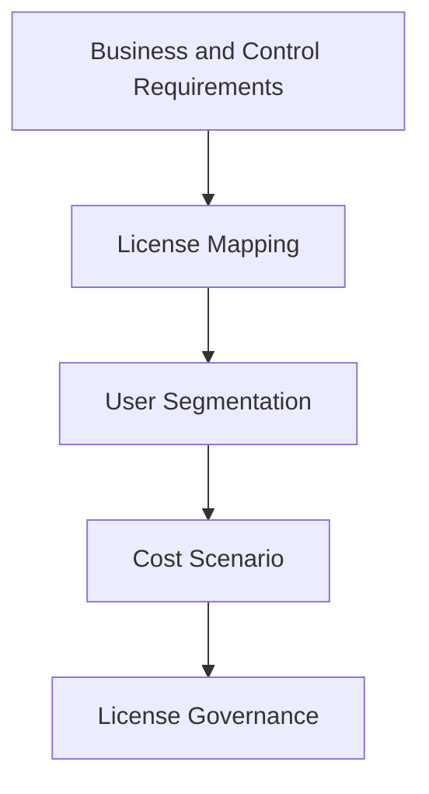

# Microsoft 365 Licensing

## Executive Summary

Microsoft 365 licensing should translate business requirements into the right mix of productivity, security, compliance, device management and AI capabilities.

The goal is not simply to minimize cost. The goal is to avoid paying for unused capabilities while ensuring required controls are actually licensed.

## 한국어 요약

Microsoft 365 licensing은 비용 절감표가 아니라 business requirement와 security/compliance control을 license capability에 매핑하는 의사결정 작업입니다.

Business Premium, E3, E5, security add-on, compliance add-on, Copilot license를 사용자 유형과 risk level에 맞게 설계해야 합니다.

## Feature Entitlement Review

Microsoft 365 licensing discussions should include a feature entitlement review. The key question is not only which SKU is purchased, but which service plans are included, enabled and usable for the required security, compliance, endpoint, Copilot and agent controls.

Use this page for the current planning model: [Microsoft Licensing Feature Update](../licensing/july-2026-microsoft-licensing-update)

## Business Scenario

- Compare Business Premium, E3, E5 and add-ons
- Build licensing model for Microsoft 365 migration
- Prepare Copilot licensing and readiness
- Align security and compliance requirements
- Support CFO and procurement review

## Architecture

## Implementation

1. Segment users by role, risk and workload need.
2. Map required capabilities to license plans.
3. Confirm included service plans and enabled state per user group.
4. Identify add-ons and overlapping products.
5. Validate with IT, security, compliance and finance.
6. Define license assignment and review process.

## Security

Licensing must be checked against required security controls such as Defender, Purview, Conditional Access, Intune, audit and eDiscovery. Missing licenses can silently block the intended architecture.

## Decision Checklist

| Decision | Recommended Question |
|---|---|
| User segmentation | Which users require productivity, security, compliance or frontline licensing? |
| Security controls | Which Defender, Intune, Entra ID and Purview features are mandatory? |
| Copilot readiness | Which users are ready for Copilot license assignment? |
| Add-ons | Are E5 add-ons more efficient than full E5 for certain groups? |
| Governance | How often are unused or misassigned licenses reviewed? |

## Delivery Artifacts

- License requirement matrix
- Service plan inventory
- User segmentation model
- E3/E5/Business Premium comparison
- Security and compliance capability mapping
- Copilot license readiness plan
- Executive license-to-control matrix

## Customer Success Pattern

| Industry | Scenario | Pattern |
|---|---|---|
| Finance | Security and compliance uplift | E5 capability mapping with audit-driven justification |
| Manufacturing | Mixed workforce | E3/E5 segmentation and frontline licensing review |
| Retail | Cost optimization | License reclaim process and role-based assignment model |

## Lessons Learned

Executive stakeholders respond better to licensing proposals that connect included capabilities to risk reduction, operational efficiency, Copilot readiness and adoption value.

## 검색 키워드

- Microsoft 365 licensing
- Microsoft 365 E3 vs E5
- Business Premium licensing
- Copilot licensing
- Microsoft 365 license optimization
- Microsoft 365 라이선스
