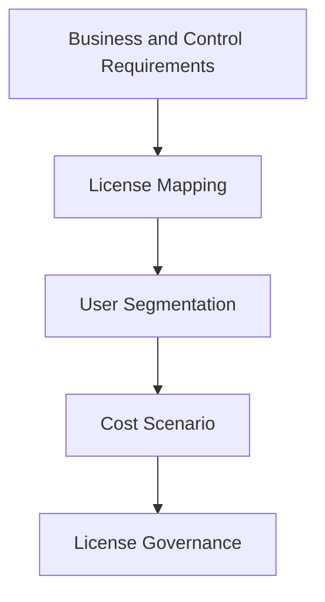

# Microsoft 365 Licensing

## Executive Summary

Microsoft 365 licensing should translate business requirements into the right mix of productivity, security, compliance, device management and AI capabilities.

The goal is not simply to minimize cost. The goal is to avoid paying for unused capabilities while ensuring required controls are actually licensed.

## Business Scenario

- Compare Business Premium, E3, E5 and add-ons
- Build licensing model for Microsoft 365 migration
- Prepare Copilot licensing and readiness
- Align security and compliance requirements
- Support CFO and procurement review

## Architecture

## Implementation

1. Segment users by role, risk and workload need.
2. Map required capabilities to license plans.
3. Identify add-ons and overlapping products.
4. Build baseline, recommended and premium scenarios.
5. Validate with IT, security, compliance and finance.
6. Define license assignment and review process.

## Security

Licensing must be checked against required security controls such as Defender, Purview, Conditional Access, Intune, audit and eDiscovery. Missing licenses can silently block the intended architecture.

## Lessons Learned

Executive stakeholders respond better to licensing proposals that connect cost to risk reduction, operational efficiency and adoption value.
