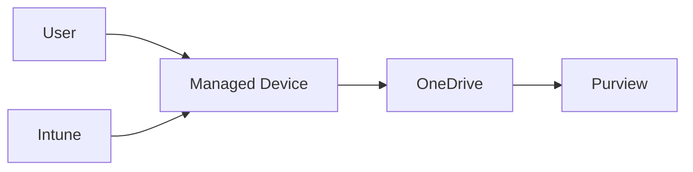

# OneDrive

## Executive Summary

OneDrive provides personal work file storage, synchronization and sharing in Microsoft 365.

In enterprise design, OneDrive should be governed as part of the collaboration and data protection architecture. It affects external sharing, device sync, retention, DLP, migration and Copilot readiness.

## Business Scenario

- Replace local user folders and personal network drives
- Enable secure file access from managed devices
- Support known folder move for Windows users
- Govern external sharing and sensitive files
- Prepare personal work content for Copilot

## Architecture

## Implementation

1. Configure sharing policy and sync restrictions.
2. Enable known folder move where appropriate.
3. Apply retention and DLP controls.
4. Define migration approach for personal drives.
5. Pilot with representative user groups.
6. Monitor sync health and support issues.

## Security

- Restrict sync to managed devices if required.
- Review anonymous and external sharing.
- Apply sensitivity labels and DLP.
- Use retention for user departure scenarios.
- Monitor risky sharing and oversharing.

## Lessons Learned

OneDrive rollout succeeds when users understand what belongs in OneDrive versus Teams or SharePoint. Clear information architecture reduces support tickets.
