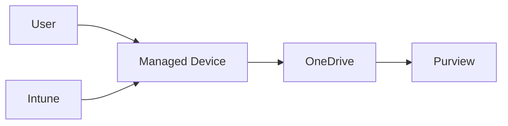

# OneDrive

## Executive Summary

OneDrive provides personal work file storage, synchronization and sharing in Microsoft 365.

In enterprise design, OneDrive should be governed as part of the collaboration and data protection architecture. It affects external sharing, device sync, retention, DLP, migration and Copilot readiness.

For regulated collaboration boundaries, OneDrive should also be reviewed with Microsoft Purview Information Barriers. Segment-based policies can affect file sharing, direct link access and search behavior when users belong to separated business groups.

## 한국어 요약

OneDrive는 개인 업무 파일 저장소이지만 enterprise architecture에서는 data protection과 collaboration governance의 일부로 설계해야 합니다.

Known Folder Move, sync restriction, external sharing, retention, DLP, user departure process, Copilot readiness까지 함께 고려해야 합니다.

## Business Scenario

- Replace local user folders and personal network drives
- Enable secure file access from managed devices
- Support known folder move for Windows users
- Govern external sharing and sensitive files
- Prepare personal work content for Copilot

## Architecture

## Implementation

1. Configure sharing policy and sync restrictions.
2. Enable known folder move where appropriate.
3. Apply retention and DLP controls.
4. Define migration approach for personal drives.
5. Pilot with representative user groups.
6. Monitor sync health and support issues.

## Security

- Restrict sync to managed devices if required.
- Review anonymous and external sharing.
- Apply sensitivity labels and DLP.
- Validate Information Barriers behavior for Segment-based sharing restrictions where required.
- Use retention for user departure scenarios.
- Monitor risky sharing and oversharing.

## Decision Checklist

| Decision | Recommended Question |
|---|---|
| Sync policy | Can users sync to unmanaged or personal devices? |
| Sharing | Which external sharing options are allowed? |
| Information Barriers | Are any users restricted from sharing with other business Segments? |
| Migration | Which personal drives or local folders move to OneDrive? |
| Retention | What happens to OneDrive data after user departure? |
| Copilot readiness | Which personal work files need cleanup or labeling? |

## Delivery Artifacts

- OneDrive governance policy
- Known Folder Move rollout plan
- Sync and sharing configuration matrix
- OneDrive migration plan
- Retention and user departure procedure
- Copilot data readiness checklist

## Customer Success Pattern

| Industry | Scenario | Pattern |
|---|---|---|
| Manufacturing | Personal drive modernization | Known Folder Move and managed device sync policy |
| Finance | Sensitive user files | DLP, retention and restricted external sharing |
| Retail | Distributed workforce | OneDrive adoption with support and sync health monitoring |

## Lessons Learned

OneDrive rollout succeeds when users understand what belongs in OneDrive versus Teams or SharePoint. Clear information architecture reduces support tickets.

## 검색 키워드

- OneDrive enterprise governance
- OneDrive Known Folder Move
- OneDrive external sharing
- OneDrive DLP retention
- Copilot data readiness
- OneDrive 거버넌스
