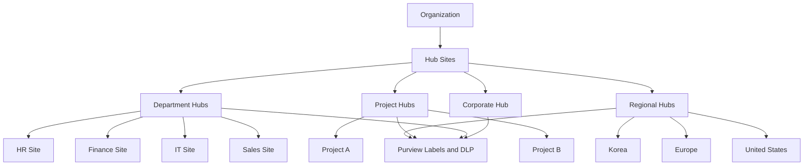
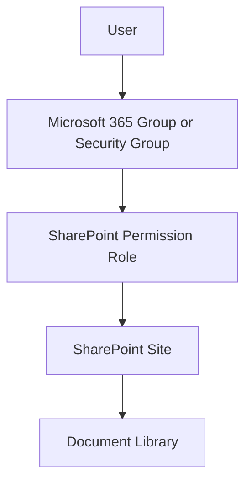
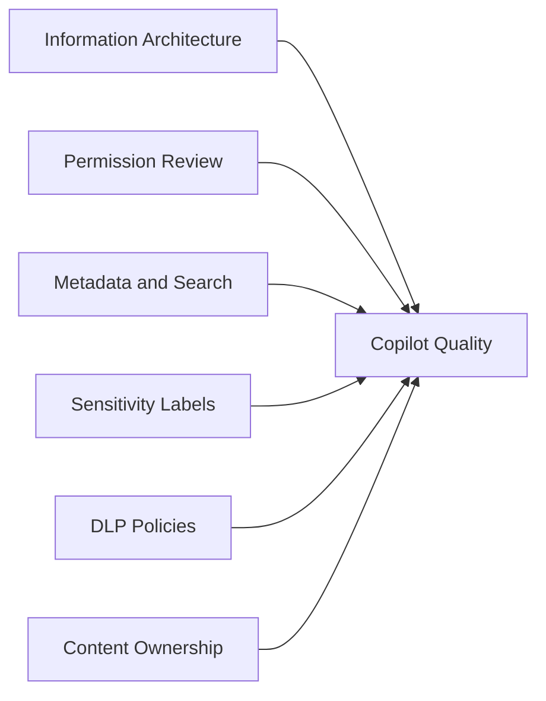
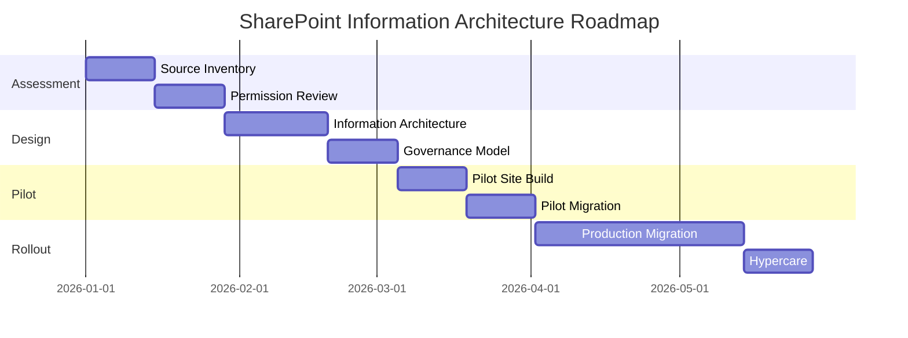

---
id: sharepoint
title: SharePoint Information Architecture Framework
sidebar_label: SharePoint
---

# SharePoint Information Architecture Framework

## Executive Summary

SharePoint Online should not be positioned as a simple file server replacement.

A successful SharePoint implementation requires a well-designed information architecture, governance model, permission strategy, lifecycle policy and data protection framework.

This framework provides a practical approach for designing SharePoint Online as an enterprise content and knowledge platform.

---

## Business Scenario

Typical SharePoint initiatives include:

- File server or NAS modernization
- Department document management
- Intranet implementation
- Project collaboration
- Enterprise knowledge management
- Microsoft 365 Copilot readiness
- Information protection and DLP implementation
- Global collaboration standardization

---

## Reference Architecture



---

## Design Principles

| Principle | Description |
|---|---|
| Business Ownership | Each site must have an accountable business owner |
| Governed Provisioning | Sites should be created through a defined process |
| Least Privilege | Permissions should be granted based on business need |
| Metadata First | Use metadata to improve search and lifecycle management |
| Security by Design | Apply sensitivity labels and DLP where required |
| Lifecycle Management | Sites and content must be reviewed, archived or deleted |

---

## Site Architecture Model

### Hub Sites

Hub Sites should be used to organize related sites and provide:

- Common navigation
- Search scope
- Branding
- Governance alignment
- Logical grouping

Recommended hub models:

| Hub Type | Purpose |
|---|---|
| Corporate Hub | Company-wide information and policies |
| Department Hub | Department collaboration and knowledge |
| Project Hub | Program and project collaboration |
| Regional Hub | Country or regional operations |
| Community Hub | Practice communities and knowledge sharing |

---

## Department Site Model

Department sites should be used for long-term business ownership.

Recommended structure:

```text
Department Hub
├── Policies
├── Procedures
├── Templates
├── Working Documents
├── Reports
└── Archive
```

Design considerations:

- Define site owner and backup owner
- Define member groups
- Define external sharing policy
- Apply sensitivity label where required
- Apply retention policy where required

---

## Project Site Model

Project sites should be used for temporary collaboration.

Recommended structure:

```text
Project Site
├── 01_Project Management
├── 02_Working Documents
├── 03_Deliverables
├── 04_Meeting Notes
├── 05_Risks and Issues
└── 99_Archive
```

Design considerations:

- Define project owner
- Define project end date
- Define archive policy
- Define external participant policy
- Review site after project closure

---

## Permission Architecture

Recommended model:



Avoid assigning permissions directly to individual users unless there is a documented business reason.

---

## Permission Roles

| Role | Recommended Usage |
|---|---|
| Owner | Site administration and permission management |
| Member | Content contribution |
| Visitor | Read-only access |
| Restricted Access | Sensitive libraries or controlled content |
| External Guest | Partner or vendor collaboration |

---

## External Sharing Strategy

External sharing should be controlled based on sensitivity.

| Content Type | Recommended Sharing |
|---|---|
| Public content | External sharing allowed where approved |
| Internal documents | Internal only |
| Customer documents | Selected external users |
| Financial documents | Internal only or restricted |
| Executive documents | Restricted access |
| Regulated data | External sharing disabled unless approved |

---

## Information Architecture

Information architecture should define:

- Site hierarchy
- Navigation
- Document libraries
- Metadata
- Content types
- Naming standards
- Search experience
- Retention strategy

### Recommended Metadata

| Metadata | Purpose |
|---|---|
| Department | Ownership and filtering |
| Region | Regional search and governance |
| Document Type | Classification and lifecycle |
| Confidentiality | Security and DLP |
| Owner | Accountability |
| Retention Category | Lifecycle management |

---

## Document Library Strategy

Recommended library types:

| Library | Purpose |
|---|---|
| Working Documents | Active collaboration |
| Policies | Controlled official documents |
| Templates | Standard forms and reusable assets |
| Reports | Periodic business reporting |
| Archive | Closed or historical content |

---

## Naming Convention

Recommended naming examples:

| Site Type | Naming Example |
|---|---|
| Department | HR-Global |
| Region | Region-Korea |
| Project | PRJ-Copilot-Adoption |
| Community | CoP-Security-Champions |
| Archive | ARCH-Finance-2025 |

---

## Purview Integration

SharePoint should be integrated with Microsoft Purview for:

- Sensitivity labels
- Data Loss Prevention
- Retention policies
- Audit
- eDiscovery
- Insider risk investigation

Recommended label model:

| Label | Example |
|---|---|
| Public | Marketing material |
| Internal | Internal working document |
| Confidential | Customer or financial data |
| Highly Confidential | Executive, legal, M&A, R&D |

---

## Copilot Readiness

SharePoint is one of the most important readiness areas for Microsoft 365 Copilot.

Before enabling Copilot, review:

- Overshared sites
- Anonymous links
- External sharing
- Sensitive libraries
- Site ownership
- Stale content
- Metadata quality
- Search quality
- Permission inheritance breaks

Copilot readiness architecture:



---

## Migration Considerations

When migrating from file server or NAS to SharePoint, avoid a direct lift-and-shift approach.

Recommended approach:

| Step | Description |
|---|---|
| Inventory | Identify source folders, owners and data volume |
| Rationalization | Remove obsolete or duplicate content |
| IA Design | Define target site and library structure |
| Permission Review | Redesign permissions where needed |
| Pilot Migration | Validate mapping and user experience |
| Production Migration | Execute wave-based migration |
| Hypercare | Support users and resolve issues |

---

## Governance Operating Model

| Role | Responsibility |
|---|---|
| Business Owner | Content ownership and access approval |
| Site Owner | Site operation and membership review |
| M365 Admin | Platform configuration |
| Security Team | External sharing and access risk |
| Compliance Team | Retention, DLP and labels |
| Help Desk | User support |

---

## KPI Framework

| KPI | Purpose |
|---|---|
| Ownerless Sites | Governance risk |
| External Sharing Links | Data exposure risk |
| Anonymous Links | High-risk sharing |
| Inactive Sites | Lifecycle risk |
| Sensitive Data Locations | Compliance risk |
| Permission Review Completion | Governance maturity |
| Copilot Ready Sites | AI readiness |

---

## Risk Register

| Risk | Impact | Mitigation |
|---|---|---|
| Direct file server lift-and-shift | Poor search and governance | Redesign information architecture |
| Excessive permissions | Oversharing risk | Permission review |
| Anonymous links enabled | Data leakage | Restrict sharing policy |
| No site owners | Operational risk | Assign primary and secondary owners |
| No metadata | Poor search experience | Define metadata standards |
| Stale content | Poor Copilot responses | Archive or delete obsolete content |

---

## Implementation Roadmap



---

## Deliverables

SharePoint architecture engagement should produce:

- Current State Assessment
- Source Inventory
- Information Architecture Design
- Permission Model
- Metadata Model
- Governance Model
- Migration Plan
- Risk Register
- Copilot Readiness Summary

---

## References

- Microsoft Learn
- SharePoint Online Documentation
- Microsoft Purview Documentation
- Microsoft 365 Copilot Documentation
- Microsoft Cloud Adoption Framework