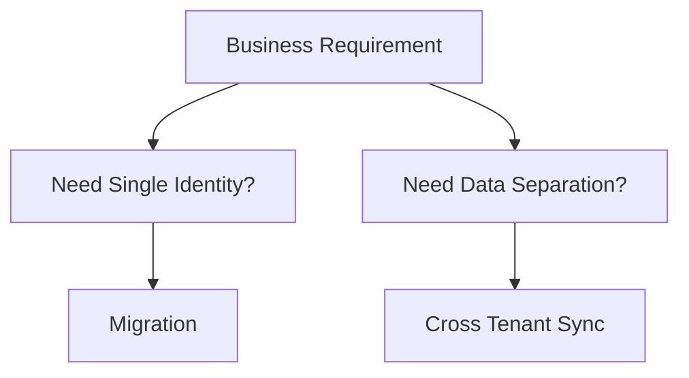

# Cross-Tenant Synchronization vs Full Tenant Migration

## Executive Summary

Organizations frequently face the challenge of integrating multiple Microsoft 365 tenants after mergers, acquisitions, divestitures, regional compliance requirements, or operating model changes.

There are two primary approaches:

1. Cross-Tenant Synchronization
2. Full Tenant Migration

Selecting the wrong strategy can create significant operational, security, compliance, and user experience challenges.

This document provides a decision framework used in enterprise Microsoft 365 transformation projects.

---

# Typical Business Scenarios

## Merger & Acquisition

Examples:

- Subsidiary acquisition
- Business integration
- Organizational restructuring

---

## Regional Compliance

Examples:

- GDPR
- German BDSG
- Local Data Residency

---

## Divestiture

Examples:

- Business spin-off
- Company separation

---

## Global Operating Model

Examples:

- HQ and Regional Tenant
- Shared Services Model
- Multi-Tenant Governance

---

# Decision Framework

---

# Option 1

# Cross-Tenant Synchronization

## Overview

Cross-Tenant Synchronization synchronizes users between Microsoft Entra tenants.

Users remain in their original tenant.

Data remains in its original tenant.

---

## Architecture

---

# Benefits

## Low Complexity

No mailbox migration.

No SharePoint migration.

No Teams migration.

---

## Lower Risk

Business disruption minimized.

---

## Faster Deployment

Days to weeks.

---

## Compliance Friendly

Regional data remains local.

---

# Limitations

## Data Remains Separate

Mailboxes stay in source tenant.

SharePoint remains separate.

Teams remains separate.

---

## User Experience

Multiple tenant context.

Potential collaboration complexity.

---

## Administration

Multiple tenants remain.

Multiple governance models remain.

---

# Recommended Use Cases

| Scenario | Recommendation |
|----------|---------------|
| GDPR Separation | Strong Fit |
| Germany Data Residency | Strong Fit |
| Regional Autonomy | Strong Fit |
| Temporary Integration | Strong Fit |
| M&A Due Diligence Phase | Strong Fit |

---

# Option 2

# Full Tenant Migration

## Overview

Users and workloads are migrated into a target tenant.

The source tenant is eventually decommissioned.

---

## Architecture

---

# Migration Scope

## Identity

- User Accounts
- Groups
- Entra Objects

---

## Exchange Online

- Mailboxes
- Archives
- Shared Mailboxes

---

## SharePoint Online

- Sites
- Permissions
- Metadata

---

## OneDrive

- User Data
- Sharing Links

---

## Teams

- Channels
- Membership
- Files

---

# Benefits

## Single Tenant

Centralized administration.

---

## Better User Experience

Single sign-in experience.

---

## Governance Simplification

Single security framework.

---

## Copilot Readiness

Optimal architecture for Microsoft 365 Copilot.

---

# Challenges

## Complexity

Migration planning required.

---

## Cost

Migration tooling required.

---

## Downtime Risk

Business impact possible.

---

## Change Management

User communication required.

---

# Recommended Use Cases

| Scenario | Recommendation |
|----------|---------------|
| Long-Term Integration | Strong Fit |
| Shared Security Model | Strong Fit |
| Copilot Rollout | Strong Fit |
| Centralized IT | Strong Fit |
| Unified Governance | Strong Fit |

---

# Comparison Matrix

| Area | Cross-Tenant Sync | Full Migration |
|--------|--------|--------|
| Deployment Speed | Fast | Moderate |
| Risk | Low | Medium |
| Cost | Low | Medium-High |
| Governance | Distributed | Centralized |
| User Experience | Multi-Tenant | Single Tenant |
| Compliance Flexibility | High | Medium |
| Copilot Readiness | Moderate | High |
| Operational Complexity | Medium | Low (Post Migration) |

---

# Exchange Online Considerations

## Cross-Tenant Sync

Mailbox remains in source tenant.

Users collaborate through B2B relationship.

---

## Migration

Mailbox moved to target tenant.

Single mailbox strategy.

---

# SharePoint Considerations

## Cross-Tenant Sync

Separate content repositories.

Separate search indexes.

Separate permissions.

---

## Migration

Unified content repository.

Unified governance.

Unified Copilot access model.

---

# Microsoft Teams Considerations

## Cross-Tenant Sync

Users switch tenant context.

---

## Migration

Single Teams experience.

---

# Copilot Considerations

## Cross-Tenant Sync

Challenges:

- Separate Graph boundaries
- Separate SharePoint repositories
- Separate Search Indexes
- Separate Governance

---

## Migration

Benefits:

- Unified Graph
- Unified Search
- Unified Security
- Unified Knowledge Base

---

# Security Considerations

## Cross-Tenant Sync

Benefits:

- Data Segmentation
- Regional Compliance

Risks:

- Governance Duplication
- Multiple Policy Sets

---

## Migration

Benefits:

- Single Security Model
- Simplified Compliance

Risks:

- Larger Blast Radius
- More Complex Initial Project

---

# GDPR and Data Residency

Cross-Tenant Sync is frequently preferred when:

- Data must remain within specific countries.
- Regional legal entities require autonomy.
- Separate DPO governance exists.

---

# Recommended Migration Methodology

## Phase 1

Assessment

Activities:

- Tenant Discovery
- Identity Review
- Data Assessment

---

## Phase 2

Target Operating Model

Activities:

- Governance Design
- Security Design
- Compliance Design

---

## Phase 3

Pilot

Activities:

- Pilot Users
- Pilot Mailboxes
- Pilot Teams

---

## Phase 4

Migration

Activities:

- Exchange
- SharePoint
- OneDrive
- Teams

---

## Phase 5

Hypercare

Activities:

- User Support
- Monitoring
- Issue Resolution

---

# Real World Recommendation

## Choose Cross-Tenant Sync When

- Regional compliance is primary.
- Business entities remain independent.
- Data residency is mandatory.
- Temporary coexistence is expected.

---

## Choose Full Migration When

- Long-term integration is required.
- Unified governance is required.
- Microsoft 365 Copilot deployment is planned.
- Centralized security is required.

---

# Deliverables

- Tenant Assessment
- Migration Readiness Assessment
- Governance Framework
- Security Architecture
- Migration Strategy
- User Communication Plan
- Hypercare Plan

---

# Related Documents

- Migration Architecture
- Microsoft 365 Architecture
- Security Architecture
- Copilot Readiness
- Global Secure Access