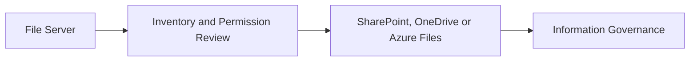

# File Server Migration

## Executive Summary

File server migration moves legacy shared folders into modern collaboration platforms such as SharePoint, OneDrive or Azure Files.

The biggest risk is not the copy operation. The biggest risk is moving unmanaged folder structures, stale permissions and unclear ownership into a modern platform without governance.

## Business Scenario

- Retire on-premises file servers
- Improve remote work and collaboration
- Prepare content for Microsoft 365 Copilot
- Reduce storage and backup complexity
- Standardize permissions and lifecycle management

## Architecture

## Implementation

1. Inventory shares, size, file types and owners.
2. Identify stale, duplicate and restricted data.
3. Map target locations by business function.
4. Review permissions and external sharing requirements.
5. Run pilot migration and validate access.
6. Execute migration waves with freeze and rollback plan.
7. Decommission legacy shares after acceptance.

## Security

- Remove orphaned permissions before migration.
- Avoid copying inherited access blindly.
- Use sensitivity labels where required.
- Validate external sharing settings.
- Keep rollback and read-only archive plans.

## Lessons Learned

File server migration is an information architecture project. Customers get better outcomes when folder cleanup and ownership decisions happen before migration waves.
