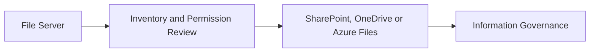

# File Server Migration

## Executive Summary

File server migration moves legacy shared folders into modern collaboration platforms such as SharePoint, OneDrive or Azure Files.

The biggest risk is not the copy operation. The biggest risk is moving unmanaged folder structures, stale permissions and unclear ownership into a modern platform without governance.

## 한국어 요약

File Server Migration은 파일 복사 작업이 아니라 information architecture와 permission governance 작업입니다.

부서별 owner, stale data, duplicate files, sensitive data, inherited permission을 정리하지 않으면 SharePoint와 OneDrive에서도 동일한 혼란이 반복됩니다.

## Business Scenario

- Retire on-premises file servers
- Improve remote work and collaboration
- Prepare content for Microsoft 365 Copilot
- Reduce storage and backup complexity
- Standardize permissions and lifecycle management

## Architecture

## Implementation

1. Inventory shares, size, file types and owners.
2. Identify stale, duplicate and restricted data.
3. Map target locations by business function.
4. Review permissions and external sharing requirements.
5. Run pilot migration and validate access.
6. Execute migration waves with freeze and rollback plan.
7. Decommission legacy shares after acceptance.

## Security

- Remove orphaned permissions before migration.
- Avoid copying inherited access blindly.
- Use sensitivity labels where required.
- Validate external sharing settings.
- Keep rollback and read-only archive plans.

## Decision Checklist

| Decision | Recommended Question |
|---|---|
| Target platform | Should each share move to SharePoint, OneDrive or Azure Files? |
| Ownership | Who owns each folder or business content area? |
| Cleanup | Which stale, duplicate or restricted content should not migrate? |
| Permissions | Which permissions are redesigned instead of copied? |
| Cutover | What freeze, rollback and user communication plan is required? |

## Delivery Artifacts

- File server inventory report
- Share-to-target mapping workbook
- Permission cleanup plan
- Migration wave plan
- Cutover and rollback runbook
- Post-migration validation checklist

## Customer Success Pattern

| Industry | Scenario | Pattern |
|---|---|---|
| Manufacturing | Department file shares | Business owner mapping and phased SharePoint migration |
| Finance | Sensitive file migration | Permission redesign and DLP readiness before cutover |
| Retail | Distributed user folders | OneDrive migration and user communication plan |

## Lessons Learned

File server migration is an information architecture project. Customers get better outcomes when folder cleanup and ownership decisions happen before migration waves.

## 검색 키워드

- file server migration
- SharePoint migration
- OneDrive migration
- Azure Files migration
- file share permission cleanup
- 파일 서버 마이그레이션
