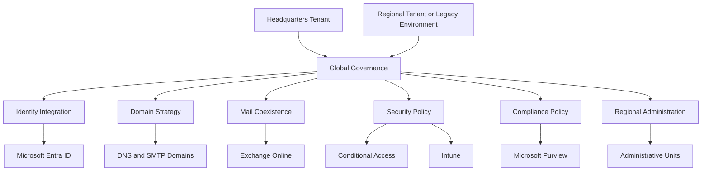
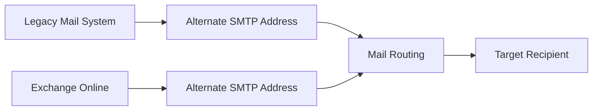
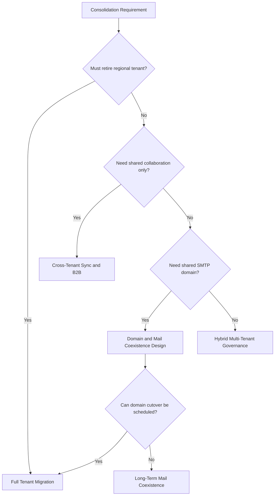

# Global Tenant Consolidation Framework

## Executive Summary

Global tenant consolidation is not only a migration project.

It requires coordinated design across identity, domain, mail coexistence, security policy, compliance policy, data protection, regional administration and user communication.

A successful tenant consolidation program should define whether the organization needs full migration, long-term coexistence or a hybrid multi-tenant operating model.

---

## Business Scenario

Typical scenarios include:

- Headquarters and regional subsidiaries using separate Microsoft 365 tenants
- Acquired companies requiring integration with the parent company
- Legacy mail systems coexisting with Exchange Online
- Shared SMTP domain or subdomain routing requirements
- Regional security and compliance policy differences
- Data protection and sensitivity label migration requirements
- Global governance standardization

---

## Consolidation Scope

| Area | Key Considerations |
|---|---|
| Domain | Domain transfer, subdomain routing, DNS, MX, SPF, DKIM, DMARC |
| Identity | UPN, source identity, target identity, guest access, admin delegation |
| Mail | Mail coexistence, forwarding, contacts, mail flow validation |
| Collaboration | Teams, SharePoint, OneDrive, guest access, external sharing |
| Security | Conditional Access, Intune, Defender, download restriction |
| Compliance | Purview, sensitivity labels, DLP, retention, audit |
| Administration | Administrative Units, regional admin delegation |
| User Impact | Sign-in, Outlook, Teams, mobile, communication, hypercare |

---

## Target Architecture

---

## Mail Coexistence Strategy

Mail coexistence must be designed before domain migration.

This is especially important when:

- Headquarters uses a legacy mail platform
- Regional subsidiaries use Exchange Online
- Multiple tenants share similar SMTP domains
- Users must communicate across mail systems during transition

### Common Pattern

### Design Elements

| Element | Description |
|---|---|
| Primary SMTP | Main user email address |
| Alternate SMTP | Routing address for coexistence |
| Mail Contact | Object used to route to external or legacy mailbox |
| Forwarding | Mail redirection between systems |
| Accepted Domain | Domain registered in Microsoft 365 tenant |
| Connector | Mail flow control between systems |

---

## Shared Domain Strategy

When two environments need to share or transition the same SMTP domain, additional routing design is required.

### Key Design Options

| Option | Description |
|---|---|
| Subdomain Routing | Use subdomains such as m365.company.com or notes.company.com |
| Alternate Address | Assign additional routing addresses per user |
| Mail Contact Routing | Create contacts to route messages to the other system |
| Forwarding-Based Coexistence | Configure forwarding from source mailbox to target mailbox |
| Full Domain Cutover | Remove domain from source and add to target tenant |

---

## Domain Transfer Impact

Domain transfer is a high-impact activity.

### Potential Impact

| Area | Impact |
|---|---|
| User Sign-in | UPN and login address may change |
| Mail Flow | Inbound and outbound mail routing may change |
| Teams | Tenant identity and collaboration may be affected |
| Guest Access | Existing guest invitations may need to be recreated |
| Mobile | Mail profiles may need reconfiguration |
| Outlook | Outlook profile may need recreation or reconnection |

### Controls

- Lower DNS TTL before cutover
- Freeze domain and proxy address changes
- Validate all users, aliases and contacts
- Prepare domain removal checklist
- Prepare rollback plan
- Validate mail flow immediately after cutover

---

## Legacy Mail and Exchange Online Coexistence

### Scenario

Headquarters uses a legacy mail platform while regional users use Exchange Online.

### Recommended Approach

| Requirement | Recommendation |
|---|---|
| Mail delivery between systems | Configure alternate SMTP routing |
| Legacy user visibility in M365 | Create mail contacts or mail users |
| Exchange Online user visibility in legacy mail | Create equivalent routing objects |
| Migration wave support | Use forwarding and staged validation |
| Cutover readiness | Validate mail flow both directions |

---

## Identity and Guest Access Impact

After tenant consolidation, users may no longer use the original regional tenant identity.

### Impact Areas

- Guest access to external tenants
- Teams membership
- Shared channels
- External collaboration
- Application access
- MFA registration
- Conditional Access policy scope

### Recommendation

Create an identity transition plan that includes:

- Source identity mapping
- Target identity assignment
- Guest re-invitation plan
- MFA re-registration guidance
- Application access validation

---

## Teams and Collaboration Impact

Tenant consolidation can affect Teams collaboration.

### Key Considerations

| Area | Consideration |
|---|---|
| Teams Membership | Membership must be validated after migration |
| Chat History | Migration capability depends on tooling |
| Private Channels | Requires special validation |
| Shared Channels | Cross-tenant collaboration must be reviewed |
| Meeting Links | Existing links may need communication |
| Guest Users | Guests may need to be re-invited |

---

## Purview and Sensitivity Label Migration

Sensitivity labels and protected documents require special planning.

### Key Considerations

- Existing labels may be tenant-specific
- Encrypted documents may not be readable after migration without proper handling
- Label policies must be recreated or mapped in the target tenant
- Protected files may require decryption or relabeling before migration
- DLP and retention policies must be reviewed in the target tenant

### Recommended Approach

| Step | Activity |
|---|---|
| 1 | Inventory sensitivity labels and protected content |
| 2 | Identify encrypted or restricted documents |
| 3 | Define label mapping between source and target tenant |
| 4 | Validate sample document access after migration |
| 5 | Reapply target tenant label policy |
| 6 | Validate user access and compliance controls |

---

## Regional Policy Separation

A single Microsoft 365 tenant can support regional policy differences.

However, policy separation should generally be designed by group, not by domain alone.

### Group-Based Policy Model

| Policy Area | Separation Method |
|---|---|
| Conditional Access | User or group assignment |
| Intune | User group or device group |
| Sensitivity Label Policy | User or group targeting |
| DLP | Policy scope and conditions |
| Defender | Device group or user scope |
| SharePoint Access | Site, group and CA policy |

---

## Administrative Units

Administrative Units can provide limited regional administration.

### Use Cases

- Regional password reset
- Regional user management
- Limited help desk delegation
- Regional device support
- Location-based administrative scope

### Limitations

Administrative Units do not provide complete tenant-level separation.

They are suitable for delegated administration but not for full regional autonomy.

---

## Download Restriction and SharePoint Limited Access

Download restriction can be implemented through Conditional Access and SharePoint limited access controls.

### Example Access Model

| User Type | Access Model |
|---|---|
| Guest User | Browser-only access |
| Internal Employee | Download allowed based on policy |
| Regional Employee | Group-based exception |
| Privileged User | Download and offline access allowed |
| Unmanaged Device | Browser-only or block download |

---

## Consolidation Decision Framework

---

## Consolidation Readiness Checklist

| Category | Checklist |
|---|---|
| Domain | Domain ownership, DNS access, MX, SPF, DKIM, DMARC confirmed |
| Identity | User mapping, UPN, guest access, MFA, admin roles reviewed |
| Mail | Coexistence, forwarding, contacts, connectors, mail flow tested |
| Teams | Membership, guest access, shared channels, meeting impact reviewed |
| SharePoint | Permissions, external sharing, download restriction reviewed |
| Purview | Labels, DLP, retention, encrypted documents reviewed |
| Security | CA, Intune, Defender policy scope reviewed |
| Admin | Administrative Units and delegated admin model reviewed |
| Communication | User impact and support plan prepared |
| Hypercare | Support channel, escalation and daily issue reporting defined |

---

## Risk Register

| ID | Risk | Impact | Mitigation |
|---|---|---|---|
| R-001 | Domain removal delay | Mail cutover delay | Pre-check domain dependencies |
| R-002 | Incorrect routing address | Mail delivery failure | Validate alternate SMTP routing |
| R-003 | Guest access loss | Collaboration disruption | Prepare guest re-invitation plan |
| R-004 | Encrypted document migration issue | Data access failure | Validate sensitivity label and encryption handling |
| R-005 | Regional policy conflict | User access issue | Use group-based policy targeting |
| R-006 | Admin delegation misunderstanding | Operational gap | Define Administrative Unit limitations |
| R-007 | Download policy misconfiguration | Data leakage or access issue | Validate CA and SharePoint limited access policy |

---

## Recommended Deliverables

A global tenant consolidation engagement should produce:

- Current Tenant Landscape
- Domain and Mail Coexistence Design
- Identity Mapping Plan
- Security Policy Mapping
- Purview and Sensitivity Label Review
- Regional Policy Design
- Administrative Unit Design
- Migration or Coexistence Roadmap
- Cutover Runbook
- User Communication Plan
- Hypercare Plan

---

## Executive Recommendation

Do not start with migration tooling.

Start with the operating model decision.

The organization should first decide whether the target state is:

1. One tenant with unified governance
2. Multiple tenants with cross-tenant collaboration
3. Hybrid coexistence with phased migration

Only after this decision should the technical migration approach be finalized.

---

## References

- Microsoft 365 Tenant Migration Guidance
- Microsoft Entra Cross-Tenant Synchronization
- Microsoft Entra Administrative Units
- Microsoft Exchange Online Mail Flow
- Microsoft Purview Information Protection
- Microsoft Conditional Access