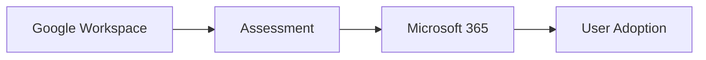

# Google Workspace Migration

## Executive Summary

Google Workspace migration moves mail, calendar, contacts, Drive content and collaboration workflows into Microsoft 365.

The program should be planned as identity, data, collaboration and change management workstreams. A mail-only view misses user behavior, file ownership and coexistence complexity.

## 한국어 요약

Google Workspace Migration은 Gmail만 Exchange Online으로 옮기는 작업이 아닙니다.

Identity, domain, alias, group, calendar, Drive ownership, shared drive, external collaborator, user adoption을 함께 설계해야 Microsoft 365 전환 리스크를 줄일 수 있습니다.

## Business Scenario

- Consolidate collaboration platforms
- Move from Gmail and Drive to Exchange Online, Teams, SharePoint and OneDrive
- Standardize identity and security controls
- Prepare Microsoft 365 Copilot adoption
- Reduce duplicate licensing and administration

## Architecture

## Implementation

1. Assess users, aliases, groups, mail routing and Drive ownership.
2. Design identity and coexistence model.
3. Prepare Exchange Online, SharePoint, OneDrive and Teams.
4. Run pilot migration for representative users.
5. Plan communication, training and support.
6. Execute migration waves.
7. Validate mail flow, calendars, permissions and file access.

## Security

- Review third-party app access before migration.
- Map Google groups to Microsoft 365 groups carefully.
- Validate sharing links and external collaborators.
- Apply Conditional Access and device compliance after migration readiness.

## Decision Checklist

| Decision | Recommended Question |
|---|---|
| Coexistence | Is coexistence required or will users cut over by wave? |
| Identity mapping | How are users, aliases, groups and domains mapped? |
| Drive ownership | Who owns shared drives and orphaned content? |
| Calendar | Which room, resource and shared calendar scenarios are in scope? |
| Adoption | How will users learn Outlook, Teams, SharePoint and OneDrive workflows? |

## Delivery Artifacts

- Google Workspace assessment report
- User, alias and group mapping workbook
- Gmail and calendar migration plan
- Drive and shared drive mapping plan
- Cutover communication template
- Hypercare support model

## Customer Success Pattern

| Industry | Scenario | Pattern |
|---|---|---|
| Retail | Gmail and Drive consolidation | Department wave plan and shared drive owner validation |
| Technology | Google to Microsoft 365 transition | Coexistence, user mapping and Teams adoption support |
| Manufacturing | Global collaboration standardization | Regional champions and file ownership cleanup |

## Lessons Learned

Drive ownership and shared drive structure often create more complexity than mailbox migration. Early inventory and business owner validation reduce cutover surprises.

## 검색 키워드

- Google Workspace migration
- Gmail to Exchange Online
- Google Drive to SharePoint migration
- Google Workspace to Microsoft 365
- tenant migration planning
- Google Workspace 마이그레이션
