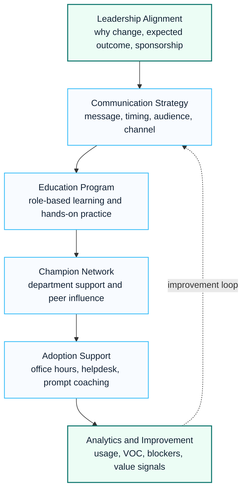
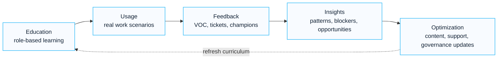

# Enterprise Change Management Playbook

## Executive Summary

Technology deployment does not guarantee business adoption.

Successful transformation requires structured change management that aligns leadership, communication, education, support and continuous improvement.

This playbook provides a framework for driving user adoption and realizing business value from Microsoft 365, Copilot, Security and Digital Workplace initiatives.

---

## Change Management Framework

---

## Objectives

The program should achieve:

- User awareness
- User engagement
- Behavioral change
- Productivity improvement
- Business outcome realization
- Sustainable adoption

---

## Stakeholder Model

| Stakeholder | Responsibility |
|---|---|
| Executive Sponsor | Strategic direction and sponsorship |
| Steering Committee | Governance and decision making |
| IT Team | Platform delivery |
| Business Leaders | Department adoption |
| Champions | Local advocacy |
| End Users | Adoption and feedback |

---

## Executive Sponsorship

Executive support is the strongest predictor of adoption success.

Key activities:

- Executive announcements
- Leadership communication
- Adoption KPI review
- Success story sharing
- Department accountability

---

## Communication Strategy

### Phase 1 – Awareness

Objectives:

- Explain why change is required
- Communicate business value
- Set expectations

Channels:

- Town Hall
- Leadership email
- Intranet
- Video messages

---

### Phase 2 – Adoption

Objectives:

- Encourage usage
- Promote success stories
- Increase confidence

Channels:

- Weekly newsletters
- Use case campaigns
- Community channels
- Department briefings

---

### Phase 3 – Optimization

Objectives:

- Reinforce behaviors
- Expand advanced use cases
- Improve business outcomes

Channels:

- Monthly updates
- Executive dashboards
- Champion meetings

---

## Education Framework

### Executive Education

Topics:

- Business value
- Strategic use cases
- Governance
- KPI interpretation

Duration:

- 1~2 hours

---

### End User Education

Topics:

- Daily productivity scenarios
- Collaboration workflows
- Best practices
- Responsible usage

Duration:

- 2~4 hours

---

### Advanced User Education

Topics:

- Department-specific use cases
- Automation opportunities
- Workflow redesign

Duration:

- 1~2 days

---

## Champion Network

### Objectives

- Accelerate adoption
- Provide local support
- Collect feedback
- Promote best practices

---

### Recommended Scale

| User Population | Champion Target |
|---|---|
| 500 | 10-20 |
| 1,000 | 20-40 |
| 5,000 | 50-100 |
| 10,000+ | 100-200 |

---

### Champion Responsibilities

- Peer support
- Use case creation
- Community participation
- Feedback collection
- Adoption advocacy

---

## Adoption Support Model

### Level 1

User Support

Examples:

- How-to questions
- Training requests
- Usage guidance

---

### Level 2

Champion Support

Examples:

- Department use cases
- Workflow consultation
- Adoption coaching

---

### Level 3

Expert Support

Examples:

- Technical escalation
- Security concerns
- Governance decisions

---

## Office Hours Program

Recommended sessions:

| Session | Purpose |
|---|---|
| Prompt Clinic | Improve prompt quality |
| Use Case Workshop | Develop business scenarios |
| Technical Q&A | Resolve technical issues |
| Executive Advisory | Leadership coaching |
| Community Forum | Knowledge sharing |

---

## Adoption Analytics

Track:

### Adoption

- Active users
- Weekly usage
- Monthly usage

### Engagement

- Feature utilization
- Training attendance
- Champion participation

### Business Outcomes

- Time savings
- Process improvements
- User satisfaction

---

## KPI Framework

| Category | KPI |
|---|---|
| Awareness | Communication reach |
| Adoption | Active users |
| Education | Training completion |
| Support | Ticket volume |
| Engagement | Community participation |
| Business Value | Use case realization |

---

## Continuous Improvement Model

---

## Common Risks

| Risk | Impact | Mitigation |
|---|---|---|
| Weak sponsorship | Low adoption | Executive engagement |
| Poor communication | User resistance | Communication plan |
| Insufficient training | Low productivity | Structured education |
| No champions | Slow adoption | Champion network |
| No KPI tracking | Unclear ROI | Adoption analytics |

---

## Deliverables

| Deliverable | Description |
|---|---|
| Change Management Strategy | Overall adoption framework |
| Communication Plan | Stakeholder communications |
| Education Plan | Training roadmap |
| Champion Program | Champion operating model |
| Adoption Dashboard | KPI measurement |
| Support Model | Office Hours and Help Desk |
| Continuous Improvement Plan | Long-term optimization |

---

## Lessons Learned

- Technology deployment is only the beginning
- Leadership behavior influences adoption
- Champions accelerate change significantly
- Continuous education is required
- Analytics should drive optimization
- Business outcomes matter more than usage metrics

---

## References

- Microsoft Adoption Framework
- Microsoft Change Management Guidance
- Microsoft Copilot Adoption Framework
- Microsoft Learn
- Prosci Change Management Methodology

## 검색 키워드

- Microsoft 365 playbook
- Copilot readiness playbook
- security modernization playbook
- tenant migration playbook
- change management playbook
- Microsoft 365 구축 방법론
- Copilot 도입 방법론

## Contact / Asset Request

For editable playbooks, delivery checklists, workshop agendas, risk registers or handover templates, use [Contact and Asset Request](../contact).
