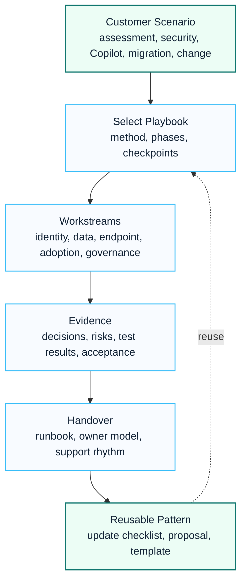

# Playbooks

The Playbooks section provides repeatable delivery guidance for Microsoft 365 assessment, Copilot readiness, Intune deployment, security modernization, tenant-to-tenant migration and change management.

Playbooks are designed to bridge consulting strategy and real execution. They define workstreams, checkpoints, deliverables, risks and handover expectations.

## Visual Playbook System

## 한국어 요약

Playbooks는 전략 문서를 실제 delivery workstream으로 바꾸기 위한 실행 가이드입니다.

assessment, readiness, implementation, migration, adoption, handover 단계에서 무엇을 확인하고 어떤 산출물을 만들어야 하는지 정리하여 프로젝트 품질을 일정하게 유지하는 데 목적이 있습니다.

## Playbook Categories

| Playbook | Purpose |
|---|---|
| M365 Assessment | evaluate tenant, identity, security, collaboration and operational readiness |
| Copilot Readiness | prepare data, security, adoption, license and use case readiness |
| Intune Deployment | plan enrollment, compliance, platform policy and support model |
| Security Modernization | organize Zero Trust, Defender, Purview and access control workstreams |
| Tenant-to-Tenant Migration | structure discovery, coexistence, migration factory and cutover |
| Change Management | align communication, champions, training and adoption measurement |

## How To Use

1. Select the playbook that matches the customer scenario.
2. Use the discovery and readiness steps to confirm scope.
3. Convert playbook workstreams into WBS activities.
4. Track risks, decisions and dependencies during delivery.
5. Use handover outputs to support operational transition.

## Playbook Operating Model

| Operating Step | Description |
|---|---|
| Select | Match the customer scenario to the right playbook and confirm the scope boundary. |
| Assess | Capture current state, risks, dependencies and stakeholder expectations. |
| Design | Convert requirements into architecture decisions, policy settings and delivery workstreams. |
| Execute | Run implementation, migration or adoption activities with checkpoints and evidence. |
| Handover | Transfer ownership, documentation and operating rhythm to the customer team. |

## When To Use Each Playbook

- Use **M365 Assessment** before major licensing, security or migration decisions.
- Use **Copilot Readiness** before purchasing or expanding Microsoft 365 Copilot.
- Use **Intune Deployment** when device compliance, app protection or endpoint policy is unclear.
- Use **Security Modernization** when identity, endpoint, data and email controls must be redesigned together.
- Use **Tenant-to-Tenant Migration** when domains, identities, mailboxes, Teams and SharePoint must move in coordinated waves.
- Use **Change Management** when adoption risk is as important as technical readiness.

## Recommended Reading

- [M365 Assessment Playbook](./m365-assessment-playbook)
- [Copilot Readiness Playbook](./copilot-readiness-playbook)
- [Intune Deployment Playbook](./intune-deployment-playbook)
- [Security Modernization Playbook](./security-modernization-playbook)
- [Tenant-to-Tenant Migration Playbook](./tenant-to-tenant-migration-playbook)
- [Change Management Playbook](./change-management-playbook)

## Field-Informed Patterns

- Copilot adoption WBS and executive review rhythm
- Exchange Online migration pre-assessment and cutover plan
- Intune and Entra ID implementation policy workbook
- security committee evidence pack
- migration hypercare and operations handover

## 검색 키워드

- Microsoft 365 playbook
- Copilot readiness playbook
- Intune deployment playbook
- security modernization
- tenant migration playbook
- change management Microsoft 365
- Microsoft 365 구축 방법론
- Copilot 도입 방법론
