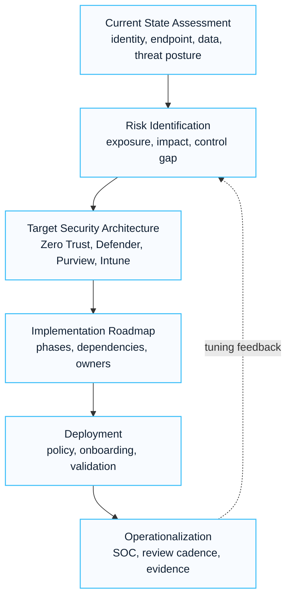

# Security Modernization Playbook

## Executive Summary

Security modernization is not a product deployment initiative.

The objective is to establish a Zero Trust security architecture that continuously protects identities, devices, applications, data and business processes.

This playbook provides a structured framework for assessing, designing and implementing Microsoft security capabilities across the enterprise.

---

## Program Objectives

The program should achieve:

- Identity protection
- Device protection
- Data protection
- Threat detection
- Incident response readiness
- Regulatory compliance
- Security operations maturity

---

## Modernization Framework

---

## Assessment Scope

### Identity Security

Review:

- Entra ID
- MFA
- Conditional Access
- Identity Protection
- PIM
- Access Reviews

### Endpoint Security

Review:

- Intune
- Defender for Endpoint
- Compliance Policies
- Device Management
- Patch Management

### Email Security

Review:

- Exchange Online Protection
- Defender for Office 365
- Anti-Phishing
- Safe Links
- Safe Attachments

### Data Protection

Review:

- Microsoft Purview
- Sensitivity Labels
- DLP
- Retention
- Insider Risk

### Security Operations

Review:

- Defender XDR
- Microsoft Sentinel
- Incident Response
- Threat Hunting
- SOC Maturity

---

## Security Maturity Model

| Level | Description |
|---------|-------------|
| Level 1 | Basic Security |
| Level 2 | Managed Security |
| Level 3 | Standardized Security |
| Level 4 | Optimized Security |
| Level 5 | Zero Trust Mature |

---

## Recommended Implementation Sequence

### Phase 1

Identity Security Foundation

- MFA
- Conditional Access
- Legacy Authentication Block
- PIM

---

### Phase 2

Endpoint Security

- Intune Enrollment
- Compliance Policies
- Defender for Endpoint

---

### Phase 3

Email Protection

- Defender for Office 365
- Safe Links
- Safe Attachments

---

### Phase 4

Data Protection

- Sensitivity Labels
- DLP
- Retention Policies

---

### Phase 5

Security Operations

- Defender XDR
- Sentinel
- Incident Management

---

## Zero Trust Model

Core principles:

### Verify Explicitly

Always authenticate and authorize.

### Use Least Privilege

Minimize permissions.

### Assume Breach

Design assuming compromise will occur.

---

## Deliverables

| Deliverable | Description |
|---|---|
| Current State Assessment | Security review |
| Security Gap Analysis | Risk identification |
| Target Architecture | Future-state design |
| Security Roadmap | Prioritized implementation plan |
| Risk Register | Identified risks |
| Governance Framework | Security operating model |
| Executive Report | Strategic recommendations |

---

## KPI Framework

| Area | KPI |
|---|---|
| Identity | MFA coverage |
| Endpoint | Managed device percentage |
| Email | Phishing detection rate |
| Data | Labeled data percentage |
| Security Operations | Mean Time To Detect |
| Compliance | Policy compliance score |

---

## Common Risks

| Risk | Impact | Mitigation |
|---|---|---|
| Weak identity controls | Account compromise | MFA and CA |
| Unmanaged devices | Data leakage | Intune |
| Poor email protection | Phishing attacks | MDO |
| No data classification | Compliance gaps | Purview |
| No monitoring | Delayed detection | Sentinel |

---

## Lessons Learned

- Identity is the first security boundary
- Security transformation should be phased
- DLP requires business engagement
- Endpoint compliance significantly reduces risk
- Security operations require process as well as technology
- Executive sponsorship accelerates security adoption

---

## References

- Microsoft Zero Trust Framework
- Microsoft Security Adoption Framework
- Microsoft Defender Documentation
- Microsoft Purview Documentation
- Microsoft Learn

## 검색 키워드

- Microsoft 365 playbook
- Copilot readiness playbook
- security modernization playbook
- tenant migration playbook
- change management playbook
- Microsoft 365 구축 방법론
- Copilot 도입 방법론

## Contact / Asset Request

For editable playbooks, delivery checklists, workshop agendas, risk registers or handover templates, use [Contact and Asset Request](../contact).
