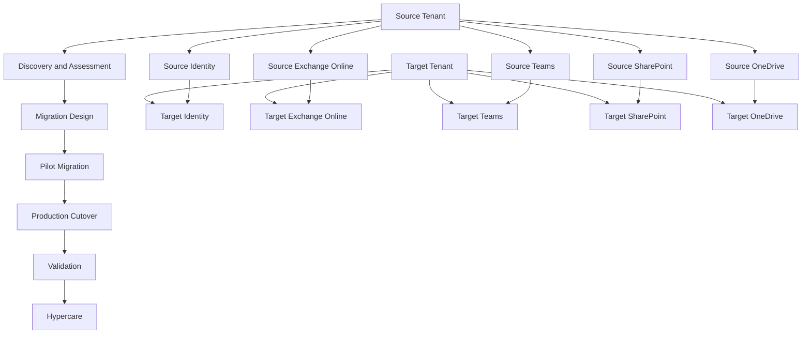
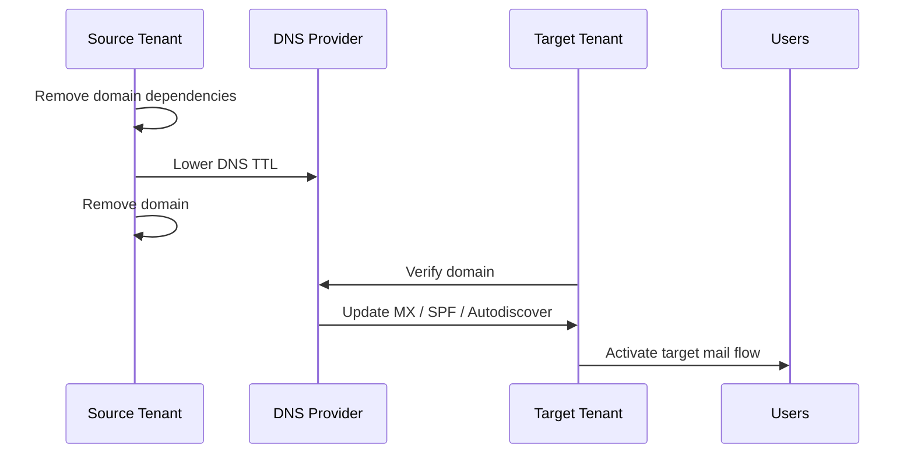

# Tenant-to-Tenant Migration Playbook

## Executive Summary

Tenant-to-tenant migration is not a simple data transfer project.

It requires coordinated planning across identity, domain, mail flow, Teams, SharePoint, OneDrive, security, compliance, user communication and business cutover.

This playbook provides a structured delivery model for Microsoft 365 tenant migration programs.

---

## Migration Scope

Typical tenant-to-tenant migration scope includes:

- User accounts
- Mailboxes
- Shared mailboxes
- Distribution groups
- Microsoft Teams
- SharePoint sites
- OneDrive data
- Domains and aliases
- Security policies
- Compliance policies
- User communication and support

---

## Migration Architecture

---

## Migration Lifecycle

---

## Phase 1. Discovery

### Objectives

- Understand the source tenant environment
- Identify migration scope
- Validate business requirements
- Identify dependencies and risks
- Define stakeholder and communication model

### Discovery Areas

| Area | Key Questions |
|---|---|
| Tenant | How many tenants are involved? |
| Users | How many users and mailboxes are in scope? |
| Domains | Which domains and aliases are used? |
| Mail | Are there hybrid or mail relay dependencies? |
| Teams | Are Teams, channels and chats in scope? |
| SharePoint | How many sites and how much data? |
| OneDrive | How many users and how much data? |
| Security | Are policies required in target tenant? |
| Compliance | Are retention, DLP or audit requirements present? |

---

## Phase 2. Assessment

### Assessment Checklist

| Workload | Assessment Item |
|---|---|
| Identity | User mapping, guest users, admin roles |
| Exchange | Mailbox size, shared mailboxes, mail flow |
| Teams | Teams inventory, owners, guests, channels |
| SharePoint | Site inventory, permissions, external sharing |
| OneDrive | Storage size, sharing links, ownership |
| Domain | MX, SPF, DKIM, DMARC, aliases |
| Security | CA, Defender, DLP, labels |
| Operations | Help desk, escalation, communication |

---

## Phase 3. Migration Design

### Design Components

- Migration strategy
- Identity mapping
- Domain strategy
- Mail flow strategy
- Coexistence strategy
- Data migration sequence
- Pilot scope
- Cutover plan
- Rollback plan
- Hypercare model

### Recommended Design Outputs

| Output | Description |
|---|---|
| Migration Architecture | Source and target tenant design |
| User Mapping | Source to target identity mapping |
| Domain Plan | Domain release and verification plan |
| Cutover Runbook | Step-by-step cutover procedure |
| Rollback Plan | Recovery and fallback approach |
| Communication Plan | User and executive communication |

---

## Identity Migration

### Key Considerations

- Source user principal name
- Target user principal name
- Immutable ID dependencies
- Guest users
- Admin accounts
- MFA state
- Conditional Access
- Licensing assignment

### Recommended Approach

| Area | Recommendation |
|---|---|
| User Mapping | Freeze mapping before pilot |
| Admin Accounts | Separate admin accounts from user migration |
| MFA | Revalidate after target tenant sign-in |
| Guest Users | Reinvite or recreate where needed |
| Licensing | Assign before workload validation |

---

## Domain Migration

### Key Considerations

- Domain removal from source tenant
- Domain verification in target tenant
- MX record update
- Autodiscover
- SPF, DKIM, DMARC
- Alias continuity
- SMTP relay dependencies

### Domain Cutover Sequence

---

## Exchange Online Migration

### Scope Items

- User mailboxes
- Shared mailboxes
- Resource mailboxes
- Distribution groups
- Mail contacts
- Mail flow rules
- SMTP relay
- Mobile access
- Outlook profile impact

### Validation Checklist

| Item | Validation |
|---|---|
| Mailbox Access | User can access mailbox |
| Mail Flow | Internal and external mail flow works |
| Calendar | Calendar data visible |
| Shared Mailbox | Delegation works |
| Mobile | Mobile profile reconfigured |
| Outlook | Outlook profile recreated or reconnected |

---

## Teams Migration

### Scope Items

- Teams
- Channels
- Membership
- Owners
- Guest users
- Files
- Tabs and apps
- Meeting policies

### Key Risks

| Risk | Mitigation |
|---|---|
| Chat history limitations | Confirm migration tool capability |
| Private channel complexity | Validate during pilot |
| Guest user mismatch | Reinvite or remap guests |
| App and tab limitations | Document unsupported items |

---

## SharePoint Migration

### Scope Items

- Site collections
- Libraries
- Lists
- Permissions
- Metadata
- Sharing links
- Version history
- Retention requirements

### Validation Checklist

| Item | Validation |
|---|---|
| Site Access | Owners and members can access |
| Permissions | Permission model is preserved |
| Files | Files and folders migrated |
| Metadata | Metadata preserved where required |
| Sharing | External sharing reviewed |
| Search | Content searchable after indexing |

---

## OneDrive Migration

### Scope Items

- User OneDrive data
- Folder structure
- Sharing links
- Ownership
- Deleted user data
- Large file constraints

### Validation Checklist

| Item | Validation |
|---|---|
| User Access | User can access OneDrive |
| Data Count | File and folder count validated |
| Sharing | Sharing links reviewed |
| Sync | OneDrive sync works |
| Ownership | Ownership mapped correctly |

---

## Security and Compliance Migration

### Assessment Areas

- Conditional Access
- MFA
- Defender policies
- DLP policies
- Sensitivity labels
- Retention policies
- Audit settings
- eDiscovery requirements

### Recommendation

Security and compliance policies should not be blindly copied.

They should be reviewed, rationalized and redesigned for the target tenant operating model.

---

## Pilot Migration

### Pilot Objectives

- Validate migration tools
- Test cutover process
- Identify user impact
- Confirm support readiness
- Validate rollback assumptions

### Recommended Pilot Scope

| User Group | Purpose |
|---|---|
| IT Users | Technical validation |
| Business Champions | Business process validation |
| Executive Assistant | Executive calendar and mailbox validation |
| Security Team | Policy and access validation |

---

## Production Cutover

### Cutover Preparation

- Final user mapping confirmed
- Communication sent
- Migration tool ready
- DNS access confirmed
- Support team staffed
- Rollback plan approved
- Executive contacts identified

### Cutover Activities

| Step | Activity |
|---|---|
| 1 | Stop source changes |
| 2 | Final delta migration |
| 3 | Domain removal from source |
| 4 | Domain verification in target |
| 5 | DNS update |
| 6 | Mail flow validation |
| 7 | User access validation |
| 8 | Executive confirmation |

---

## Hypercare

### Hypercare Scope

- Mailbox access issues
- Outlook profile issues
- Mobile access issues
- Teams access issues
- SharePoint permission issues
- OneDrive sync issues
- External sharing issues
- Executive support

### Hypercare Reporting

| Report | Frequency |
|---|---|
| Issue Summary | Daily |
| Executive Status | Daily or as required |
| Risk Register | Daily |
| User Impact Report | Daily |
| Closure Report | End of hypercare |

---

## Risk Register

| ID | Risk | Impact | Mitigation |
|---|---|---|---|
| R-001 | Domain release delay | Mail cutover delay | Pre-check domain dependencies |
| R-002 | User mapping mismatch | Access failure | Freeze mapping before pilot |
| R-003 | Teams migration limitation | User experience impact | Validate tool capability |
| R-004 | Permission mismatch | Data access issue | Pilot and permission review |
| R-005 | Executive disruption | Business escalation | Dedicated executive migration wave |
| R-006 | DNS update issue | Mail flow impact | Lower TTL and prepare rollback |

---

## Communication Plan

### Communication Audiences

- Executive sponsors
- IT administrators
- End users
- Help desk
- Security and compliance teams
- External partners

### Communication Timeline

| Timing | Communication |
|---|---|
| T-4 weeks | Project announcement |
| T-2 weeks | Migration preparation guide |
| T-1 week | User impact notice |
| T-1 day | Final reminder |
| Cutover day | Support channel notice |
| T+1 day | Known issue and support guide |

---

## Deliverables

Tenant migration projects should produce:

- Discovery Report
- Migration Assessment
- User Mapping
- Domain Migration Plan
- Workload Migration Plan
- Cutover Runbook
- Rollback Plan
- Communication Plan
- Hypercare Report
- Final Closure Report

---

## Success Criteria

The migration is considered successful when:

- Target tenant sign-in works
- Mail flow is operational
- Required data is migrated
- Executive users are validated
- Critical business workloads are operational
- Hypercare issues are within acceptable threshold
- Customer accepts migration closure

---

## Advanced Tenant Consolidation Considerations

### Mail Coexistence with Legacy Mail Systems

Tenant consolidation may require mail coexistence when the headquarters and regional entities use different mail platforms.

Typical scenarios include:

- Legacy mail platform and Exchange Online coexistence
- Multiple Microsoft 365 tenants
- Shared SMTP domain
- Regional mail domain transition
- Staged mailbox migration

#### Recommended Design

| Area | Recommendation |
|---|---|
| Primary SMTP | Preserve user-facing address where possible |
| Alternate SMTP | Use routing address for coexistence |
| Mail Contacts | Represent users from the other system |
| Forwarding | Configure temporary forwarding where required |
| Mail Flow | Validate both inbound and outbound routing |
| Cutover | Prepare rollback and validation checklist |

---

### Shared Domain and Subdomain Routing

When the same email domain must be shared or transitioned between environments, routing design must be completed before migration.

Recommended options:

| Option | Use Case |
|---|---|
| Subdomain routing | Long-term coexistence or phased transition |
| Alternate address routing | User-level coexistence |
| Mail contact routing | Represent non-migrated users |
| Full domain cutover | Final consolidation into target tenant |

---

### Domain Transfer Impact

Moving a domain from one tenant to another can affect:

- User sign-in
- Mail reception
- Teams identity
- Guest access
- External collaboration
- Mobile mail profile
- Outlook profile

#### Required Controls

- Lower DNS TTL before cutover
- Freeze proxy address changes
- Validate all aliases
- Prepare domain removal checklist
- Prepare target tenant verification
- Validate MX, SPF, DKIM and DMARC
- Communicate user sign-in impact
- Prepare rollback plan

---

### Purview and Sensitivity Label Migration

If documents are protected by Microsoft Purview Information Protection, migration requires additional planning.

Key considerations:

| Area | Consideration |
|---|---|
| Sensitivity Labels | Source tenant labels may not directly map to target tenant labels |
| Encryption | Encrypted files may require decryption or relabeling |
| DLP | Target tenant DLP policies must be reviewed |
| Retention | Retention policies may need redesign |
| Access Validation | Sample protected documents must be tested after migration |

#### Recommended Approach

1. Inventory sensitivity labels and protected files.
2. Identify encrypted or restricted documents.
3. Define source-to-target label mapping.
4. Validate sample migration.
5. Reapply target tenant labels where required.
6. Confirm user access after migration.

---

### Regional Policy Separation in a Single Tenant

A single Microsoft 365 tenant can still support different policies by region or business unit.

The recommended design is **group-based policy assignment**, not domain-based policy assignment.

| Policy Area | Recommended Scope |
|---|---|
| Conditional Access | User or security group |
| Intune | User group or device group |
| Defender | User, device or policy group |
| DLP | User, group or workload scope |
| Sensitivity Labels | Label policy assignment |
| SharePoint Download Restriction | Conditional Access group exception |

---

### Administrative Units for Regional Delegation

Microsoft Entra Administrative Units can provide limited regional administration.

Use cases:

- Regional password reset
- Regional user management
- Help desk delegation
- Limited device administration

Important limitation:

Administrative Units do not provide full tenant-level separation. They should be used for scoped delegation, not as a replacement for tenant isolation.

---

### Download Restriction and SharePoint Limited Access

Download restrictions can be implemented using Conditional Access and SharePoint limited access controls.

Example model:

| User Type | Access Model |
|---|---|
| Guest user | Browser-only access |
| Internal employee | Download allowed based on policy |
| Regional employee | Group-based exception |
| Unmanaged device | Browser-only or download blocked |
| Privileged user | Download and offline access allowed |

---

### Tenant Consolidation Readiness Checklist

Before executing tenant consolidation, validate:

- Domain ownership
- DNS control
- SMTP proxy addresses
- Mail coexistence routing
- User identity mapping
- Guest access impact
- Teams collaboration impact
- Purview label and encryption impact
- Conditional Access policy scope
- Regional policy exceptions
- Administrative Unit requirements
- User communication plan
- Hypercare support model

## References

- Microsoft Learn
- Microsoft Exchange Online Migration Guidance
- Microsoft SharePoint Migration Guidance
- Microsoft Teams Migration Considerations
- Microsoft Entra Documentation

## Global Tenant Consolidation Considerations

### Mail Coexistence Strategy

테넌트 통합 프로젝트에서는 데이터 마이그레이션보다 메일 공존(Coexistence) 설계가 선행되어야 한다.

특히 아래와 같은 환경에서는 메일 흐름 설계가 필수적이다.

- Notes + Exchange Online
- Google Workspace + Exchange Online
- Multiple Exchange Online Tenants
- Shared SMTP Domain Environment

#### Key Design Principles

- Primary SMTP 유지
- Alternate SMTP 설계
- Mail Forwarding 구성
- Mail Contact 활용
- Mail Routing 검증

---

### Shared Domain Migration

동일 SMTP Domain을 사용하는 경우 다음 절차를 수행한다.

#### Current State

Tenant A

user@company.com

#### Target State

Tenant B

user@company.com

#### Migration Procedure

1. Source Tenant Domain 제거
2. Target Tenant Domain 추가
3. User SMTP Reassignment
4. Mail Flow Validation
5. Teams Federation Validation

#### Risks

- Mail Delivery Failure
- Teams Chat Failure
- Guest Access Loss
- Login UPN Change

---

### Teams Identity Impact

Tenant Consolidation 이후

다음 데이터는 자동 유지되지 않는다.

#### User Impact

- Teams Chat History
- Teams Membership
- Private Channel Membership
- Shared Channel Membership
- Guest Invitations

#### Recommendation

Cross Tenant Sync를 우선 검토하고

Full Migration은 Business Requirement 검증 후 수행한다.

---

### Sensitivity Label Migration

Microsoft Purview Information Protection 적용 환경에서는

문서 마이그레이션 이전에 정책 검토가 필요하다.

#### Considerations

- Label Mapping
- Encryption Removal
- Rights Migration
- Label Reassignment

#### Risk

암호화된 문서는
단순 Migration Tool로 이동 불가

별도 검증 필요

---

### Regional Security Policy

Single Tenant에서도 국가별 정책 분리가 가능하다.

#### Supported Controls

- Conditional Access
- Intune Policy
- DLP
- Sensitivity Labels
- Defender Policies
- SharePoint Access Control

#### Design Principle

정책은 Domain 기반이 아닌

Group 기반으로 설계한다.

---

### Administrative Units

글로벌 운영 조직의 경우

Administrative Units를 사용하여

지역별 관리자 권한을 분리한다.

#### Example

Korea Admin

- Password Reset
- User Management

Myanmar Admin

- Password Reset
- Device Management

HQ Admin

- Global Administrator

---

### Download Restriction Model

Conditional Access 기반

SharePoint Limited Access 정책을 활용한다.

#### Typical Scenario

Guest User

- Browser Only

Employee

- Download Allowed

Privileged User

- Download Allowed
- Offline Access Allowed

Regional User

- Group Based Exception

---

### Migration Readiness Checklist

Before Migration

- Domain Ownership Review
- SMTP Routing Validation
- Mail Coexistence Design
- Teams Impact Assessment
- Guest Access Assessment
- Sensitivity Label Review
- Conditional Access Review
- Administrative Unit Design
- Data Migration Validation
- User Communication Plan