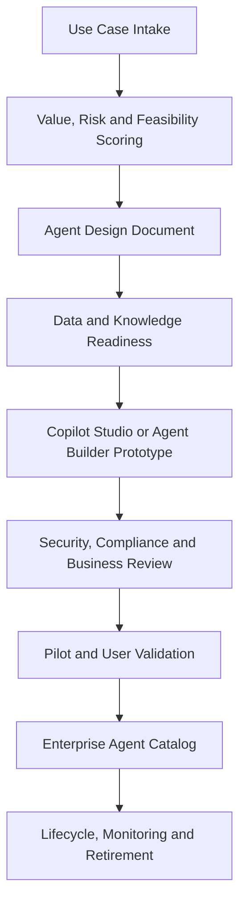

# Enterprise AI Agent Factory Case Study

This anonymized case study summarizes an enterprise AI Agent and Copilot Studio enablement pattern. Customer names, internal project names, source file names, commercial terms and confidential architecture details are intentionally excluded.

## Business Context

A large enterprise organization wanted to move beyond generic Copilot training and identify practical AI Agent opportunities across business functions.

The working patterns included research reporting, pricing analysis, HR data inquiry, market intelligence, ESG and risk review, proposal support and internal knowledge search.

The objective was to convert scattered AI ideas into a governed Agent portfolio with clear ownership, data boundaries, pilot criteria and reusable delivery assets.

## 한국어 요약

이 사례는 Copilot Studio와 AI Agent를 활용해 현업 업무 자동화 후보를 발굴하고, Agent Factory 운영 모델로 정리하는 익명화된 customer success pattern입니다.

고객명과 내부 프로젝트명은 공개하지 않고, 제조/소재/상사/대기업 그룹사에서 반복적으로 나타나는 Agent use case와 governance pattern만 정리합니다.

## Key Challenges

- AI Agent ideas existed across multiple departments but were not prioritized consistently.
- Business users needed examples that connected Copilot Studio with real work, not only product features.
- Some agent candidates required sensitive business data, approval workflow or human review.
- Agent prototypes needed lifecycle governance before broader rollout.
- Executives needed a portfolio view showing value, risk, readiness and delivery sequence.

## Agent Opportunity Patterns

| Business Area | Anonymized Agent Pattern | Expected Value |
|---|---|---|
| Research and R&D | Portfolio review and report drafting Agent | Reduce manual report preparation and improve review consistency |
| Marketing and market intelligence | Market sensing and keyword monitoring Agent | Support faster market trend analysis and executive briefing |
| Pricing and commercial operations | Pricing analysis Agent using market, freight and FX inputs | Improve pricing review speed and decision traceability |
| HR and corporate operations | HR data inquiry and policy Q&A Agent | Reduce repetitive internal inquiries and improve employee experience |
| ESG and risk management | Greenwashing and compliance risk review Agent | Improve evidence-based risk review and governance |
| Proposal and presales | Proposal, SOW and executive summary drafting Agent | Accelerate proposal production while keeping review control |

## Agent Factory Architecture

## Delivery Approach

1. Collect candidate Agent ideas from business teams and existing proposal or prototype materials.
2. Normalize the ideas into a common use case intake format.
3. Score each candidate by business value, data readiness, risk, complexity and reusability.
4. Separate knowledge-only Agents from action-capable Agents.
5. Define ownership, source data, permission boundary and human review point.
6. Build a small number of pilot Agents using Copilot Studio or Agent Builder.
7. Establish Agent Factory governance before expanding the portfolio.

## Governance Model

| Governance Area | Recommended Control |
|---|---|
| Ownership | Assign both business owner and technical owner for each Agent |
| Data access | Validate knowledge sources, permissions, DLP and sensitivity labels |
| Approval | Require review before publishing department or enterprise Agents |
| Human oversight | Define which outputs require review before business action |
| Monitoring | Track usage, failure patterns, user feedback and business value |
| Lifecycle | Review, update, retire or consolidate Agents periodically |

## Reusable Deliverables

- AI Agent opportunity assessment
- Agent use case intake template
- Agent prioritization matrix
- Copilot Studio pilot plan
- Agent design document
- Agent governance and approval model
- Enterprise Agent catalog
- Agent Factory operating model
- Executive AI Agent roadmap

## Success Metrics

| Metric Area | Example Measure |
|---|---|
| Portfolio | number of Agent candidates collected, prioritized and approved |
| Readiness | data sources validated, owners assigned, risk items closed |
| Adoption | pilot users, feedback score, repeated usage |
| Productivity | report drafting time reduction, inquiry deflection, review cycle improvement |
| Governance | Agents with owner, approval, monitoring and retirement plan |
| Quality | human review findings, incorrect response rate, escalation count |

## Lessons Learned

- Agent programs need a portfolio model before broad creation is allowed.
- The best first Agents are narrow, high-frequency and measurable.
- Data readiness and permission design matter more than prompt quality alone.
- Action-capable Agents require stronger approval and audit controls than Q&A Agents.
- Agent Factory governance prevents duplicate Agents and unmanaged automation sprawl.

## 검색 키워드

- Copilot Studio Agent case study
- AI Agent Factory
- Enterprise AI Agent governance
- Copilot Studio use case
- Agent prioritization matrix
- Multi-Agent operating model
- Copilot Studio 고객 사례
- AI Agent 도입 사례
- Agent Factory 운영 모델

## Related Documents

- [Copilot Studio](../copilot/copilot-studio)
- [Agentic AI Architecture](../copilot/agentic-ai-architecture)
- [Agent Factory Operating Model](../copilot/agent-factory-operating-model)
- [Multi-Agent Framework](../copilot/multi-agent-framework)
- [Customer Success Reference Patterns](./customer-success-reference-patterns)
