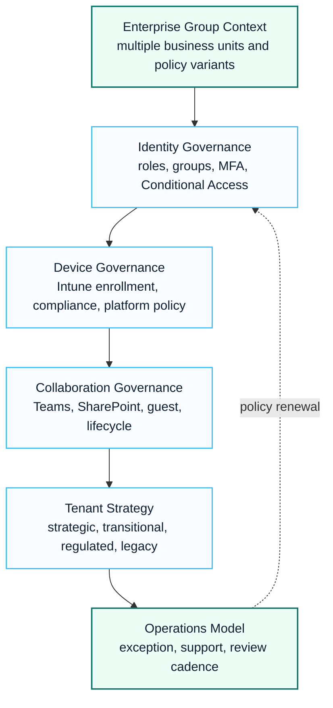

# Enterprise Group Governance Case Study

This anonymized case study summarizes an enterprise group pattern involving Entra ID, Intune, Microsoft 365 governance and multi-tenant operating decisions.

## Visual Governance Pattern

## 한국어 요약

이 사례는 여러 사업부 또는 계열사가 Microsoft 365, Entra ID, Intune, Teams, SharePoint, Defender, Purview를 서로 다른 기준으로 운영하는 상황에서 공통 governance model을 수립한 익명화된 customer success pattern입니다.

고객명과 내부 프로젝트명은 공개하지 않고, 계열사/사업부 환경에서 반복적으로 발생하는 identity, device, collaboration, tenant strategy, exception process, operations handover 패턴만 정리합니다.

## Business Context

An enterprise group needed consistent identity, device and collaboration governance across multiple business units. The environment required clear policy decisions, operating ownership and a roadmap for tenant and workload governance.

## Key Challenges

- Business units had different identity and device standards.
- Intune and Entra ID policies needed consistent design.
- Device compliance and enrollment exceptions needed operational handling.
- Collaboration governance required ownership and lifecycle decisions.
- Multi-tenant decisions needed a business-aligned target model.

## Microsoft Workloads

- Microsoft Entra ID
- Microsoft Intune
- Microsoft 365
- Microsoft Teams
- SharePoint Online
- Microsoft Defender for Endpoint
- Microsoft Purview

## Delivery Approach

| Workstream | Activities | Outputs |
|---|---|---|
| Identity governance | role, group and Conditional Access review | identity policy matrix |
| Device governance | enrollment, compliance and platform policy design | Intune policy workbook |
| Collaboration governance | Teams, SharePoint, guest and lifecycle rules | workspace governance model |
| Tenant strategy | tenant role, consolidation and coexistence decisions | multi-tenant roadmap |
| Operations | exception, support and handover model | operations guide |

## Governance Decision Model

| Decision Area | Standardization Question | Exception Question |
|---|---|---|
| Identity | Which MFA, admin role and Conditional Access controls are mandatory? | Which business units require temporary exceptions and who approves them? |
| Device | Which platforms and compliance policies are supported? | Which unmanaged or legacy devices need compensating controls? |
| Collaboration | Which Teams and SharePoint lifecycle rules apply globally? | Which teams require external sharing or guest access exceptions? |
| Tenant strategy | Which tenant is strategic, transitional, regulated or legacy? | Which workloads must remain isolated for legal or business reasons? |
| Operations | Who owns policy review, support and exception renewal? | How are unresolved exceptions escalated? |

## Reusable Assets

- Entra ID and Intune implementation guide
- device compliance policy matrix
- dynamic group design
- multi-tenant governance roadmap
- Teams and SharePoint lifecycle model
- operations handover checklist

## Success Pattern

The strongest pattern is to document decisions in a policy workbook. Enterprise governance fails when decisions stay informal. A workbook creates traceability across security, operations and business stakeholders.

## Business Outcome

| Outcome | Practical Meaning |
|---|---|
| Consistent baseline | group-wide identity, device and collaboration controls become easier to explain and operate |
| Better exception control | exceptions have owners, expiry dates and compensating controls |
| Reduced operational ambiguity | support teams know which policy applies and where to escalate |
| Executive visibility | tenant strategy and governance roadmap can be reviewed as business decisions |
| Safer expansion | Copilot, AI Agent and collaboration initiatives can build on clearer data and access controls |

## Lessons Learned

- Separate global baseline policy from business-unit exceptions.
- Make exception ownership explicit.
- Use dynamic groups carefully and document membership logic.
- Connect tenant strategy to business ownership, not only technical preference.

## 검색 키워드

- enterprise group governance
- Microsoft 365 governance case study
- Entra ID governance
- Intune policy workbook
- multi-tenant governance
- 계열사 Microsoft 365 governance
- Microsoft 365 운영 모델
- tenant strategy

## Related Documents

- [Multi-Tenant Governance Strategy](./multi-tenant-governance-strategy)
- [Governance Architecture](../architecture/governance-architecture)
- [Microsoft 365 Reference Architecture](../architecture/m365-reference-architecture)
- [Intune Deployment Playbook](../playbooks/intune-deployment-playbook)
