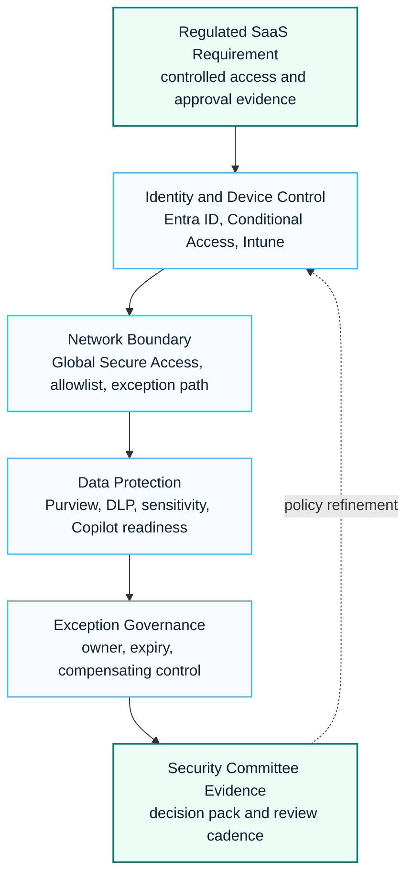

# Financial SaaS Security Case Study

This anonymized case study summarizes a financial-services pattern for Microsoft 365, SaaS access and Zero Trust readiness in a regulated environment.

## Visual Control Pattern

## 한국어 요약

이 사례는 금융권 또는 규제 산업 환경에서 Microsoft 365와 SaaS access를 승인 가능한 보안 구조로 정리한 익명화된 customer success pattern입니다.

핵심은 Conditional Access, device compliance, Defender, Purview, Global Secure Access, exception workflow를 각각의 설정이 아니라 security committee가 검토할 수 있는 evidence-ready architecture로 묶는 것입니다.

## Business Context

A regulated financial organization needed to validate Microsoft 365 and SaaS usage from a controlled network environment. The work required security committee evidence, approval logic and a clear operating model for exceptions.

## Key Challenges

- SaaS access had to satisfy internal network and security requirements.
- Microsoft 365 and Copilot usage needed a data protection baseline.
- Conditional Access, endpoint posture and network controls had to work together.
- Security exceptions required owners, expiry dates and compensating controls.
- Architecture had to be readable by security, infrastructure and business stakeholders.

## Microsoft Workloads

- Microsoft Entra ID
- Conditional Access
- Microsoft Defender XDR
- Microsoft Defender for Office 365
- Microsoft Purview
- Microsoft Intune
- Global Secure Access

## Delivery Approach

| Workstream | Activities | Outputs |
|---|---|---|
| Security baseline | control mapping and policy review | baseline checklist and control matrix |
| Access architecture | identity, device, network and SaaS access design | Zero Trust reference architecture |
| Data protection | Purview, DLP and sensitivity label readiness | data protection plan |
| Exception governance | exception criteria, owner and expiry model | exception register |
| Approval evidence | executive and committee-ready documentation | security review pack |

## Reusable Assets

- SaaS security architecture note
- Conditional Access policy matrix
- Defender and Intune onboarding plan
- Purview and DLP readiness checklist
- risk register and exception workflow
- security committee approval pack

## Executive Summary Pattern

This pattern is best presented as a regulated access modernization program. The business value is the ability to use Microsoft 365 and SaaS capabilities while maintaining approval evidence, exception ownership and security committee visibility.

## Success Pattern

For regulated environments, success depends on evidence-ready governance. Architecture diagrams alone are not enough. The delivery must include control ownership, exception handling and operational review rhythm.

## Success Metrics

| Metric | What To Track |
|---|---|
| Control coverage | identity, endpoint, network, data and SaaS controls mapped to risks |
| Exception hygiene | exceptions with owner, expiry, approval evidence and compensating control |
| Evidence readiness | committee-ready pack prepared before production approval |
| Copilot readiness | oversharing, Purview, DLP and audit posture reviewed before broad AI use |
| Review cadence | recurring security review and policy refinement rhythm established |

## Lessons Learned

- Treat approval evidence as a deliverable from day one.
- Connect identity, endpoint, data and network controls in one architecture.
- Assign owner, expiry date and compensating control to every exception.
- Make the architecture readable for security, infrastructure and business reviewers.

## 검색 키워드

- financial SaaS security
- Microsoft 365 security case study
- Conditional Access architecture
- Global Secure Access
- Microsoft Purview DLP
- Defender XDR
- 금융권 Microsoft 365 보안
- SaaS 보안 승인

## Reference Snapshot

  
<small>CHALLENGE</small><strong>Security assurance pressure</strong>Customer due diligence, identity controls and data protection evidence must be presented clearly.

  
<small>APPROACH</small><strong>Evidence-ready design</strong>Map Conditional Access, Defender, Purview, audit and exception process into an approval-ready story.

  
<small>OUTCOME</small><strong>Faster review cycle</strong>Reusable evidence and governance artifacts reduce repeated security questionnaire effort.

## Related Documents

- [Security Modernization Program](./security-modernization-program)
- [Security Reference Architecture](../architecture/security-reference-architecture)
- [Conditional Access](../security/conditional-access)
- [Zero Trust Framework](../security/zero-trust-framework)
- [Microsoft 365 Security](../search/microsoft-365-security)
- [Contact and Asset Request](../contact)
