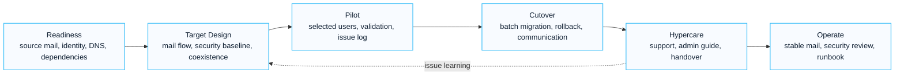

# Logistics Exchange Online Modernization Case Study

This anonymized case study summarizes a logistics-sector Microsoft 365 modernization pattern centered on Exchange Online, security review and operational continuity.

## Visual Modernization Pattern

## 한국어 요약

이 사례는 물류/유통형 조직에서 Exchange Online과 Microsoft 365 collaboration을 현대화하면서 업무 연속성, mail flow, security review, cutover, rollback, hypercare를 함께 설계한 익명화된 customer success pattern입니다.

메일 migration은 데이터 이동만으로 끝나지 않습니다. DNS, firewall, endpoint, user communication, administrator guide, post-cutover support가 함께 준비되어야 안정적인 전환이 가능합니다.

## Business Context

A distributed logistics organization needed to modernize mail and collaboration while minimizing disruption for business users and operations teams.

The project required migration readiness, mail flow validation, security review, administrator guidance and post-cutover support planning.

## Key Challenges

- Mail migration had to preserve business continuity.
- Mail flow, DNS, firewall and endpoint dependencies needed early validation.
- Security configuration had to be reviewed before broad production use.
- Administrators needed practical operating procedures after handover.
- User communication and hypercare were required for adoption stability.

## Microsoft Workloads

- Exchange Online
- Microsoft Defender for Office 365
- Microsoft Teams
- SharePoint Online
- OneDrive for Business
- Microsoft Entra ID

## Delivery Approach

| Phase | Activities | Outputs |
|---|---|---|
| Pre-assessment | source environment, identities, mail flow and dependencies | migration readiness checklist |
| Design | target mail flow, security baseline and cutover approach | migration design document |
| Pilot | pilot users, coexistence and validation | pilot report and issue log |
| Cutover | batch migration, rollback and communication | cutover runbook |
| Hypercare | issue handling, admin guide and handover | operations guide |

## Reusable Assets

- migration pre-assessment checklist
- Exchange Online security review template
- firewall and service dependency checklist
- cutover and rollback runbook
- administrator guide
- hypercare issue tracker

## Executive Summary Pattern

This pattern should be framed as a business continuity modernization effort. The value is not only Exchange Online migration. It is stable mail flow, verified dependencies, user communication, rollback readiness and administrator handover.

## Success Pattern

The most reusable pattern is to pair migration planning with security and operations handover. Migration is not complete when data moves; it is complete when operations can support the new service.

## Success Metrics

| Metric | What To Track |
|---|---|
| Migration readiness | source inventory, DNS, mail flow and dependency checks completed |
| Pilot quality | pilot issues logged, resolved and reflected in cutover planning |
| Cutover control | rollback path, communication plan and validation checklist prepared |
| Security readiness | Exchange Online security review completed before production expansion |
| Handover readiness | administrator guide, support process and hypercare issue tracker delivered |

## Lessons Learned

- Validate mail flow and network dependencies before migration windows.
- Treat cutover, rollback and hypercare as first-class deliverables.
- Include Exchange Online security review before broad production adoption.
- Prepare administrator handover material before project closure.

## 검색 키워드

- Exchange Online migration
- Microsoft 365 modernization
- logistics Exchange Online case study
- mail flow validation
- cutover rollback runbook
- Exchange Online security review
- 물류 Microsoft 365 전환
- Exchange Online 마이그레이션

## Related Documents

- [Migration Overview](../migration/overview)
- [Exchange Online](../microsoft365/exchange-online)
- [Tenant-to-Tenant Migration Playbook](../playbooks/tenant-to-tenant-migration-playbook)
- [Customer Success Reference Patterns](./customer-success-reference-patterns)
- [Contact and Asset Request](../contact)
