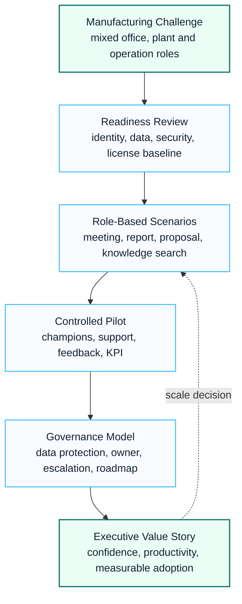

# Manufacturing Copilot Adoption Case Study

This anonymized case study summarizes a manufacturing-sector Copilot adoption pattern. Customer names, internal project names and commercial details are intentionally excluded.

## Visual Success Pattern

## 한국어 요약

이 사례는 제조업 환경에서 Microsoft 365 Copilot을 도입할 때 readiness, security, license value, user enablement, executive reporting을 함께 설계한 익명화된 customer success pattern입니다.

제조 조직은 본사, 현업, 생산/운영 조직의 업무 패턴이 다르기 때문에 단순한 기능 교육보다 role-based use case, data protection, phased pilot, adoption metric이 중요합니다.

## Business Context

A large manufacturing organization wanted to introduce Microsoft 365 Copilot while controlling data exposure, license value, user readiness and executive expectations.

The environment included office workers, distributed business teams, strict governance expectations and a need to connect adoption planning with security readiness.

## Key Challenges

- Copilot value needed to be explained in business scenarios, not only feature demonstrations.
- Security and data readiness had to be reviewed before broad enablement.
- License assignment needed a phased and measurable plan.
- User enablement had to align with business roles and work patterns.
- Executives required a roadmap, WBS, governance model and value tracking approach.

## Microsoft Workloads

- Microsoft 365 Copilot
- Microsoft Teams
- SharePoint Online
- OneDrive for Business
- Microsoft Entra ID
- Microsoft Purview
- Microsoft Defender

## Delivery Approach

| Phase | Activities | Outputs |
|---|---|---|
| Readiness | tenant, identity, data and security review | readiness findings and risk log |
| Use case design | role-based scenario discovery | use case backlog and priority model |
| Pilot planning | pilot group, schedule, support and feedback design | pilot plan and WBS |
| Governance | data protection, policy, owner and escalation model | Copilot operating model |
| Expansion | adoption roadmap and KPI design | executive roadmap and value dashboard |

## Reusable Assets

- Copilot adoption SOW
- adoption WBS and milestone plan
- readiness checklist
- use case prioritization matrix
- executive steering committee pack
- Copilot governance and data protection checklist

## Success Pattern

The strongest pattern is to treat Copilot as a governed adoption program rather than a software rollout. The architecture, security, change management and value tracking workstreams must be connected from the beginning.

## Lessons Learned

- Start with business scenarios, not only Copilot feature demonstrations.
- Review data exposure and oversharing before assigning licenses broadly.
- Use champions and pilot users to refine prompts, use cases and training assets.
- Report value through use case maturity, user confidence and measurable time savings.

## 검색 키워드

- Manufacturing Copilot adoption
- Microsoft 365 Copilot case study
- Copilot readiness
- Copilot adoption WBS
- Copilot governance
- 제조업 Copilot 도입
- Copilot 도입 사례

## Related Documents

- [Copilot Adoption Program](../copilot/adoption-program)
- [Copilot Readiness](../copilot/readiness)
- [Copilot ROI Framework](../copilot/roi-framework)
- [Customer Success Reference Patterns](./customer-success-reference-patterns)
- Start with data and identity readiness before user excitement.
- Use role-based scenarios to make Copilot value concrete.
- Track license value through prioritized use cases and adoption signals.
- Prepare governance before scaling pilots into enterprise deployment.
