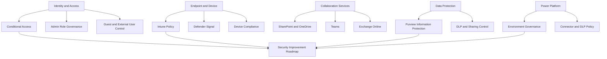

# Retail Microsoft 365 Security Policy Modernization Case Study

## Executive Summary

A retail enterprise needed to review Microsoft 365 security and policy configuration across identity, access, collaboration, endpoint, data protection and Power Platform governance.

The engagement focused on converting Microsoft 365 license capabilities and current-state findings into a practical security improvement backlog, prerequisite roadmap and implementation guidance.

This reference is anonymized. Customer names, domains, user counts, internal department names, commercial terms, internal filenames and customer-specific architecture details are intentionally excluded.

## Korean Summary

유통 업종 고객은 Microsoft 365 환경에서 identity, access, collaboration, endpoint, data protection, Power Platform 정책을 통합적으로 점검해야 했습니다.

핵심은 단순한 보안 기능 목록 정리가 아니라, 보유 license에서 사용 가능한 기능, 현재 활성화 상태, 개선 과제, 선행 요건, 적용 영향도를 하나의 실행 가능한 보안 정책 개선 로드맵으로 정리하는 것이었습니다.

공개 레퍼런스에는 고객명, 실제 사용자 수, 도메인, 내부 부서명, 기존 솔루션명, 세부 일정과 내부 파일명은 포함하지 않습니다.

## Business Challenge

| Challenge | Practical Meaning |
|---|---|
| Microsoft 365 security posture review | identify which security capabilities are available, enabled or underused |
| identity and access governance | review admin roles, guest access, authentication and Conditional Access policy direction |
| collaboration data protection | review SharePoint, OneDrive, Teams and Exchange policy posture |
| endpoint and device governance | define prerequisites for device classification, Intune enrollment and security policy rollout |
| document protection | evaluate Microsoft Purview Information Protection and sensitivity labeling direction |
| Power Platform governance | review environment policy, connector control, DLP policy and lifecycle management |

## Consulting Scope

| Workstream | Scope |
|---|---|
| License and capability review | map Microsoft 365 license families to usable security and management capabilities |
| Current-state assessment | review identity, mail, collaboration, endpoint, data protection and Power Platform policy posture |
| Security improvement backlog | define improvement items by priority, prerequisite and execution owner model |
| Prerequisite roadmap | identify Entra ID join, Intune, device classification, license readiness and change-management requirements |
| Implementation guidance | provide staged guidance for policy configuration, validation and operational handover |

## Reference Architecture View

## Improvement Themes

| Theme | Example Improvements |
|---|---|
| identity and access | admin role review, guest user governance, authentication policy alignment, Conditional Access refinement |
| endpoint management | device classification, Entra ID join strategy, Intune policy rollout, Windows security baseline |
| collaboration governance | SharePoint and OneDrive sharing boundary, Teams policy review, Exchange access and authentication review |
| information protection | sensitivity label design, MIP/Purview adoption path, document protection prerequisites |
| Defender and XDR readiness | endpoint signal, mail protection, operational monitoring and response ownership |
| Power Platform governance | environment separation, connector restriction, DLP policy and lifecycle management |

## Delivery Pattern

| Phase | Key Activities | Output |
|---|---|---|
| Assess | collect current-state data and license capability information | current-state assessment and capability map |
| Analyze | compare current settings against target Microsoft 365 security posture | gap analysis and issue list |
| Prioritize | classify improvements by impact, prerequisite and execution complexity | prioritized security improvement backlog |
| Guide | define implementation approach and operational considerations | configuration guide and roadmap |
| Handover | document validation criteria and operating ownership | handover guide and follow-up action list |

## Prerequisite Planning

Large-scale Microsoft 365 security modernization often depends on prerequisites that must be reviewed before policy deployment.

| Prerequisite | Why It Matters |
|---|---|
| device ownership model | company-owned, shared, field and partner devices may require different policy paths |
| Entra ID join strategy | access control and device identity depend on clear join and registration model |
| Intune readiness | endpoint configuration and compliance policies require enrollment and policy ownership |
| license capability mapping | E3, F3, E5 and add-on differences affect which controls are feasible |
| collaboration ownership | SharePoint, OneDrive, Teams and Exchange policies need service owner agreement |
| data classification model | information protection and DLP require business-approved classification logic |
| change management | endpoint, authentication and document protection changes affect users directly |

## Reusable Deliverables

- Microsoft 365 license-to-capability analysis
- identity and access policy assessment
- Conditional Access improvement guide
- SharePoint, OneDrive, Teams and Exchange policy review
- Intune and endpoint security policy roadmap
- Purview Information Protection and DLP planning guide
- Power Platform governance assessment
- improvement backlog and prerequisite roadmap
- implementation impact and validation checklist

## Customer Success Pattern

| Area | Reusable Lesson |
|---|---|
| license planning | security recommendations should start with actual entitlement and enabled service plans |
| identity | guest access, admin roles and authentication policy should be reviewed before broad access control changes |
| endpoint | Intune and device identity design should precede large-scale security policy rollout |
| data protection | MIP/Purview planning should include user experience, external collaboration and existing document workflows |
| Power Platform | environment and connector governance should be defined before uncontrolled app and flow growth |
| operations | improvement items should include owner, prerequisite, impact and validation criteria |

## Public Reference Positioning

Use this reference when discussing:

- retail Microsoft 365 security policy modernization
- license-based security capability review
- Entra ID, Conditional Access and guest governance
- Intune endpoint policy planning
- Purview Information Protection and DLP readiness
- Power Platform governance
- Microsoft 365 security improvement backlog design

## Requestable Assets

Editable or customer-ready versions are not published publicly. Sanitized versions can be requested through [Contact and Asset Request](../contact).

- Microsoft 365 security policy assessment template
- license-to-capability mapping workbook
- security improvement backlog template
- Intune and endpoint policy rollout checklist
- Purview Information Protection planning checklist
- Power Platform governance checklist
- executive summary and results-report structure

## Search Keywords

- retail Microsoft 365 security policy
- Microsoft 365 security assessment retail
- Microsoft 365 policy modernization
- Entra ID Conditional Access retail
- Intune endpoint governance
- Purview Information Protection planning
- Power Platform governance
- Microsoft 365 security improvement backlog
- 유통 Microsoft 365 보안 정책
- Microsoft 365 보안 정책 컨설팅

## Related Pages

- [Customer Success Reference Patterns](./customer-success-reference-patterns)
- [Microsoft 365 Licensing](../microsoft365/licensing)
- [Microsoft Licensing Feature Update](../licensing/july-2026-microsoft-licensing-update)
- [Security Modernization Playbook](../playbooks/security-modernization-playbook)
- [Microsoft 365 Assessment Playbook](../playbooks/m365-assessment-playbook)
- [Contact and Asset Request](../contact)
