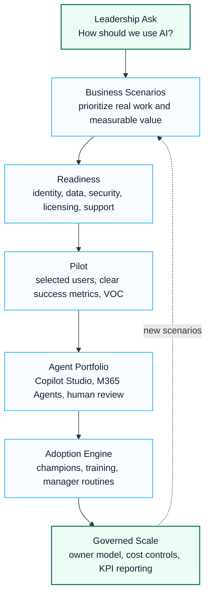

# Enterprise AI Adoption Program

The Enterprise AI Adoption Program turns Copilot, Copilot Studio and AI agent initiatives into a governed business transformation program rather than a tool rollout.

## Visual Program Story

## 한국어 요약

Enterprise AI Adoption Program은 Copilot license 배포나 단순 prompt 교육이 아니라, 기업의 실제 업무 시나리오를 AI use case와 Agent portfolio로 전환하는 프로그램입니다.

성공적인 AI 도입은 Microsoft 365 Copilot, Copilot Studio, Agent Factory, 보안/데이터 거버넌스, change management, 가치 측정이 함께 설계될 때 가능합니다. 특히 고객 조직에서는 “무엇을 자동화할 것인가”보다 “누가 소유하고, 어떤 데이터에 접근하며, 어떤 승인 절차로 운영할 것인가”가 더 중요합니다.

## Target Customers

- Enterprises preparing Microsoft 365 Copilot adoption.
- Organizations evaluating Copilot Studio or agent-based automation.
- Business units that need measurable AI use cases, not generic prompt training.
- Security and compliance teams that require data protection guardrails before expansion.

## Adoption Framework

| Phase | Objective | Key Outputs |
|---|---|---|
| Readiness | confirm identity, data, security, licensing and change readiness | readiness report, risk log, pilot criteria |
| Use Case Design | select high-value work scenarios | use case backlog, value hypothesis, persona map |
| Pilot | validate productivity, security and support model | pilot plan, training assets, feedback dashboard |
| Governance | define operating rules and ownership | AI governance charter, data protection controls, usage policy |
| Scale | expand adoption with measurable value | rollout roadmap, champions model, KPI reporting |

## AI Use Case Portfolio

| Use Case Type | Example Scenario | Governance Need |
|---|---|---|
| Knowledge search | internal policy, proposal, technical guide search | permission boundary and source freshness |
| Document drafting | report, executive summary, SOW or meeting note drafting | human review and approval |
| Business inquiry | HR, finance, pricing or sales support inquiry | data source ownership and audit trail |
| Process assistance | request intake, triage, follow-up and status generation | workflow ownership and exception handling |
| Agent automation | Copilot Studio or Agent Builder based task support | lifecycle, cost and security review |

## Operating Model

An enterprise AI program should define the following roles before broad rollout:

| Role | Responsibility |
|---|---|
| Executive Sponsor | business priority, funding and expansion decision |
| AI Program Owner | roadmap, governance, adoption and value tracking |
| Security and Compliance Lead | data protection, DLP, Purview and risk controls |
| Business Owner | use case value, process fit and acceptance criteria |
| Agent Owner | agent lifecycle, content quality, approval and retirement |
| Platform Team | Copilot Studio, Power Platform, Graph, identity and support model |

## Copilot Governance Topics

- license assignment and value tracking
- Copilot data boundary and oversharing risk
- sensitivity labels and DLP readiness
- prompt and response handling guidance
- user enablement by business role
- agent lifecycle and owner accountability
- usage-based cost governance for agent scenarios

## Deliverables

- Microsoft 365 Copilot readiness assessment
- Copilot adoption operating model
- AI use case catalog
- executive adoption roadmap
- user training and champion kit
- agent governance checklist
- Copilot cost governance guide

## Customer Success Pattern

For anonymized customer-facing references, position Enterprise AI adoption as a phased operating model:

1. Identify high-value business scenarios.
2. Assess data readiness and permission risk.
3. Prioritize Copilot and Agent opportunities.
4. Run a controlled pilot with clear success metrics.
5. Establish governance before scaling.
6. Convert lessons learned into reusable playbooks and templates.

## Success Indicators

- Copilot adoption is tied to priority business scenarios.
- Security requirements are addressed before broad enablement.
- Pilot results can be used for executive expansion decisions.
- Agent initiatives have ownership, lifecycle and cost controls.

## 검색 키워드

- Enterprise AI adoption program
- Microsoft Copilot adoption framework
- Copilot Studio Agent adoption
- AI Agent governance
- Agent Factory operating model
- Enterprise AI 도입 전략
- Copilot 도입 프레임워크
- Copilot Studio Agent 도입
- AI Agent 거버넌스

## Related Documents

- [Copilot Overview](../copilot/overview)
- [Copilot Studio](../copilot/copilot-studio)
- [Agent Factory Operating Model](../copilot/agent-factory-operating-model)
- [Enterprise AI Agent Factory Case Study](./case-study-enterprise-ai-agent-factory)
