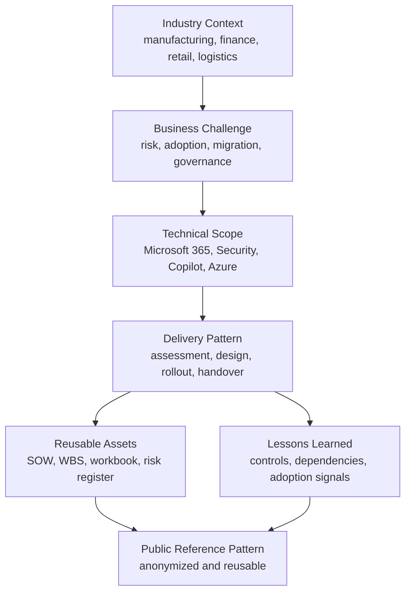

# Projects Library

This section captures anonymized enterprise project experience and reusable delivery patterns from Microsoft cloud consulting work. Customer names are intentionally omitted. References are grouped by industry, workload and delivery pattern so they can be reused safely for architecture, presales and governance discussions.

## 한국어 요약

Projects Library는 실제 고객 경험을 고객명 없이 업종, 과제, delivery pattern 중심으로 재구성한 공간입니다.

Microsoft 365, Security, Copilot, AI Agent, Azure, Migration, Governance 프로젝트에서 반복적으로 사용되는 assessment, SOW, WBS, architecture, risk register, operating model 구조를 확인할 수 있습니다.

## Project Pattern Map

## Project Categories

- Manufacturing and automotive
- Financial services
- Logistics and distribution
- Retail and consumer goods
- Construction and engineering
- Healthcare and life sciences
- Enterprise groups and holding companies
- Enterprise AI Agent and Copilot Studio programs

## Featured Customer Success Patterns

- [Customer Success Reference Patterns](./customer-success-reference-patterns)
- [Manufacturing Copilot Adoption Case Study](./case-study-manufacturing-copilot-adoption)
- [Enterprise AI Agent Factory Case Study](./case-study-enterprise-ai-agent-factory)
- [Financial SaaS Security Case Study](./case-study-financial-saas-security)
- [Logistics Exchange Online Modernization Case Study](./case-study-logistics-exchange-modernization)
- [Retail Microsoft 365 Security Policy Modernization Case Study](./case-study-retail-m365-security-policy)

## Reference Themes

| Theme | Typical Scope | Reusable Assets |
|---|---|---|
| Microsoft 365 deployment | Exchange Online, Teams, SharePoint, OneDrive, endpoint readiness | WBS, rollout plan, policy workbook, administrator guide |
| Copilot adoption | Readiness, governance, user enablement, adoption operating model | SOW, adoption roadmap, use case catalog, value tracking |
| Security modernization | Conditional Access, Defender, Purview, DLP, audit readiness | security baseline, risk register, executive review |
| Retail Microsoft 365 security policy | Entra ID, Conditional Access, Intune, Defender, Purview, collaboration policy, Power Platform governance | license-to-capability map, improvement backlog, prerequisite roadmap, results-report structure |
| Entra ID and Intune | identity governance, device registration, compliance policy, dynamic groups | implementation guide, troubleshooting guide, policy matrix |
| Migration | Google Workspace, legacy mail, file server, tenant and workload migration | assessment checklist, migration factory plan, cutover runbook |
| Network and SaaS access | firewall allowlist, Global Secure Access, internal network SaaS control | architecture note, exception approval list, operations guide |

## Documentation Standard

Each project will be documented with:

1. Business Challenge
2. Technical Scope
3. Architecture
4. Delivery Approach
5. Risk
6. Lessons Learned

## Recommended Reading

- [Customer Success Reference Patterns](./customer-success-reference-patterns)
- [Manufacturing Copilot Adoption Case Study](./case-study-manufacturing-copilot-adoption)
- [Enterprise AI Agent Factory Case Study](./case-study-enterprise-ai-agent-factory)
- [Financial SaaS Security Case Study](./case-study-financial-saas-security)
- [Logistics Exchange Online Modernization Case Study](./case-study-logistics-exchange-modernization)
- [Retail Microsoft 365 Security Policy Modernization Case Study](./case-study-retail-m365-security-policy)
- [Enterprise Group Governance Case Study](./case-study-enterprise-group-governance)
- [Microsoft 365 Optimization Program](./m365-optimization-program)
- [Security Modernization Program](./security-modernization-program)
- [Enterprise AI Adoption Program](./enterprise-ai-adoption-program)
- [Multi-Tenant Governance Strategy](./multi-tenant-governance-strategy)

## 검색 키워드

- Microsoft 365 customer success
- Copilot adoption case study
- Microsoft Security reference
- Microsoft 365 migration case
- AI Agent Factory case
- Microsoft 365 고객 성공 사례
- Copilot 도입 사례
- Microsoft 365 제안 산출물
