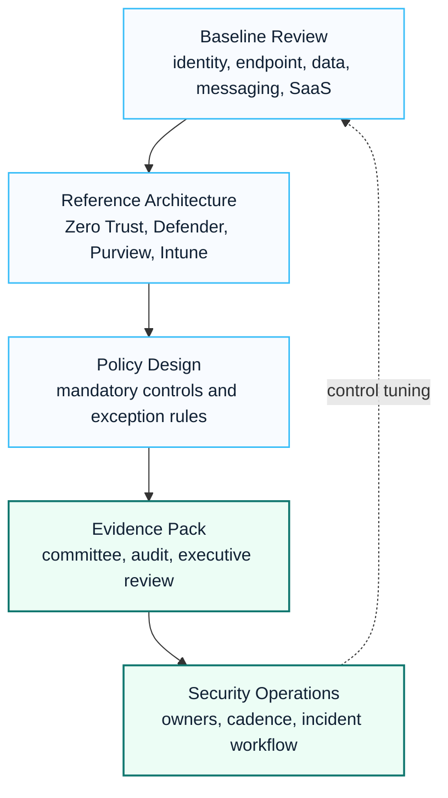

# Security Modernization Program

The Security Modernization Program helps organizations move from basic Microsoft 365 usage to an evidence-ready security operating model across identity, endpoint, collaboration, data protection and SaaS access.

## Visual Modernization Roadmap

## 한국어 요약

Security Modernization Program은 Microsoft 365 보안 설정을 단순 점검하는 작업이 아니라, Zero Trust, Conditional Access, Defender, Purview, Intune, SaaS access control, security committee evidence를 하나의 운영 모델로 묶는 프로그램입니다.

특히 Copilot, AI Agent, SaaS 확대를 준비하는 조직은 identity, endpoint, data protection, network exception, audit evidence를 먼저 정리해야 합니다. 그렇지 않으면 기능 도입은 빨라져도 보안 승인과 운영 책임이 뒤따라가지 못합니다.

## Common Drivers

- Internal network or SaaS usage requires formal security approval.
- The organization must support Copilot or Microsoft 365 expansion without increasing data exposure.
- Conditional Access, Defender, Purview and Intune controls are not yet connected into one architecture.
- Security teams need control evidence for committees, audits or executive review.

## Reference Architecture

| Layer | Microsoft Capability | Design Intent |
|---|---|---|
| Identity | Entra ID, MFA, Conditional Access | verify user, device, location and risk before access |
| Endpoint | Intune, Defender for Endpoint | enforce device compliance and threat protection |
| Data | Purview, sensitivity labels, DLP | classify and protect sensitive business data |
| Messaging | Defender for Office 365, Exchange Online | reduce phishing, malware and mail-based data leakage |
| SaaS access | Global Secure Access, network allowlists, exception workflow | control cloud access from regulated network zones |
| Operations | risk register, control matrix, incident workflow | make controls measurable and reviewable |

## Modernization Roadmap

| Stage | Focus | Output |
|---|---|---|
| Baseline | Current control review across identity, endpoint, data and messaging | risk and control gap register |
| Architecture | Connect Microsoft security capabilities into one reference model | security reference architecture |
| Policy Design | Define mandatory controls, exceptions and ownership | policy matrix and exception workflow |
| Evidence Pack | Prepare audit, committee and executive review material | approval-ready evidence package |
| Operations | Assign monitoring, review cadence and incident responsibilities | security operating model |

## Delivery Workstreams

1. Security baseline and maturity assessment
2. Control matrix and risk register
3. Conditional Access and identity protection design
4. Endpoint compliance and Defender onboarding plan
5. Purview information protection and DLP design
6. SaaS/network access exception model
7. Executive review package

## Deliverables

- Microsoft 365 security reference architecture
- Zero Trust baseline
- Conditional Access policy design
- Defender onboarding plan
- Purview and DLP readiness plan
- Global Secure Access or SaaS access design note
- security committee approval pack

## Control Evidence Model

| Evidence Area | Example Evidence |
|---|---|
| Identity | Conditional Access policy list, MFA coverage, privileged role review |
| Endpoint | Intune compliance status, Defender onboarding scope, platform baseline |
| Data | sensitivity label design, DLP policy plan, exception register |
| Messaging | anti-phishing policy, Safe Links/Safe Attachments configuration, quarantine process |
| SaaS access | allowed service list, exception owner, expiry date and compensating control |
| Operations | control owner, review cadence, incident path and executive reporting format |

## Anonymized Success Pattern

In finance, healthcare, manufacturing and regulated SaaS environments, security modernization succeeds when the project produces approval evidence, not only configuration changes. Security teams need a clear explanation of what is controlled, who owns exceptions and how the control will be reviewed after rollout.

## Success Indicators

- Security controls are mapped to business risks and approval evidence.
- Exceptions have owners, expiry dates and compensating controls.
- Microsoft 365 and Copilot adoption can proceed with clear data protection guardrails.
- Security and IT operations share the same control language.

## Executive Metrics

| Metric | What To Track |
|---|---|
| Control maturity | identity, endpoint, threat, data and SaaS controls mapped to current state |
| Evidence readiness | audit, committee and executive review materials prepared |
| Exception hygiene | owner, expiry, reason and compensating control documented |
| Copilot readiness | oversharing, Purview, DLP and audit prerequisites reviewed |
| Operations readiness | incident workflow, review cadence and control owner defined |

## Lessons Learned

- Security modernization succeeds when evidence is planned from the beginning.
- Conditional Access, Defender, Purview and Intune should be explained as one control model.
- Copilot and AI adoption make permission cleanup and data protection more urgent.
- Exception governance is often more important than the initial policy setting.
- Executive reports should translate configuration into risk, decision and operating impact.

## 검색 키워드

- Microsoft Security modernization
- Zero Trust architecture
- Conditional Access design
- Microsoft Defender XDR
- Microsoft Purview DLP
- Intune compliance
- SaaS access control
- 보안 현대화
- Microsoft 365 보안 아키텍처

## Related Documents

- [Security Overview](../security/overview)
- [Security Reference Architecture](../architecture/security-reference-architecture)
- [Zero Trust Framework](../security/zero-trust-framework)
- [Security Modernization Playbook](../playbooks/security-modernization-playbook)
- [Microsoft 365 Security](../search/microsoft-365-security)
- [Contact and Asset Request](../contact)
