# Executive Summary Template

## Executive Summary

An executive summary translates technical scope into business outcomes, risk reduction, investment rationale and decision points.

For Microsoft 365, Security, Copilot, Azure and migration proposals, this section should help executives understand why the program matters, what value it creates and what decision is required.

## 한국어 요약

Executive Summary는 기술 설명을 임원 의사결정 언어로 바꾸는 섹션입니다.

단순히 기능을 나열하기보다 business driver, risk, target outcome, recommended approach, investment value, next decision을 짧고 명확하게 연결해야 합니다.

좋은 Executive Summary는 "무엇을 구축할 것인가"보다 "왜 지금 해야 하는가", "하지 않으면 어떤 리스크가 남는가", "승인 후 어떤 변화가 생기는가"를 먼저 설명합니다.

## Executive Narrative Flow

```mermaid
flowchart LR
  Challenge["Current Challenge<br/>risk, inefficiency, adoption pressure"]:::risk
  Objective["Strategic Objective<br/>business and security outcome"]:::strategy
  Approach["Recommended Approach<br/>architecture and program direction"]:::strategy
  Value["Expected Value<br/>productivity, security, governance"]:::value
  Decision["Executive Decision<br/>approval, funding, next step"]:::decision

  Challenge --> Objective --> Approach --> Value --> Decision

  classDef risk fill:#fff7ed,stroke:#fb923c,color:#102033,stroke-width:1.6px
  classDef strategy fill:#eff6ff,stroke:#60a5fa,color:#102033,stroke-width:1.6px
  classDef value fill:#ecfdf5,stroke:#10b981,color:#102033,stroke-width:1.8px
  classDef decision fill:#0f3157,stroke:#0891b2,color:#ffffff,stroke-width:2px
```

## Recommended Structure

| Section | Purpose |
|---|---|
| Current Challenge | Explain business pain, risk or inefficiency |
| Strategic Objective | Define the target outcome |
| Recommended Approach | Summarize the architecture or program direction |
| Expected Value | Connect productivity, security, governance and cost impact |
| Delivery Roadmap | Show practical phases and decision gates |
| Executive Decision | State the approval or next step required |

## Business Drivers

- Security modernization
- Collaboration improvement
- Cost optimization
- Compliance readiness
- AI and Copilot readiness
- Migration or platform consolidation
- Governance and operational standardization

## Expected Business Outcomes

| Area | Expected Value |
|---|---|
| Productivity | Better collaboration and reduced operational friction |
| Security | Lower identity, device, email and data risk |
| Compliance | Stronger evidence and policy alignment |
| Governance | Clear ownership, review cadence and exception control |
| Innovation | Practical Copilot and AI Agent adoption readiness |
| Cost | Better license and platform investment decisions |

## Executive Message Patterns

| Scenario | Executive Positioning | Decision to Request |
|---|---|---|
| Microsoft 365 optimization | Improve collaboration, governance and license value from the existing platform | approve assessment and prioritized improvement roadmap |
| Security modernization | Reduce identity, device, email and data risk through Microsoft security controls | approve baseline design and phased control rollout |
| Copilot adoption | Prepare data, security, users and operating model before broad Copilot expansion | approve readiness assessment, pilot and governance model |
| AI Agent Factory | Convert AI interest into governed business agents with reusable build standards | approve pilot portfolio, intake model and operating guardrails |
| Migration / consolidation | Reduce platform fragmentation and operational risk through controlled migration | approve discovery, wave plan and cutover governance |

## Executive Writing Checklist

| Question | Why It Matters |
|---|---|
| What business issue is being solved? | Keeps the proposal outcome-led |
| What risk is reduced? | Helps CISO, CFO and CIO alignment |
| What changes for users or operations? | Clarifies adoption and support impact |
| What investment is required? | Supports funding decision |
| What happens if no action is taken? | Makes urgency visible |
| What decision is required now? | Converts proposal review into action |

## Sample Positioning

Use this style:

> This program establishes a secure Microsoft 365 foundation that improves collaboration, strengthens data protection and prepares the organization for Copilot adoption through a phased governance and security roadmap.

Avoid this style:

> We will configure Microsoft 365 features and provide documentation.

## Executive Summary Quality Bar

- Lead with business outcome before product capability.
- Name the risk of inaction.
- Keep Microsoft product names precise, but explain the business implication in natural language.
- Avoid listing every feature; group capabilities into outcome areas.
- State what decision is required from the executive sponsor.
- Link the summary to the SOW, WBS and governance model so the message can be executed.

## 문서 요청 안내

Customer-ready executive summary samples are not published directly. To request a reusable executive summary template, use [Contact and Asset Request](../contact) with the target workload, industry and proposal objective.

## 검색 키워드

- executive summary template
- Microsoft 365 proposal executive summary
- Copilot proposal summary
- security modernization proposal
- 제안서 Executive Summary
- 임원 보고 제안서
