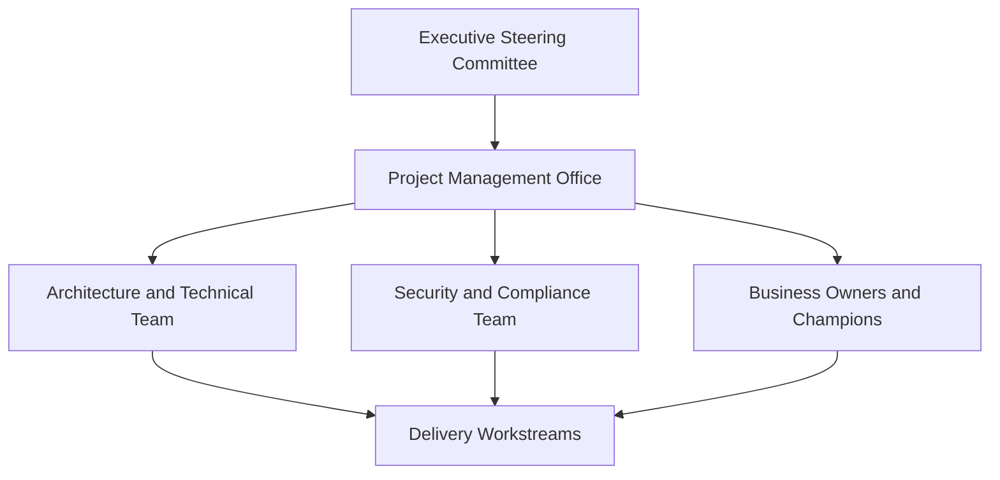

# Governance Model

## Executive Summary

A governance model defines how project decisions are made, escalated, approved and tracked during Microsoft 365, Security, Copilot, Azure or migration engagements.

For proposal work, governance should make the delivery model credible. It explains who owns decisions, how risks are escalated and how scope changes are controlled.

## 한국어 요약

Governance Model은 프로젝트 운영 구조를 설명하는 제안서 핵심 섹션입니다.

고객에게 단순히 “주간 회의를 한다”가 아니라 steering committee, project team, technical workshop, risk review, change control이 어떻게 연결되는지 보여줘야 합니다.

## Governance Structure

## Core Roles

| Role | Responsibility |
|---|---|
| Executive Sponsor | Business priority, funding, executive escalation |
| Steering Committee | Scope approval, risk acceptance, major decision review |
| Project Manager | Schedule, issue, risk, communication and status control |
| Technical Lead | Architecture design, technical decision and quality review |
| Security Lead | Security baseline, exception, compliance and evidence review |
| Business Owner | User impact, adoption, acceptance and operational readiness |

## Meeting Cadence

| Meeting | Frequency | Purpose |
|---|---|---|
| Steering Committee | Monthly or milestone-based | Executive decision, risk and scope review |
| Project Status | Weekly | Progress, blocker, risk and action tracking |
| Technical Workshop | Weekly or as needed | Architecture and implementation decision |
| Security Review | Milestone-based | Policy, exception and control validation |
| Change Control | As needed | Scope, timeline or cost impact decision |

## Decision Checklist

| Decision | Recommended Question |
|---|---|
| Escalation | Which issues require steering committee approval? |
| Scope control | How are change requests assessed and approved? |
| Risk acceptance | Who can accept security, compliance or schedule risk? |
| Evidence | Which reports prove delivery readiness and acceptance? |
| Handover | Who owns the service after project closure? |

## Delivery Artifacts

- Governance model slide
- RACI matrix
- Meeting cadence and agenda template
- Decision log
- Risk and issue register
- Change request template
- Executive status report

## Customer Success Pattern

| Industry | Scenario | Governance Pattern |
|---|---|---|
| Manufacturing | Global Microsoft 365 rollout | Regional owner model and weekly technical governance |
| Financial Services | Security modernization | Security exception approval and audit evidence review |
| Retail | Migration and adoption | Business champion network and cutover readiness review |

## 문서 요청 안내

Editable governance templates are not published directly. To request a customer-ready governance model, use [Contact and Asset Request](../contact) with the project type, target workload and proposal purpose.

## 검색 키워드

- project governance model
- Microsoft 365 governance proposal
- steering committee RACI
- SOW governance model
- project decision log
- 제안서 거버넌스 모델
- 프로젝트 RACI
