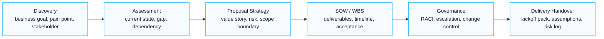

# Proposal Center

Enterprise consulting proposal assets for Microsoft 365, Azure, Security and Copilot engagements.

The Proposal Center is organized as a delivery-ready presales system. It connects discovery, executive messaging, technical scope, delivery workstreams, timeline, assumptions, risk and governance into one coherent proposal package.

## 한국어 요약

Proposal Center는 Microsoft 365, Azure, Security, Copilot, AI Agent, Migration 프로젝트 제안에 필요한 실무 산출물 구조를 정리한 공간입니다.

제안서 작성은 단순한 문서 작업이 아닙니다. 고객의 business goal, technical scope, security requirement, 일정, 역할, risk, cost, approval structure를 하나의 실행 가능한 delivery model로 연결하는 작업입니다.

이 섹션은 Executive Summary, Assessment Framework, Statement of Work, Work Breakdown Structure, Risk Register, Timeline, Governance Model 같은 제안 및 수행 산출물을 재사용 가능한 구조로 제공합니다.

> **Asset preview:** Public pages show the structure and decision logic. Editable DOCX/XLSX/PPTX versions or customer-ready samples should be requested through [Contact and Asset Request](../contact) after confirming the scenario and confidentiality boundary.

---

## Proposal Operating Model

Proposal work should not be treated as a document-writing task. It is a decision-design process. A strong proposal makes the business case, delivery model, technical risk and customer responsibilities visible before the project starts.

## Available Assets

| Asset | Purpose | When to Use |
|---|---|---|
| Executive Summary | C-Level business proposal structure and executive messaging | when the decision maker needs a concise value story |
| Assessment Framework | Discovery workshop, current state assessment and gap analysis | before defining target architecture or scope |
| Statement of Work | Scope, deliverables, assumptions and exclusions structure | when project boundaries must be contract-ready |
| Work Breakdown Structure | Project planning and execution framework | when delivery phases and activities must be visible |
| Risk Register | Project risk identification and mitigation model | when risk ownership and escalation must be explicit |
| Timeline Template | Standard project timeline and milestone planning | when stakeholders need schedule alignment |
| Governance Model | Project governance and stakeholder management structure | when decisions, approvals and reporting cadence must be defined |

---

## Proposal Delivery Flow

| Stage | Purpose | Main Output |
|---|---|---|
| 1. Discover | understand business driver, current environment and decision timeline | discovery notes and qualification summary |
| 2. Assess | identify readiness, gaps, dependencies and risks | assessment summary and recommendation path |
| 3. Shape | define target scope, assumptions, exclusions and success criteria | solution outline and executive summary |
| 4. Plan | convert the scope into workstreams, activities, timeline and roles | SOW, WBS and milestone plan |
| 5. Govern | define decision body, escalation path, reporting rhythm and acceptance criteria | governance model and risk register |
| 6. Handover | prepare delivery team and customer stakeholders for execution | kickoff pack and handover checklist |

## Proposal Package Anatomy

| Section | What It Should Answer |
|---|---|
| Executive Summary | why this project matters now and what decision is required |
| Business Drivers | what business, security, compliance or AI adoption pressure created the need |
| Current State | what is known, unknown and assumed about the customer environment |
| Target Architecture | what Microsoft capabilities and operating model will be used |
| Scope | what will be delivered, excluded and dependent on customer readiness |
| WBS | how the work is structured by phase, workstream and activity |
| Timeline | when key workshops, implementation steps, validation and handover occur |
| Risk Register | what may affect delivery and how it will be mitigated |
| Governance | who approves, who executes and how issues are escalated |
| Acceptance Criteria | how the customer and delivery team know the work is complete |

## Proposal Quality Scorecard

| Quality Area | What Good Looks Like | Review Signal |
|---|---|---|
| Business clarity | The executive can understand why the project matters without reading technical appendices | clear current challenge, target outcome and decision request |
| Scope control | Included, excluded and dependent work are separated | no hidden adjacent workload or undefined customer task |
| Delivery readiness | SOW, WBS, timeline and governance align with each other | same phases, milestones, roles and acceptance language |
| Risk visibility | Technical, operational and customer-side risks are explicit | risk register has owner, mitigation and escalation path |
| Evidence orientation | Completion can be proven through reviewable outputs | deliverables, test evidence, handover guide and acceptance record |
| Public safety | Examples are reusable without exposing customer-sensitive details | no customer names, tenant IDs, internal filenames or commercial terms |

## Public-Safe Proposal Principle

Public proposal examples should show structure and thinking, not customer-sensitive information.

Do not publish customer names, contract value, discount assumptions, internal architecture diagrams, tenant IDs, source system inventory, project code names or customer-specific security exceptions.

When a customer-ready sample is needed, share a sanitized version through [Contact and Asset Request](../contact).

## Asset Request Guidance

This public page explains the proposal structure and reusable thinking. Editable templates, customer-ready samples and detailed worksheets are shared by request after confirming the project scenario and confidentiality boundary.

Use [Contact and Asset Request](../contact) when you need a reusable proposal package for:

- Microsoft 365 implementation or optimization
- Security baseline, Defender, Purview or Conditional Access projects
- Copilot readiness, adoption and governance
- Copilot Studio or AI Agent Factory proposals
- Azure Landing Zone and migration engagements
- Tenant-to-tenant, Google Workspace or file server migration
- PMO governance, risk register, WBS and timeline design

---

## Intended Audience

- CIO
- CISO
- IT Director
- Infrastructure Manager
- Collaboration Manager
- PMO

## Role-Based Starting Points

| Visitor | Start With | Useful Follow-Up |
|---|---|---|
| CIO / Executive Sponsor | [Executive Summary](./executive-summary) | [Governance Model](./governance-model), [Timeline Template](./timeline-template) |
| CISO / Security Leader | [Risk Register](./risk-register) | [Assessment Framework](./assessment), [Security Modernization Playbook](../playbooks/security-modernization-playbook) |
| IT Director | [Assessment Framework](./assessment) | [SOW Template](./sow-template), [WBS Template](./wbs-template) |
| PMO / Project Manager | [WBS Template](./wbs-template) | [Timeline Template](./timeline-template), [Risk Register](./risk-register) |
| Presales / Architect | [Executive Summary](./executive-summary) | [SOW Template](./sow-template), [Downloads Center](../downloads/overview) |

## 검색 키워드

이 문서는 다음과 같은 검색어와 관련됩니다.

- Microsoft 365 proposal
- Microsoft 365 SOW
- Microsoft 365 WBS
- Copilot proposal
- Azure proposal
- Security proposal
- Cloud migration WBS
- Project Risk Register
- Executive Summary 템플릿
- 제안서 delivery asset
- PMO governance model

## 컨설팅 활용 사례

이 가이드는 다음과 같은 컨설팅 상황에서 활용할 수 있습니다.

- Microsoft 365 implementation proposal 작성
- Copilot readiness/adoption proposal 작성
- Azure Landing Zone 또는 migration SOW 작성
- Security assessment/implementation WBS 작성
- 고객 의사결정을 위한 executive summary 구성
- PMO와 고객 담당자가 공유할 risk register 및 governance model 작성
