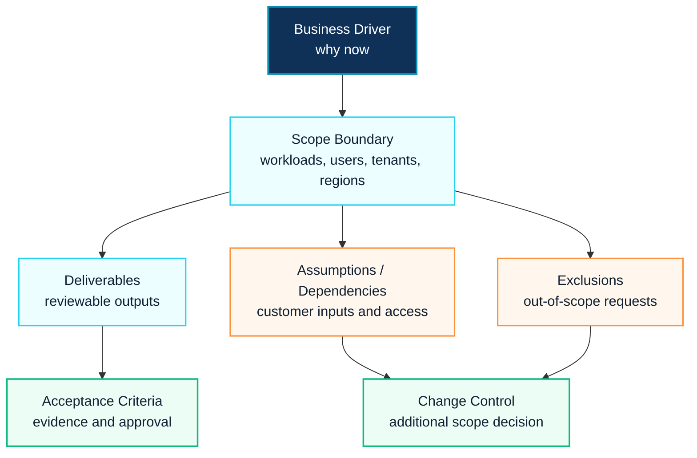

# Statement of Work Template

## Executive Summary

A Statement of Work defines the agreed scope, deliverables, assumptions, exclusions, responsibilities and acceptance criteria for a customer engagement.

For Microsoft consulting projects, a strong SOW prevents ambiguity between presales promises and delivery execution. It should connect architecture decisions to measurable work packages.

## 한국어 요약

SOW는 제안서와 실제 수행 사이의 기준 문서입니다.

Microsoft 365, Security, Copilot, Azure, Migration 프로젝트에서는 scope, deliverables, assumptions, exclusions, acceptance criteria가 명확하지 않으면 일정, 비용, 품질 리스크가 커집니다.

SOW는 고객에게 "무엇을 제공하는가"만 설명하는 문서가 아닙니다. 어떤 조건에서 시작하고, 어떤 산출물로 검토하며, 어떤 기준으로 완료를 승인할지 합의하는 delivery contract입니다.

> **Asset preview:** This page explains the SOW design model. Editable SOW templates and sanitized customer-ready examples are shared by request after confirming scope, audience and confidentiality requirements.

## SOW Design Flow

## Recommended SOW Structure

| Section | Purpose |
|---|---|
| Project Background | Explain business context and current challenge |
| Objectives | Define measurable business and technical outcomes |
| Scope | Identify workloads, users, tenants, regions and deliverables |
| Deliverables | List customer-reviewable outputs |
| Assumptions | State required customer inputs and dependencies |
| Exclusions | Clarify what is not included |
| Roles and Responsibilities | Define customer and delivery team ownership |
| Timeline | Summarize phases and milestones |
| Acceptance Criteria | Define how completion is approved |

## Delivery Scope Example

| Workstream | Example Deliverable |
|---|---|
| Assessment | Current state assessment and risk findings |
| Architecture | Target-state architecture and decision log |
| Security | Conditional Access, Defender, Purview or DLP design |
| Migration | Migration wave plan and cutover runbook |
| Adoption | Communication, training and champion enablement plan |
| Handover | Operation guide and knowledge transfer |

## Decision Checklist

| Decision | Recommended Question |
|---|---|
| Scope boundary | Which workloads, users and geographies are included? |
| Deliverables | What will the customer formally review and approve? |
| Assumptions | Which dependencies must the customer provide? |
| Exclusions | What likely requests are explicitly out of scope? |
| Acceptance | What evidence confirms completion? |
| Change control | How are additional requests priced and approved? |

## SOW Quality Gates

| Gate | Required Check | Example Evidence |
|---|---|---|
| Scope gate | Each workload, tenant, region and user group is explicitly included or excluded | scope table, out-of-scope list |
| Dependency gate | Customer responsibilities are visible before kickoff | access request list, data inventory request, stakeholder list |
| Deliverable gate | Every activity maps to a reviewable output | assessment report, architecture diagram, configuration evidence |
| Acceptance gate | Completion can be approved without subjective debate | test result, workshop sign-off, handover checklist |
| Change gate | Additional requests have a defined approval path | change request process and escalation owner |

## Anti-Patterns

- Describing only activities without deliverables
- Leaving assumptions vague or hidden
- Not defining exclusions for adjacent workloads
- Using timeline dates without dependency conditions
- Omitting acceptance criteria and handover scope
- Mixing proposal language and delivery language so the project team cannot execute the document directly

## Public-Safe Example Language

Use wording like this:

> This engagement covers Microsoft 365 security and governance assessment for the agreed tenant scope. The deliverables include current-state findings, prioritized recommendations, policy design guidance, implementation backlog and executive summary. Production configuration, end-user communication and adjacent workload implementation are excluded unless agreed through change control.

Avoid wording like this:

> We will support Microsoft 365 security and governance as needed.

## 문서 요청 안내

The public page explains the SOW structure only. Editable SOW files and customer-ready samples are shared by request after confirming the project scenario and confidentiality boundary. Use [Contact and Asset Request](../contact) to request a reusable version.

## 검색 키워드

- SOW template
- Statement of Work Microsoft 365
- Microsoft consulting SOW
- Copilot SOW
- Migration SOW
- 제안서 SOW 템플릿
- Microsoft 365 제안서 범위
