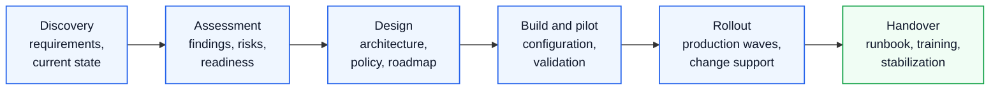

# Timeline Template

  <small>REQUESTABLE ASSET</small>
  <strong>Timeline and milestone planning template</strong>
  Use this asset to convert project phases, dependencies, review gates and stakeholder events into a delivery schedule. Editable versions should be requested after confirming scenario, audience, confidentiality boundary and expected output format.

## Executive Summary

The Timeline Template provides a standard project schedule structure for Microsoft 365, Azure, Security, Copilot and migration engagements.

The objective is to define realistic phases, milestones, dependencies and decision points so that both customer and delivery teams can align on scope, timeline and responsibilities.

## Business Scenario

This timeline is typically used for:

- Microsoft 365 tenant assessment
- Security baseline implementation
- Intune and endpoint management deployment
- SharePoint and Teams migration
- Google Workspace to Microsoft 365 migration
- Copilot readiness and adoption project
- Enterprise proposal and SOW planning

## Standard Project Timeline

| Phase | Duration | Key Activities | Output |
|---|---:|---|---|
| Phase 1. Discovery | Week 1 | Kickoff, stakeholder interview, current state review | Discovery findings |
| Phase 2. Assessment | Week 1-2 | Tenant review, license review, risk analysis, gap analysis | Assessment report |
| Phase 3. Design | Week 3-4 | Target architecture, policy design, migration plan | Design document |
| Phase 4. Build | Week 5-7 | Configuration, pilot setup, validation | Configured environment |
| Phase 5. Pilot | Week 8 | Pilot user validation, issue resolution | Pilot result |
| Phase 6. Production Rollout | Week 9-10 | Production deployment or migration rollout | Production completion |
| Phase 7. Handover | Week 11 | Admin guide, runbook, knowledge transfer | Handover package |
| Phase 8. Stabilization | Week 12 | Hypercare, issue tracking, final report | Closure report |

## Example 12-Week Timeline

| Week | Workstream | Activity |
|---:|---|---|
| 1 | Project Management | Kickoff and governance setup |
| 1 | Discovery | Business and technical interview |
| 2 | Assessment | Tenant, license and security review |
| 3 | Architecture | Target architecture and policy design |
| 4 | Architecture | Design review and approval |
| 5 | Implementation | Baseline configuration |
| 6 | Implementation | Workload-specific configuration |
| 7 | Implementation | Pilot preparation |
| 8 | Pilot | Pilot deployment and validation |
| 9 | Rollout | Production rollout wave 1 |
| 10 | Rollout | Production rollout wave 2 |
| 11 | Handover | Admin guide and knowledge transfer |
| 12 | Stabilization | Hypercare and final report |

## Milestones

| Milestone | Description | Acceptance Criteria |
|---|---|---|
| M1. Kickoff Complete | Project scope and governance confirmed | Kickoff meeting completed |
| M2. Discovery Complete | Business and technical requirements gathered | Discovery notes approved |
| M3. Assessment Complete | Current state and gap analysis completed | Assessment report delivered |
| M4. Design Approved | Target design reviewed and approved | Design document approved |
| M5. Pilot Complete | Pilot users validate configuration | Pilot issues resolved or accepted |
| M6. Production Rollout Complete | Production deployment completed | Rollout completion confirmed |
| M7. Handover Complete | Operations team receives documentation | Admin guide delivered |
| M8. Project Closure | Final report and next steps agreed | Closure meeting completed |

## Dependency Management

| Dependency | Owner | Required By | Risk if Delayed |
|---|---|---|---|
| Admin access | Customer IT | Week 1 | Assessment delay |
| License availability | Customer Procurement | Week 4 | Build delay |
| Security approval | Security Team | Week 4 | Policy deployment delay |
| Pilot users | Business Owner | Week 7 | Pilot delay |
| Migration source inventory | Customer IT | Week 2 | Migration estimate risk |
| Communication approval | Business Sponsor | Week 8 | User readiness issue |

## Timeline Design Principles

- Keep discovery and assessment separate from implementation
- Do not start production rollout before design approval
- Include customer review time
- Include pilot and rollback planning
- Include handover and stabilization period
- Reflect license procurement and security approval dependencies
- Add buffer for global subsidiaries and time zone differences

## Roles and Responsibilities

| Role | Timeline Responsibility |
|---|---|
| Project Manager | Overall schedule, milestone and dependency tracking |
| Solution Architect | Architecture design and technical decision points |
| Security Lead | Security and compliance approval |
| Migration Lead | Migration plan, test migration and cutover schedule |
| Customer Sponsor | Business decision and escalation |
| Customer IT | Access, configuration review and operational handover |

## Best Practice

- Present timeline at executive level using phases, not detailed tasks
- Maintain detailed WBS separately
- Define milestones with acceptance criteria
- Identify customer-owned dependencies clearly
- Add hypercare for production rollout
- Review timeline every project status meeting
- Use change request when timeline impact is caused by scope change

## Troubleshooting

| Issue | Cause | Recommended Action |
|---|---|---|
| Timeline is too aggressive | Scope and dependency not fully understood | Add assessment phase and risk buffer |
| Customer delays approval | Governance unclear | Define decision owner and due date |
| Build starts before design approval | Delivery pressure | Use milestone gate |
| Migration cutover delayed | Source inventory incomplete | Require inventory freeze |
| Handover not accepted | Documentation insufficient | Define handover deliverables earlier |

## Lessons Learned

- Timeline credibility is a major factor in proposal trust
- Customers often underestimate review and approval time
- Migration projects require inventory and pilot gates
- Security projects require exception handling and phased rollout
- Executive timelines should show business milestones
- Delivery timelines should be managed through WBS and issue tracking

## References

- Microsoft Cloud Adoption Framework
- Microsoft 365 deployment guidance
- Microsoft Well-Architected Framework
- Project management schedule planning practices

## 검색 키워드

- timeline template
- project milestone
- delivery schedule
- migration timeline
- 프로젝트 일정표

## Contact / Asset Request

For editable proposal assets, SOW/WBS structures, risk registers, timeline templates or executive-ready examples, use [Contact and Asset Request](../contact).
