# Work Breakdown Structure

The WBS is the delivery control layer that connects proposal scope, technical work, acceptance criteria and project governance.

For Microsoft 365, Security, Copilot and migration engagements, the WBS should not be a simple task list. It should show how discovery findings become architecture decisions, how implementation tasks are validated, and how customer acceptance is collected.

  <small>REQUESTABLE ASSET</small>
  <strong>Work Breakdown Structure template</strong>
  Use this asset to break work into workstreams, tasks, owners, dependencies, effort and acceptance checkpoints. Editable versions should be requested after confirming scenario, audience, confidentiality boundary and expected output format.

## WBS Control Flow

```mermaid
flowchart LR
  Scope["SOW Scope<br/>deliverables, assumptions, exclusions"]:::source
  Workstreams["Workstreams<br/>identity, endpoint, security, collaboration"]:::work
  Packages["Work Packages<br/>owner, activity, dependency"]:::work
  Evidence["Evidence<br/>test result, export, workshop record"]:::evidence
  Acceptance["Acceptance<br/>customer review and sign-off"]:::accept
  Handover["Handover<br/>operation guide and backlog"]:::accept

  Scope --> Workstreams --> Packages --> Evidence --> Acceptance --> Handover

  classDef source fill:#0f3157,stroke:#0891b2,color:#ffffff,stroke-width:2px
  classDef work fill:#eff6ff,stroke:#60a5fa,color:#102033,stroke-width:1.6px
  classDef evidence fill:#fff7ed,stroke:#fb923c,color:#102033,stroke-width:1.6px
  classDef accept fill:#ecfdf5,stroke:#10b981,color:#102033,stroke-width:1.8px
```

## Recommended WBS Model

| Phase | Objective | Representative Activities | Key Deliverables |
|---|---|---|---|
| Discover | Understand business and technical context | Stakeholder workshop, tenant review, security baseline review, dependency collection | Discovery report, requirement register |
| Analyze | Convert findings into risk and scope | Gap analysis, licensing review, migration complexity assessment, governance review | Assessment summary, risk register |
| Design | Define target-state architecture | Microsoft 365 architecture, identity model, security controls, Copilot readiness, migration approach | Architecture design, implementation plan |
| Build | Configure and prepare the environment | Policy configuration, pilot tenant setup, migration tooling, governance artifacts | Configuration evidence, pilot checklist |
| Validate | Confirm readiness and acceptance | Functional test, security validation, user acceptance, rollback test | Test result, acceptance record |
| Deploy | Execute controlled rollout | Production change, migration batch, policy deployment, communication | Deployment report, cutover log |
| Close | Transfer knowledge and stabilize operations | Admin handover, operation guide, issue backlog, lessons learned | Handover pack, closure report |

## Work Package Design Principles

- Each work package should have one accountable owner.
- Each task should map to a deliverable or acceptance condition.
- Security, governance and change management should be built into the WBS, not added as afterthoughts.
- Customer-side tasks should be visible, especially approvals, account provisioning, test participation and communication.
- Migration and Copilot workstreams should include pilot, rollback and adoption tasks.

## Enterprise WBS Example

| Workstream | Typical Scope | Acceptance Evidence |
|---|---|---|
| Identity | Entra ID, MFA, Conditional Access, role model | Policy export, test account result, exception list |
| Endpoint | Intune enrollment, compliance policy, device baseline | Enrollment report, compliance dashboard |
| Security | Defender, Purview, DLP, audit logging | Alert validation, policy review, risk acceptance |
| Collaboration | Exchange, Teams, SharePoint, OneDrive | Service validation, permission review |
| Copilot | Readiness, data governance, pilot users, adoption | Readiness score, pilot feedback, adoption plan |
| Migration | Inventory, batch plan, cutover, rollback | Migration report, reconciliation result |
| Governance | RACI, approval model, operation rhythm | Governance workbook, meeting cadence |

## WBS Quality Criteria

| Criteria | Good WBS Behavior | Risk if Missing |
|---|---|---|
| Traceability | Every task maps back to SOW scope or accepted change request | delivery team performs unapproved work |
| Ownership | Each work package has accountable owner and customer dependency | tasks wait without escalation |
| Evidence | Validation output is defined before implementation starts | completion becomes subjective |
| Phase control | Discovery, design, build, validate, deploy and close are separated | project jumps to configuration too early |
| Governance | Decision gates and escalation points are visible | risks are discovered late |
| Adoption | Communication, training and handover are included where user impact exists | technical success does not translate into adoption |

## Customer Success Reference Pattern

For a manufacturing group rollout, a phased WBS separated identity, security, collaboration and adoption workstreams. This helped the customer approve security policy changes independently from user adoption tasks, reducing decision delay during pilot expansion.

For a regulated financial SaaS environment, the WBS included explicit evidence tasks for Conditional Access, Defender and Purview validation. This made the final handover easier because the operations team could trace each security control back to a tested deliverable.

## Practical Checklist

- Is every proposal deliverable represented in the WBS?
- Are customer responsibilities clearly visible?
- Are approval gates defined before production deployment?
- Are rollback and exception processes included?
- Does the WBS distinguish pilot, production and handover activities?
- Can the project manager derive status reporting directly from the WBS?
- Can each workstream produce evidence that the customer can review?
- Are Security, Copilot and migration tasks separated enough to avoid ownership confusion?

## 검색 키워드

- WBS template
- work breakdown structure
- project workstream
- delivery planning
- WBS 템플릿

## Contact / Asset Request

For editable proposal assets, SOW/WBS structures, risk registers, timeline templates or executive-ready examples, use [Contact and Asset Request](../contact).
