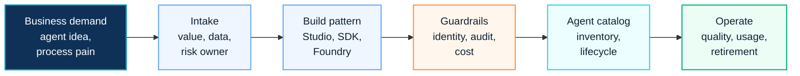

# AI Agent Factory

This page is a search landing page for visitors looking for AI Agent Factory, Copilot Studio Agent, Agentic AI architecture, multi-agent framework and enterprise AI governance.

  <a class="kc-signal-card" href="../copilot/agent-factory-operating-model">
    <small>AGENT FACTORY</small>
    <strong>Operating model</strong>
    Move from individual agents to portfolio, owner, lifecycle, risk and cost governance.
  </a>
  <a class="kc-signal-card" href="../projects/case-study-enterprise-ai-agent-factory">
    <small>REFERENCE</small>
    <strong>Customer pattern</strong>
    Use anonymized AI Agent Factory patterns for architecture and proposal discussions.
  </a>
  <a class="kc-signal-card" href="../contact">
    <small>REQUEST</small>
    <strong>Ask for reusable assets</strong>
    Use Contact and Asset Request when a template, workbook or sanitized reference would help.
  </a>

## 2026 Platform Context

Modern Agent Factory programs should include Copilot Studio new agent experience, Microsoft IQ, skills, memory, computer use, Microsoft Entra agent identities, agent inventory, A2A integration and Copilot Credit forecasting.

The practical goal is not to create many agents. The goal is to create a governed system for identifying, approving, building, monitoring and retiring agents.

For the latest platform baseline, see [Copilot Studio 2026 Platform Update](../copilot/copilot-studio-2026-platform-update).

## 한국어 요약

AI Agent Factory는 부서별로 agent를 무작정 만드는 방식이 아닙니다. agent idea intake, prioritization, design, approval, publishing, monitoring, retirement를 반복 가능한 운영 모델로 만드는 접근입니다.

Copilot Studio, Agent Builder, Microsoft 365 Agents SDK, Microsoft Foundry를 활용하더라도 enterprise 환경에서는 owner, permission boundary, knowledge source, audit, lifecycle, cost control이 먼저 정리되어야 합니다.

## Agent Factory Journey Map

## Factory Operating Model

| Stage | Decision Focus |
|---|---|
| Intake | Which business problem should the agent solve? |
| Prioritize | Is the value high enough and is the data ready? |
| Design | What knowledge, action, permission and human review are required? |
| Build | Which Microsoft agent platform is the right fit? |
| Approve | Who reviews risk, data access, security and business ownership? |
| Operate | How will usage, quality, cost and incidents be monitored? |
| Retire | When should agents be updated, consolidated or removed? |

## What Good Looks Like

| Maturity Level | Observable Signal |
|---|---|
| Idea Collection | business teams submit agent ideas, but risk and value are not yet normalized |
| Governed Intake | every agent candidate has owner, value hypothesis, data source and risk profile |
| Pilot Factory | selected agents are built with reusable patterns, approval gates and evaluation criteria |
| Agent Portfolio | agents are tracked in a catalog with lifecycle, cost, quality and incident signals |
| Operating Model | intake, build, publish, monitor, improve and retire processes run as a repeatable platform capability |

## Platform Fit Guide

| Agent Pattern | Good Fit | Governance Focus |
|---|---|---|
| Copilot Studio agent | business-owned workflow, knowledge-grounded assistant, low-code iteration | connector permissions, publishing approval, usage monitoring |
| Agent Builder / Microsoft 365 agent | productivity scenario inside Microsoft 365 user flow | data boundary, user education, lifecycle ownership |
| Microsoft 365 Agents SDK | custom enterprise app or deeper application integration | identity, API permission, source control and DevSecOps |
| Microsoft Foundry agent | advanced AI workflow, model orchestration or broader Azure AI integration | model governance, cost control, evaluation and monitoring |
| Multi-agent pattern | coordinated tasks across specialist agents | orchestration boundary, human review, failure handling |

## Frequently Asked Questions

### What is an AI Agent Factory?

An AI Agent Factory is an operating model for turning business agent ideas into governed, reusable and measurable agents. It includes intake, prioritization, design, approval, build, publishing, monitoring and retirement.

### Is Agent Factory only about Copilot Studio?

No. Copilot Studio is a strong fit for many business-owned agent scenarios, but an enterprise Agent Factory can also include Microsoft 365 Agents, Microsoft 365 Agents SDK, Microsoft Foundry and multi-agent patterns.

### What should be reviewed before building an agent?

Review business value, data source, permission boundary, action risk, human approval, owner, cost model, lifecycle and evaluation criteria before build starts.

### When should an agent not be built?

Do not build an agent when the process is unclear, data ownership is weak, approval responsibility is missing, or the same result can be achieved with a simpler Copilot prompt or workflow.

### How is agent success measured?

Measure reuse, task completion, quality, user satisfaction, incident count, cost consumption, review effort and whether the agent reduces manual work without increasing risk.

## Recommended Entry Points

- [Agentic AI Architecture](../copilot/agentic-ai-architecture)
- [Copilot Studio](../copilot/copilot-studio)
- [Copilot Studio 2026 Platform Update](../copilot/copilot-studio-2026-platform-update)
- [Multi-Agent Framework](../copilot/multi-agent-framework)
- [Agent Factory Operating Model](../copilot/agent-factory-operating-model)
- [Enterprise AI Agent Factory Case Study](../projects/case-study-enterprise-ai-agent-factory)
- [Contact and Asset Request](../contact)

## Requestable Assets

- AI Agent opportunity assessment
- Agent intake template
- Agent prioritization matrix
- Agent design document
- Agent governance and approval model
- Enterprise Agent catalog
- Agent Factory operating model

## Contact Path

For an editable Agent intake template, prioritization matrix, governance checklist or executive Agent Factory roadmap, use [Contact and Asset Request](../contact). Public pages explain the method; customer-ready artifacts should be shared only after the business scenario and confidentiality boundary are confirmed.

## 검색 키워드

- AI Agent Factory
- Copilot Studio Agent
- AI Agent 도입
- AI Agent 거버넌스
- Agentic AI architecture
- Multi-Agent Framework
- Agent Factory 운영 모델
- Copilot Studio new agent experience
- Microsoft IQ
- Copilot Studio skills
- Copilot Studio memory
- Computer use agents
- Agent inventory
- Microsoft Entra agent identities
- Agent-to-agent A2A
- Copilot Credit forecasting
