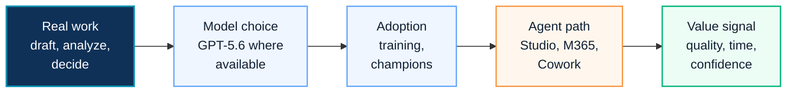

# Copilot Adoption

This page is a search landing page for visitors looking for Microsoft 365 Copilot adoption strategy, readiness assessment, governance, GPT-5.6 model guidance and rollout planning.

## 2026 Adoption Context

Copilot adoption now starts with a wider question: how should an organization use AI from everyday Copilot work to Copilot Studio agents, Microsoft 365 Agents and Copilot Cowork?

GPT-5.6 raises the quality ceiling for reasoning, drafting, analysis and presentation work, but enterprise value still depends on readiness, data protection, user behavior, governance and measurement.

Before scaling, review [Copilot Overview](../copilot/overview), [Copilot Readiness](../copilot/readiness), [Copilot Studio 2026 Platform Update](../copilot/copilot-studio-2026-platform-update) and [Copilot Cowork Cost Governance](../copilot/copilot-cowork-cost-governance).

## 한국어 요약

Copilot 도입은 license를 배정하고 교육을 진행하는 단순 rollout이 아닙니다. 성공적인 도입은 data readiness, security, Purview, DLP, use case prioritization, champion model, ROI measurement, change management를 함께 설계할 때 가능합니다.

특히 2026년 이후에는 "누가 Copilot을 사용할 것인가"보다 "어떤 업무에서 Copilot, GPT-5.6, Copilot Studio Agent, Copilot Cowork를 어떻게 연결해 반복 가능한 가치를 만들 것인가"가 더 중요합니다.

방문자가 이 페이지에서 얻어야 할 핵심은 명확합니다. Copilot은 기능 교육이 아니라 업무 방식의 변화이며, adoption은 readiness, governance, training, measurement가 연결된 운영 모델이어야 합니다.

## AI Adoption Storyline

## Adoption Workstreams

| Workstream | Focus |
|---|---|
| Readiness | data exposure, permissions, security baseline, license scope |
| GPT-5.6 Guidance | model selector guidance, reasoning scenarios, user communication |
| Use Case Design | role-based scenarios, value hypothesis and pilot backlog |
| Governance | owner model, acceptable use, DLP, audit and escalation |
| Pilot | pilot group, communication, feedback, support and measurement |
| Enablement | training, prompt guidance, champions and office hours |
| ROI | baseline measurement, productivity signal, quality and adoption maturity |
| Scale-Out | rollout roadmap, risk control and operating rhythm |

## Adoption Readiness Questions

| Question | Why It Matters |
|---|---|
| Which business roles will create measurable value first? | prevents license assignment without use case value |
| Are SharePoint, OneDrive, Teams and Exchange permissions ready? | reduces oversharing and Copilot answer quality risk |
| Which data protection controls must be in place before rollout? | aligns Copilot with Purview, DLP and security requirements |
| When should GPT-5.6 be selected? | helps users choose deeper reasoning only when the task needs it |
| When should work move to Copilot Studio or Cowork? | separates quick assistance from governed long-running work |
| What metric proves progress to executives? | connects adoption to business value, not only usage count |

## Recommended Entry Points

- [Copilot Overview](../copilot/overview)
- [Copilot Readiness](../copilot/readiness)
- [Copilot Adoption Program](../copilot/adoption-program)
- [Copilot ROI Framework](../copilot/roi-framework)
- [Copilot Studio 2026 Platform Update](../copilot/copilot-studio-2026-platform-update)
- [Copilot Cowork Cost Governance](../copilot/copilot-cowork-cost-governance)
- [Manufacturing Copilot Adoption Case Study](../projects/case-study-manufacturing-copilot-adoption)
- [Contact and Asset Request](../contact)

## Requestable Assets

- Copilot readiness workbook
- GPT-5.6 adoption message and model selector guide
- Copilot adoption WBS
- Copilot governance checklist
- Copilot pilot scorecard
- Copilot use case prioritization matrix
- executive adoption roadmap

## 검색 키워드

- Copilot 도입
- Microsoft 365 Copilot adoption
- GPT-5.6 Microsoft 365 Copilot
- Copilot model selector
- Copilot readiness
- Copilot governance
- Copilot ROI
- Copilot adoption WBS
- Copilot 파일 권한 점검
- Copilot 변화관리
- Copilot Studio Agent
- Copilot Credit forecasting
- Microsoft 365 Copilot ROI
