# Copilot Adoption

This page is a search landing page for visitors looking for Microsoft 365 Copilot adoption strategy, readiness assessment, governance and rollout planning.

## 2026 Adoption Context

Copilot adoption programs now need to connect Microsoft 365 Copilot usage, Copilot Studio agents, license value, Copilot Credit forecasting, Security, Purview and measurable business scenarios.

Before scaling, review [Copilot Studio 2026 Platform Update](../copilot/copilot-studio-2026-platform-update) and [Microsoft Licensing Feature Update](../licensing/july-2026-microsoft-licensing-update).

## 한국어 요약

Copilot 도입은 license를 배정하고 교육을 진행하는 단순 rollout이 아닙니다. 성공적인 도입은 data readiness, security, Purview, DLP, use case prioritization, champion model, ROI measurement, change management를 함께 설계할 때 가능합니다.

특히 기업 환경에서는 “누가 사용할 것인가”보다 “어떤 업무 시나리오에서 반복 가능한 가치를 만들 것인가”가 더 중요합니다.

## Adoption Journey Map

```mermaid
flowchart LR
  Interest["Executive Interest<br/>Copilot value and AI readiness"]:::source
  Readiness["Readiness<br/>data, security, license, user scope"]:::step
  Pilot["Pilot Design<br/>roles, use cases, measurement"]:::step
  Governance["Governance<br/>Purview, DLP, acceptable use"]:::control
  Scale["Scale-Out<br/>champions, training, support rhythm"]:::outcome
  Measure["ROI Signal<br/>usage, quality, time saved, adoption maturity"]:::outcome

  Interest --> Readiness --> Pilot --> Governance --> Scale --> Measure

  classDef source fill:#0f3157,stroke:#0891b2,color:#ffffff,stroke-width:2px
  classDef step fill:#eff6ff,stroke:#60a5fa,color:#102033,stroke-width:1.6px
  classDef control fill:#fff7ed,stroke:#fb923c,color:#102033,stroke-width:1.6px
  classDef outcome fill:#ecfdf5,stroke:#10b981,color:#102033,stroke-width:1.8px
```

## Adoption Workstreams

| Workstream | Focus |
|---|---|
| Readiness | data exposure, permissions, security baseline, license scope |
| Use Case Design | role-based scenarios, value hypothesis and pilot backlog |
| Governance | owner model, acceptable use, DLP, audit and escalation |
| Pilot | pilot group, communication, feedback, support and measurement |
| Enablement | training, prompt guidance, champions and office hours |
| ROI | baseline measurement, productivity signal, quality and adoption maturity |
| Scale-Out | rollout roadmap, risk control and operating rhythm |

## Adoption Readiness Questions

| Question | Why It Matters |
|---|---|
| Which business roles will create measurable value first? | prevents license assignment without use case value |
| Are SharePoint, OneDrive, Teams and Exchange permissions ready? | reduces oversharing and Copilot answer quality risk |
| Which data protection controls must be in place before rollout? | aligns Copilot with Purview, DLP and security requirements |
| How will pilot feedback become a backlog? | turns user feedback into governed expansion decisions |
| What metric proves progress to executives? | connects adoption to business value, not only usage count |

## Recommended Entry Points

- [Copilot Overview](../copilot/overview)
- [Copilot Readiness](../copilot/readiness)
- [Copilot Adoption Program](../copilot/adoption-program)
- [Copilot ROI Framework](../copilot/roi-framework)
- [Copilot Studio 2026 Platform Update](../copilot/copilot-studio-2026-platform-update)
- [Microsoft Licensing Feature Update](../licensing/july-2026-microsoft-licensing-update)
- [Manufacturing Copilot Adoption Case Study](../projects/case-study-manufacturing-copilot-adoption)
- [Contact and Asset Request](../contact)

## Requestable Assets

- Copilot readiness workbook
- Copilot adoption WBS
- Copilot governance checklist
- Copilot pilot scorecard
- Copilot use case prioritization matrix
- executive adoption roadmap

## 검색 키워드

- Copilot 도입
- Microsoft 365 Copilot adoption
- Copilot readiness
- Copilot governance
- Copilot ROI
- Copilot adoption WBS
- Copilot 파일 권한 점검
- Copilot Studio Agent
- Copilot Credit forecasting
- Microsoft 365 Copilot ROI
- Microsoft licensing update
