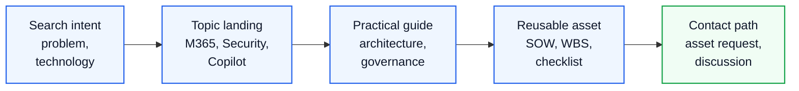

# Microsoft Enterprise Architecture Search Guide

This page helps visitors and search engines understand the main topics covered by the Youngsun Kang Enterprise Microsoft Knowledge Center.

The Knowledge Center focuses on practical enterprise consulting topics across Microsoft 365, Security, Copilot, AI Agents, Azure, Migration, Licensing, Proposal assets and customer success reference patterns.




<div class="kc-signal-grid" aria-label="Architecture Keywords search landing cards">
  <a class="kc-signal-card" href="../architecture/overview">
    <small>ARCHITECTURE</small>
    <strong>Architecture center</strong>
    <span>Start from business driver, reference design, control model and operating model.</span>
  </a>
  <a class="kc-signal-card" href="../microsoft365/overview">
    <small>M365</small>
    <strong>Microsoft 365 platform</strong>
    <span>Connect tenant, security, collaboration and Copilot readiness.</span>
  </a>
  <a class="kc-signal-card" href="../contact">
    <small>REQUEST</small>
    <strong>Ask for reusable assets</strong>
    <span>Use Contact and Asset Request when a template, workbook or sanitized reference would help.</span>
  </a>
</div>

## Search Intent Map

| Visitor Intent | Recommended Entry Point | What to Look For |
|---|---|---|
| Understand enterprise Microsoft capability | [Executive Architecture Blueprint](../architecture/executive-architecture-blueprint) | Overall operating model, governance, delivery structure |
| Explore Microsoft 365 consulting | [Microsoft 365 Consulting](./microsoft-365-consulting) | Exchange, Teams, SharePoint, OneDrive, licensing, governance |
| Learn how to use AI in work | [How to Use AI in Enterprise](./how-to-use-ai-in-enterprise) | Copilot, GPT-5.6, Copilot Studio, M365 Agents, Cowork |
| Plan Copilot adoption | [Copilot Adoption](./copilot-adoption) | Readiness, change management, champions, value measurement |
| Build AI Agent capability | [AI Agent Factory](./ai-agent-factory) | Copilot Studio, agent lifecycle, governance, portfolio model |
| Review security modernization | [Microsoft 365 Security](./microsoft-365-security) | Zero Trust, Defender, Purview, Conditional Access, Intune |
| Plan migration | [Migration Overview](../migration/overview) | Tenant-to-tenant, Google Workspace, file server, cutover planning |
| Prepare proposal assets | [Proposal Center](../proposal/overview) | Executive summary, SOW, WBS, risk register, timeline |
| Request practical templates | [Downloads Center](../downloads/overview) | Assessment workbook, questionnaires, delivery templates |

## Korean Search Terms

Visitors may find this site through Korean search queries such as:

| Area | Natural Korean Queries |
|---|---|
| Microsoft 365 Architecture | Microsoft 365 아키텍처, Microsoft 365 컨설팅, Microsoft 365 보안 설계 |
| Copilot Adoption | Copilot 도입, Copilot readiness, Copilot 거버넌스, Copilot 변화관리 |
| AI Usage | AI 활용 방법, Microsoft 365 AI 활용, 업무 AI 도입, GPT-5.6 Copilot |
| AI Agents | Copilot Studio Agent, AI Agent Factory, AI Agent 거버넌스, Agent Factory 운영 모델 |
| Security | Microsoft 365 보안, Defender XDR 구축, Purview DLP 설계, Conditional Access 설계 |
| Endpoint | Microsoft Intune 디바이스 관리, Intune 보안 정책, macOS USB 제어 |
| Migration | Microsoft 365 마이그레이션, Tenant to Tenant Migration, Google Workspace Microsoft 365 전환 |
| Licensing | Microsoft 365 라이선스 전략, Microsoft 365 E3 E5 비교, Copilot 라이선스 관리 |
| Proposal Assets | Microsoft 365 제안서, SOW 템플릿, WBS 템플릿, 제안서 산출물 |
| Customer Success | Microsoft 365 고객 성공 사례, Copilot 도입 사례, 보안 거버넌스 사례 |

## Topic Landing Pages

| Landing Page | Best For |
|---|---|
| [How to Use AI in Enterprise](./how-to-use-ai-in-enterprise) | AI 활용 방법, Copilot, GPT-5.6, Copilot Studio, Cowork storyline |
| [Microsoft 365 Consulting](./microsoft-365-consulting) | Microsoft 365 architecture and operating model review |
| [Microsoft 365 Security](./microsoft-365-security) | Security, Defender, Purview, Entra ID, Intune, Zero Trust |
| [Copilot Adoption](./copilot-adoption) | Adoption, readiness, change management and value tracking |
| [AI Agent Factory](./ai-agent-factory) | Copilot Studio, agent governance and AI operating model |
| [Customer Success Reference Patterns](../projects/customer-success-reference-patterns) | Anonymized industry patterns and repeatable delivery models |
| [Contact and Asset Request](../contact) | Requesting actual workbook, proposal or delivery asset samples |

## English Search Terms

- Youngsun Kang Microsoft Architect
- Microsoft 365 Enterprise Architecture
- Microsoft Security Architecture
- Microsoft Copilot Readiness
- GPT-5.6 Microsoft 365 Copilot
- Microsoft Copilot Governance
- Microsoft Purview Data Protection
- Microsoft Defender XDR
- Microsoft Entra ID Conditional Access
- Microsoft Intune Compliance
- Azure Landing Zone Architecture
- AI Agent Architecture
- Copilot Studio Agent Factory
- Copilot Studio Agent Governance
- Enterprise AI Adoption Program
- Microsoft 365 License Optimization
- Microsoft 365 E3 E5 Decision Guide
- Microsoft 365 Migration Strategy
- Google Workspace to Microsoft 365 Migration
- SOW Template for Microsoft 365
- WBS Template for Cloud Migration
- Enterprise Architecture Reference
- Customer Success Reference Patterns

## Search Engine Notes

This site provides a public sitemap and allows search crawlers through `robots.txt`.

Search visibility still depends on external indexing by Google and Naver. For faster discovery, the site should be registered in Google Search Console and Naver Search Advisor, and the sitemap URL should be submitted:

```text
https://eric841001.github.io/sitemap.xml
```

## 검색 키워드

- enterprise Microsoft architecture
- Microsoft 365 architecture
- security architecture
- 엔터프라이즈 아키텍처
