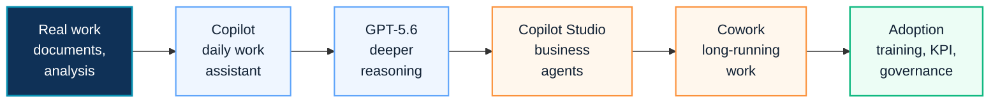

# How to Use AI in Enterprise

This page is a search landing page for visitors asking a practical question: how should an enterprise use AI at work?

The answer should not start with tools alone. It should start with real work, then move through Copilot, GPT-5.6, Copilot Studio, Microsoft 365 Agents, Copilot Cowork and change management.

## 한국어 요약

기업에서 AI를 활용한다는 것은 단순히 Chat이나 Copilot 기능을 켜는 일이 아닙니다. 실제 업무에서 문서 작성, 분석, 회의 요약, 의사결정, 후속 조치, 장기 실행 업무를 어떻게 바꿀 것인지 설계해야 합니다.

가장 자연스러운 흐름은 다음과 같습니다.

1. Copilot으로 개인 업무 생산성을 높입니다.
2. GPT-5.6을 활용해 더 깊은 reasoning이 필요한 문서, 분석, 발표, 의사결정 업무를 고도화합니다.
3. 반복되는 업무는 Copilot Studio Agent로 전환합니다.
4. Microsoft 365 업무 맥락 안에서는 M365 Agents를 활용합니다.
5. 장기 실행 업무는 Copilot Cowork로 확장하되 approval, cost, owner, governance를 함께 설계합니다.

## Enterprise AI Usage Journey

## Where To Start

| Starting Question | Recommended Path |
|---|---|
| We want to use AI but do not know where to start | start with role-based Copilot scenarios and readiness assessment |
| Users already use Copilot but value is unclear | define use cases, baseline metrics, champion network and ROI model |
| We need deeper reasoning for documents and analysis | add GPT-5.6 model selector guidance and scenario examples |
| We repeat the same request handling process | evaluate Copilot Studio Agent or M365 Agent pattern |
| Work runs across multiple tools and needs approval | evaluate Copilot Cowork with cost and approval governance |
| Security is concerned about data exposure | review permissions, Purview, DLP, audit and acceptable use |

## What Good Looks Like

| Maturity Level | Observable Signal |
|---|---|
| Feature Trial | users test Copilot but business scenarios are not yet defined |
| Guided Adoption | role-based scenarios, champion training and prompt patterns are available |
| Governed Agent Use | Copilot Studio agents have owners, approvals, knowledge boundaries and monitoring |
| Scaled AI Work | Copilot, GPT-5.6, M365 Agents and Copilot Cowork are connected to measurable business outcomes |
| Continuous Improvement | VOC, analytics, cost, security signals and scenario backlog are reviewed regularly |

## AI Adoption Operating Model

| Layer | Practical Decision |
|---|---|
| Business Scenario | Which real work should change first? |
| Data Boundary | Which SharePoint, Teams, OneDrive and Exchange content can AI reason over? |
| Model Guidance | When should users select GPT-5.6 or use standard Copilot interaction? |
| Agent Pattern | Is this personal assistance, business agent, M365 Agent or Cowork? |
| Governance | Who owns policy, approval, cost, risk and lifecycle? |
| Change Management | How will users learn, trust, measure and improve the new way of working? |

## Frequently Asked Questions

### What is the best first step for enterprise AI adoption?

Start with real business scenarios, not with the tool list. Identify where users spend time on drafting, summarizing, analysis, meetings, reporting or follow-up work, then map those scenarios to Copilot, GPT-5.6, Copilot Studio or Cowork.

### When should GPT-5.6 be used?

Use GPT-5.6 where deeper reasoning is useful: document critique, spreadsheet analysis, presentation refinement, decision support, comparison, planning and synthesis. Keep simple tasks in standard Copilot interaction when deeper reasoning is not needed.

### When does a Copilot scenario become an agent scenario?

If the same request is repeated, requires structured inputs, touches business systems, needs approval or creates an output that must be tracked, evaluate Copilot Studio Agent or M365 Agent patterns.

### When should Copilot Cowork be considered?

Consider Copilot Cowork when the work is long-running, multi-step, approval-driven or spans several Microsoft 365 tools. Cowork should be introduced with budget, owner, approval and monitoring rules.

### How should change management be handled?

Treat AI adoption as behavior change. Training should show real work before and after, champion communities should capture feedback, and KPI should measure quality, time saved, confidence and rework reduction.

## Recommended Entry Points

- [Copilot Overview](../copilot/overview)
- [Copilot Adoption](./copilot-adoption)
- [Copilot Readiness](../copilot/readiness)
- [Copilot Studio 2026 Platform Update](../copilot/copilot-studio-2026-platform-update)
- [AI Agent Factory](./ai-agent-factory)
- [Copilot Cowork Cost Governance](../copilot/copilot-cowork-cost-governance)
- [Enterprise AI Adoption Program](../projects/enterprise-ai-adoption-program)
- [Contact and Asset Request](../contact)

## Requestable Assets

- enterprise AI adoption roadmap
- GPT-5.6 model selector guide
- Copilot role-based scenario library
- AI Agent opportunity assessment
- Copilot Studio Agent intake template
- Copilot Cowork governance checklist
- executive AI adoption briefing

## Contact Path

If you need a customer-ready workbook, workshop outline or executive briefing, use [Contact and Asset Request](../contact). Share only the industry, workload, project phase and desired output type. Do not send confidential customer names, tenant IDs or internal architecture details through the public site.

## 검색 키워드

- AI 활용 방법
- 기업 AI 도입
- Microsoft 365 AI 활용
- GPT-5.6 Copilot
- Copilot Studio Agent
- Microsoft 365 Agents
- Copilot Cowork
- Copilot 변화관리
- Enterprise AI adoption
- AI Agent governance
