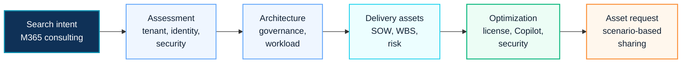

# Microsoft 365 Consulting

This page is a search landing page for visitors looking for Microsoft 365 consulting, architecture, governance, security, migration and delivery assets.

  <a class="kc-signal-card" href="../microsoft365/overview">
    <small>M365</small>
    <strong>Platform overview</strong>
    Review tenant, collaboration, security, migration and operations decisions.
  </a>
  <a class="kc-signal-card" href="../proposal/overview">
    <small>DELIVERY</small>
    <strong>Proposal center</strong>
    Convert consulting strategy into SOW, WBS, risk and governance assets.
  </a>
  <a class="kc-signal-card" href="../contact">
    <small>REQUEST</small>
    <strong>Ask for reusable assets</strong>
    Use Contact and Asset Request when a template, workbook or sanitized reference would help.
  </a>

## 2026 Renewal Context

Microsoft 365 consulting should include a renewal review that connects license scope, security baseline, Copilot adoption, Copilot Studio agents, storage usage, endpoint management and measurable business value.

For the current planning model, see [Microsoft Licensing Feature Update](../licensing/july-2026-microsoft-licensing-update).

## 한국어 요약

Microsoft 365 컨설팅은 단순히 Exchange Online, Teams, SharePoint, OneDrive를 구축하는 일이 아닙니다. 실제 enterprise 환경에서는 Entra ID, Intune, Defender, Purview, Conditional Access, collaboration governance, migration, 운영 인수인계까지 함께 설계해야 안정적인 결과가 나옵니다.

이 Knowledge Center는 Microsoft 365 architecture, security baseline, tenant governance, SOW, WBS, assessment workbook, migration planning을 연결해 실무형 컨설팅 산출물로 정리합니다.

## Consulting Journey Map

## Consulting Scope

| Area | What To Review |
|---|---|
| Tenant Architecture | tenant structure, domain, admin role, workload ownership and lifecycle |
| Identity | Entra ID, MFA, Conditional Access, privileged access and guest access |
| Collaboration | Teams, SharePoint, OneDrive, external sharing and workspace lifecycle |
| Security | Defender, Purview, DLP, audit, retention and Zero Trust control alignment |
| Endpoint | Intune enrollment, compliance policy, app protection and device governance |
| Copilot | readiness, GPT-5.6 guidance, adoption, agent governance and ROI |
| Migration | Exchange, Google Workspace, file server, SharePoint and tenant transition |
| Delivery Assets | assessment report, SOW, WBS, risk register and handover guide |

## What Good Looks Like

| Maturity Level | Observable Signal |
|---|---|
| Issue-Based Support | work is handled as isolated requests without a target architecture |
| Structured Assessment | tenant, identity, collaboration, security and operations are assessed together |
| Architecture-Led Delivery | design decisions are documented before implementation and migration |
| Governed Operation | ownership, exception process, security review and handover are part of delivery |
| Business Value Review | license value, Copilot readiness, risk reduction and user productivity are measured together |

## Visitor Routing

| If You Are Looking For | Start Here | Next Step |
|---|---|---|
| Microsoft 365 architecture design | [Microsoft 365 Reference Architecture](../architecture/m365-reference-architecture) | request architecture review or tenant assessment |
| Security and governance baseline | [Microsoft 365 Security](./microsoft-365-security) | review Defender, Purview, Conditional Access and Intune scope |
| License and renewal value | [Microsoft Licensing Feature Update](../licensing/july-2026-microsoft-licensing-update) | map license capability to security and Copilot readiness |
| Copilot or AI adoption | [How to Use AI in Enterprise](./how-to-use-ai-in-enterprise) | connect Copilot, GPT-5.6, Copilot Studio and Cowork |
| Migration or tenant transition | [Migration Architecture](../architecture/migration-architecture) | prepare inventory, wave plan and rollback governance |
| Proposal or delivery package | [Proposal Center](../proposal/overview) | request SOW, WBS, risk register or assessment workbook |

## Frequently Asked Questions

### What does Microsoft 365 consulting include?

It includes tenant architecture, identity, collaboration, security, endpoint management, migration, Copilot readiness, operating model and delivery asset design.

### Why is Microsoft 365 consulting not only technical implementation?

Enterprise projects require decisions about ownership, governance, security, user impact, change management, support handover and measurable business value.

### What should be reviewed before a Microsoft 365 renewal?

Review license entitlement, enabled service plans, security baseline, Purview/Defender/Intune usage, Copilot readiness, storage growth, adoption and support cost.

### Which documents are typically useful?

Common assets include assessment workbook, executive summary, SOW, WBS, risk register, architecture note, migration plan, security checklist and handover guide.

### How should customer references be handled?

Use industry and scenario-level patterns only. Do not expose customer names, tenant IDs, internal filenames, commercial terms or customer-specific architecture details.

## Recommended Entry Points

- [Microsoft 365 Overview](../microsoft365/overview)
- [Microsoft 365 Reference Architecture](../architecture/m365-reference-architecture)
- [Microsoft 365 Security](./microsoft-365-security)
- [Microsoft 365 Optimization Program](../projects/m365-optimization-program)
- [M365 Assessment Workbook](../downloads/m365-assessment-workbook)
- [Microsoft Licensing Feature Update](../licensing/july-2026-microsoft-licensing-update)
- [Contact and Asset Request](../contact)

## Requestable Assets

- Microsoft 365 assessment workbook
- tenant governance decision workbook
- Teams and SharePoint operating guide
- Exchange Online security review template
- Entra ID and Intune policy matrix
- Microsoft 365 SOW / WBS sample

## Contact Path

For a customer-ready Microsoft 365 assessment workbook, SOW/WBS sample, security review template or architecture workshop outline, use [Contact and Asset Request](../contact). Public pages describe the method; editable delivery assets should be shared after scope and confidentiality are confirmed.

## 검색 키워드

- Microsoft 365 컨설팅
- Microsoft 365 아키텍처
- Microsoft 365 보안 설계
- Microsoft 365 migration
- Microsoft 365 SOW
- Microsoft 365 WBS
- Microsoft 365 운영 개선
- Microsoft 365 licensing update
- Microsoft 365 renewal assessment
- Copilot license value
- Microsoft 365 cost optimization
