# Microsoft 365 Consulting

This page is a search landing page for visitors looking for Microsoft 365 consulting, architecture, governance, security, migration and delivery assets.

## 2026 Renewal Context

Microsoft 365 consulting should include a renewal review that connects license scope, security baseline, Copilot adoption, Copilot Studio agents, storage usage, endpoint management and measurable business value.

For the current planning model, see [Microsoft Licensing Feature Update](../licensing/july-2026-microsoft-licensing-update).

## 한국어 요약

Microsoft 365 컨설팅은 단순히 Exchange Online, Teams, SharePoint, OneDrive를 구축하는 일이 아닙니다. 실제 기업 환경에서는 Entra ID, Intune, Defender, Purview, Conditional Access, collaboration governance, migration, 운영 인수인계까지 함께 설계해야 안정적인 결과가 나옵니다.

이 Knowledge Center는 Microsoft 365 architecture, security baseline, tenant governance, SOW, WBS, assessment workbook, migration planning을 연결해 실무형 컨설팅 산출물로 정리합니다.

## Consulting Journey Map

```mermaid
flowchart LR
  Search["Search Intent<br/>Microsoft 365 consulting"]:::source
  Assess["Assessment<br/>tenant, identity, security, collaboration"]:::step
  Design["Architecture<br/>governance, workload, operating model"]:::step
  Deliver["Delivery Assets<br/>SOW, WBS, risk register, handover"]:::asset
  Optimize["Optimization<br/>license value, Copilot readiness, security posture"]:::outcome
  Contact["Asset Request<br/>scenario-based template sharing"]:::cta

  Search --> Assess --> Design --> Deliver --> Optimize --> Contact

  classDef source fill:#0f3157,stroke:#0891b2,color:#ffffff,stroke-width:2px
  classDef step fill:#eff6ff,stroke:#60a5fa,color:#102033,stroke-width:1.6px
  classDef asset fill:#ecfeff,stroke:#22d3ee,color:#102033,stroke-width:1.6px
  classDef outcome fill:#ecfdf5,stroke:#10b981,color:#102033,stroke-width:1.8px
  classDef cta fill:#fff7ed,stroke:#fb923c,color:#102033,stroke-width:1.8px
```

## Consulting Scope

| Area | What To Review |
|---|---|
| Tenant Architecture | tenant structure, domain, admin role, workload ownership and lifecycle |
| Identity | Entra ID, MFA, Conditional Access, privileged access and guest access |
| Collaboration | Teams, SharePoint, OneDrive, external sharing and workspace lifecycle |
| Security | Defender, Purview, DLP, audit, retention and Zero Trust control alignment |
| Endpoint | Intune enrollment, compliance policy, app protection and device governance |
| Migration | Exchange, Google Workspace, file server, SharePoint and tenant transition |
| Delivery Assets | assessment report, SOW, WBS, risk register and handover guide |

## Visitor Routing

| If You Are Looking For | Start Here | Next Step |
|---|---|---|
| Microsoft 365 architecture design | [Microsoft 365 Reference Architecture](../architecture/m365-reference-architecture) | request architecture review or tenant assessment |
| Security and governance baseline | [Security Reference Architecture](../architecture/security-reference-architecture) | review Defender, Purview, Conditional Access and Intune scope |
| License and renewal value | [Microsoft Licensing Feature Update](../licensing/july-2026-microsoft-licensing-update) | map license capability to security and Copilot readiness |
| Migration or tenant transition | [Migration Architecture](../architecture/migration-architecture) | prepare inventory, wave plan and rollback governance |
| Proposal or delivery package | [Proposal Center](../proposal/overview) | request SOW, WBS, risk register or assessment workbook |

## Recommended Entry Points

- [Microsoft 365 Overview](../microsoft365/overview)
- [Microsoft 365 Reference Architecture](../architecture/m365-reference-architecture)
- [Microsoft 365 Optimization Program](../projects/m365-optimization-program)
- [M365 Assessment Playbook](../playbooks/m365-assessment-playbook)
- [M365 Assessment Workbook](../downloads/m365-assessment-workbook)
- [Microsoft Licensing Feature Update](../licensing/july-2026-microsoft-licensing-update)
- [Contact and Asset Request](../contact)

## Requestable Assets

- Microsoft 365 assessment workbook
- tenant governance decision workbook
- Teams and SharePoint operating guide
- Exchange Online security review template
- Entra ID and Intune policy matrix
- Microsoft 365 SOW / WBS sample

## 검색 키워드

- Microsoft 365 컨설팅
- Microsoft 365 아키텍처
- Microsoft 365 보안 설계
- Microsoft 365 migration
- Microsoft 365 SOW
- Microsoft 365 WBS
- Microsoft 365 운영 개선
- Microsoft 365 licensing update
- Microsoft 365 renewal assessment
- Copilot license value
- Microsoft 365 cost optimization
