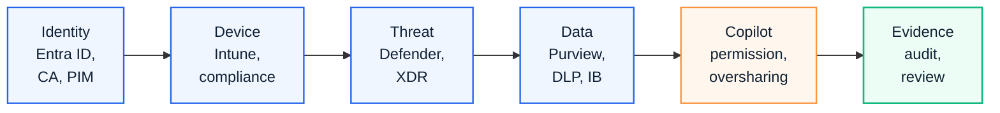

# Microsoft 365 Security

This page is a search landing page for visitors looking for Microsoft 365 security architecture, Zero Trust, Defender, Purview, Conditional Access, Intune and Copilot data protection.

  <a class="kc-signal-card" href="../security/overview">
    <small>SECURITY</small>
    <strong>Security overview</strong>
    Connect Zero Trust, Conditional Access, Defender, Purview and endpoint controls.
  </a>
  <a class="kc-signal-card" href="../projects/case-study-retail-m365-security-policy">
    <small>REFERENCE</small>
    <strong>Retail security policy</strong>
    Review an anonymized Microsoft 365 security policy modernization pattern.
  </a>
  <a class="kc-signal-card" href="../contact">
    <small>REQUEST</small>
    <strong>Ask for reusable assets</strong>
    Use Contact and Asset Request when a template, workbook or sanitized reference would help.
  </a>

## 한국어 요약

Microsoft 365 보안은 개별 기능을 켜는 작업이 아닙니다. Entra ID, Conditional Access, Intune, Defender, Purview, DLP, Information Barriers, audit, incident response를 하나의 control architecture로 연결해야 합니다.

Copilot과 GPT-5.6이 업무에 더 깊게 들어올수록 security architecture는 더 중요해집니다. AI가 더 좋은 답변을 하기 위해서는 데이터에 접근해야 하고, 그 데이터 접근은 permission, label, DLP, audit, retention, sharing policy와 연결됩니다.

## Security Control Map

## Security Domains

| Domain | What To Review |
|---|---|
| Identity | Entra ID, MFA, Conditional Access, PIM, guest access |
| Device | Intune enrollment, compliance, app protection, device risk |
| Threat Protection | Defender for Endpoint, Defender for Office 365, Defender XDR |
| Data Protection | Purview sensitivity labels, DLP, retention, audit, eDiscovery |
| Collaboration Boundary | Teams, SharePoint, OneDrive sharing and Information Barriers |
| Copilot Protection | permission cleanup, oversharing review, data classification, user guidance |
| Operations | incident workflow, exception process, evidence package and review cadence |

## Security Modernization Path

| Phase | Outcome |
|---|---|
| Baseline | confirm identity, device, threat and data protection controls |
| Prioritize | select high-risk workloads, sensitive repositories and user groups |
| Design | align Conditional Access, Intune, Defender, Purview, DLP and sharing policy |
| Validate | test allowed and blocked paths, alert visibility and audit evidence |
| Operate | define exception process, review cadence, incident workflow and executive reporting |
| Extend to AI | apply permission cleanup, label strategy and Copilot data protection guidance |

## Security Questions For AI Era

| Question | Why It Matters |
|---|---|
| Can Copilot access more content than the user expects? | overshared data can become visible through AI-assisted answers |
| Are sensitive repositories labeled and governed? | Purview labels and DLP reduce accidental exposure |
| Are unmanaged devices restricted? | AI-assisted work can increase the value of stolen sessions or unmanaged access |
| Is external sharing reviewed? | Teams, SharePoint and OneDrive sharing affect data exposure |
| Are Information Barriers required? | regulated or conflict-of-interest scenarios need segment-based restrictions |
| Is audit evidence ready? | security architecture must be provable, not only configured |

## Frequently Asked Questions

### Why does Copilot make Microsoft 365 security more important?

Copilot answers from content a user can already access. If SharePoint, Teams or OneDrive permissions are too broad, Copilot can make overshared information easier to discover. Security readiness should therefore include permission cleanup, Purview labels, DLP and audit review.

### What should be reviewed before Copilot rollout?

Review Entra ID, Conditional Access, Intune compliance, Defender coverage, Purview labels, DLP, external sharing, guest access, ownerless sites and sensitive repositories.

### Is Information Barriers only for Teams chat?

No. Information Barriers should be treated as a segmentation model that can affect collaboration boundaries across users, groups, Teams, SharePoint and OneDrive depending on workload behavior and configuration.

### What evidence should security teams prepare?

Prepare policy screenshots or exports, allowed and blocked test results, audit logs, exception approvals, rollback notes and ownership records. Security architecture must be reviewable by executives, auditors and operations teams.

### How should AI security be communicated to business users?

Use simple guidance: use approved work accounts, store sensitive content in governed locations, avoid oversharing, follow label and DLP policy, and escalate unusual Copilot answers or exposed content.

## Recommended Entry Points

- [Security Overview](../security/overview)
- [Security Reference Architecture](../architecture/security-reference-architecture)
- [Zero Trust Framework](../security/zero-trust-framework)
- [Defender XDR](../security/defender-xdr)
- [Microsoft Purview](../security/purview)
- [Purview Information Barriers](../security/information-barriers)
- [DLP](../security/dlp)
- [Global Secure Access Whitelist Design](../knowledge-center/gsa-whitelist-design)
- [Financial SaaS Security Case Study](../projects/case-study-financial-saas-security)
- [Retail M365 Security Policy Case Study](../projects/case-study-retail-m365-security-policy)

## Requestable Assets

- Microsoft 365 security assessment checklist
- Conditional Access policy review matrix
- Defender and Purview readiness checklist
- Copilot data protection review checklist
- Information Barriers validation plan
- executive security modernization roadmap

## Contact Path

For a customer-ready security assessment workbook, Conditional Access review matrix or Copilot data protection checklist, use [Contact and Asset Request](../contact). Public pages provide the method; editable documents and customer-specific examples should be shared only after the confidentiality boundary is confirmed.

## 검색 키워드

- Microsoft 365 보안
- Microsoft 365 보안 설계
- Zero Trust 아키텍처
- Conditional Access 설계
- Defender XDR 구축
- Microsoft Purview DLP
- Information Barriers
- Copilot 데이터 보호
- SharePoint 권한 점검
- Intune 보안 정책
