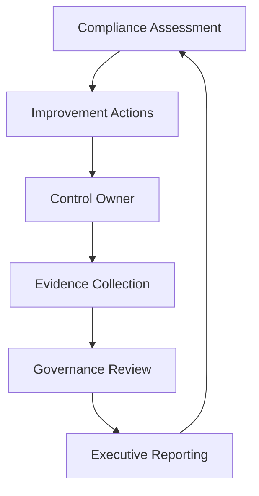

# Compliance Manager

## Executive Summary

Microsoft Purview Compliance Manager helps organizations assess compliance posture, track improvement actions and maintain evidence for security, privacy and regulatory programs.

For enterprise architecture, Compliance Manager should be positioned as an operating tool for risk visibility and evidence management, not only as a score dashboard.

## 한국어 요약

Compliance Manager는 Microsoft cloud 환경의 compliance posture를 점검하고 improvement action, evidence, ownership을 관리하기 위한 도구입니다.

실무에서는 점수 자체보다 어떤 control을 누가 개선하고, 어떤 evidence를 남기며, 어떤 risk를 임원 또는 governance board에 보고할지가 더 중요합니다.

## Business Scenario

- Microsoft 365 compliance assessment
- Security and privacy audit readiness
- Compliance evidence collection
- Risk-based improvement action tracking
- Executive compliance reporting
- Copilot and data protection readiness review

## Compliance Operating Model

## Core Design Areas

| Area | Design Focus | Output |
|---|---|---|
| Assessment scope | Regulations, standards and Microsoft cloud services | Assessment scope matrix |
| Control ownership | Security, compliance, IT and business owners | RACI model |
| Improvement actions | Prioritized remediation activities | Improvement roadmap |
| Evidence | Policy, screenshot, configuration, report and approval records | Evidence library |
| Reporting | Score trend, risk, overdue actions and exceptions | Executive report |

## Decision Checklist

| Decision | Recommended Question |
|---|---|
| Scope | Which regulations, standards or internal policies are in scope? |
| Ownership | Who owns each improvement action and evidence item? |
| Priority | Which controls reduce the highest business risk first? |
| Evidence | What proof is required for audit or executive review? |
| Cadence | How often are scores, risks and overdue actions reviewed? |
| Exception | How are accepted risks documented and revalidated? |

## Anti-Patterns

- Treating the compliance score as the only success metric
- Assigning improvement actions without accountable owners
- Collecting screenshots without linking them to control evidence
- Running assessment once and never reviewing drift
- Ignoring business risk when prioritizing technical actions

## Delivery Artifacts

- Compliance assessment scope matrix
- Improvement action tracker
- Evidence collection guide
- Control owner RACI
- Risk acceptance and exception register
- Executive compliance dashboard

## Customer Success Pattern

| Industry | Scenario | Pattern |
|---|---|---|
| Financial Services | Audit readiness | Evidence library and owner-based improvement action tracking |
| Manufacturing | Global compliance posture | Regional control mapping and monthly governance review |
| SaaS | Security questionnaire response | Reusable compliance evidence pack for customer due diligence |

## 검색 키워드

- Microsoft Purview Compliance Manager
- Compliance Manager assessment
- Microsoft 365 compliance posture
- audit evidence management
- compliance improvement actions
- Microsoft 365 컴플라이언스
- 보안 감사 증적 관리

## Related Documents

- [Purview](./purview)
- [Data Lifecycle Management](./data-lifecycle)
- [Insider Risk Management](./insider-risk)
- [Security Reference Architecture](../architecture/security-reference-architecture)
