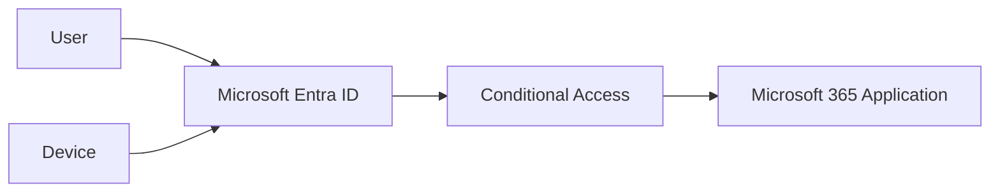

---
id: conditional-access
title: Conditional Access
sidebar_label: Conditional Access
---

# Conditional Access

## Executive Summary

Microsoft Entra Conditional Access is the policy enforcement engine of Microsoft's Zero Trust architecture.

Conditional Access evaluates user identity, device posture, location, application, risk signals, and session context before granting access to corporate resources.

This document provides an enterprise design methodology used in Microsoft 365, Azure, Security, and Copilot deployments.

---

# Why Conditional Access Matters

Traditional security models assume trust after successful authentication.

Modern attacks target:

- Credential Theft
- Session Hijacking
- Phishing
- Token Replay
- Legacy Authentication Abuse
- Unmanaged Device Access

Conditional Access enables organizations to continuously validate trust before granting access.

---

# Zero Trust Architecture

---

# Core Evaluation Signals

## Identity

Examples:

- User
- Group Membership
- Role Membership

---

## Device

Examples:

- Entra Joined
- Hybrid Joined
- Intune Compliant

---

## Location

Examples:

- Korea
- Germany
- Trusted Network
- Unknown Country

---

## Application

Examples:

- Exchange Online
- SharePoint Online
- Teams
- Microsoft 365 Copilot

---

## Risk

Examples:

- User Risk
- Sign-In Risk
- Defender Device Risk

---

# Enterprise Conditional Access Framework

## Layer 1

Identity Protection

Purpose:

Protect against compromised credentials.

Controls:

- MFA
- Risk Policies
- Passwordless Authentication

---

## Layer 2

Device Protection

Purpose:

Allow access only from trusted devices.

Controls:

- Require Compliant Device
- Device Risk Evaluation
- Defender Integration

---

## Layer 3

Data Protection

Purpose:

Protect corporate data.

Controls:

- App Enforced Restrictions
- Session Control
- Download Restrictions

---

# Recommended Enterprise Policies

## Policy 1

### Require MFA for All Users

Scope:

All Users

Exclude:

- Break Glass Accounts

Control:

Require MFA

Priority:

Highest

---

## Policy 2

### Block Legacy Authentication

Scope:

All Users

Protocols:

- POP3
- IMAP
- SMTP AUTH
- Basic Authentication

Control:

Block Access

Priority:

Critical

---

## Policy 3

### Require Compliant Device

Applications:

- Exchange Online
- SharePoint Online
- Teams
- OneDrive

Control:

Require Compliant Device

Priority:

High

---

## Policy 4

### Administrative Account Protection

Scope:

- Global Administrator
- Security Administrator
- Exchange Administrator
- SharePoint Administrator

Controls:

- MFA
- Compliant Device
- PIM

Priority:

Critical

---

## Policy 5

### High Risk User Protection

Condition:

User Risk = High

Controls:

- Block Access

or

- Password Change Required

Priority:

Critical

---

## Policy 6

### High Risk Sign-In Protection

Condition:

Sign-In Risk = High

Controls:

- Block Access

Priority:

Critical

---

# Break Glass Account Design

## Purpose

Provide emergency access when Conditional Access or MFA becomes unavailable.

---

## Recommended Configuration

Accounts:

Minimum 2

Requirements:

- Cloud Only
- Excluded from CA
- Excluded from MFA
- Long Complex Password

Monitoring:

Mandatory

---

## Security Controls

- No Mailbox
- No Daily Usage
- Alert on Sign-In
- Quarterly Validation

---

# Device Compliance Design

## Compliant Device Requirements

### Windows

- BitLocker Enabled
- Defender Active
- Latest Updates Installed

### macOS

- Defender Active
- Encryption Enabled

### Mobile

- Passcode Enabled
- Not Rooted
- Not Jailbroken

---

# SharePoint and OneDrive Protection

## Managed Device

Allow:

- Download
- Sync
- Print

---

## Unmanaged Device

Allow:

- Browser View

Block:

- Download
- Sync
- Print

---

# Copilot Security Integration

Copilot inherits user permissions.

Conditional Access should protect:

- SharePoint Online
- OneDrive
- Teams
- Exchange Online

before Copilot deployment.

---

## Recommended Copilot Controls

Required:

- MFA
- Compliant Device

Recommended:

- Sensitivity Labels
- DLP
- Defender Device Risk

---

# Global Secure Access Integration

## Use Cases

- Tenant Restriction
- Microsoft Traffic Control
- Corporate Access Enforcement

---

## Recommended Design

Allow:

- Corporate Tenant

Block:

- Personal Microsoft Accounts
- Unauthorized Tenants

---

# Deployment Methodology

## Phase 1

Assessment

Activities:

- Identity Review
- Device Review
- Application Review

---

## Phase 2

Pilot

Activities:

- IT Team
- Security Team
- Executive Validation

---

## Phase 3

Production Rollout

Activities:

- User Communication
- Monitoring
- Incident Support

---

# Common Mistakes

## No Break Glass Account

Risk:

Tenant Lockout

---

## No Pilot Group

Risk:

Business Disruption

---

## Legacy Authentication Not Blocked

Risk:

Credential Attack

---

## Broad Exclusions

Risk:

Security Gaps

---

## Missing Device Compliance

Risk:

Unmanaged Access

---

# Operational KPIs

| KPI | Target |
|-------|---------|
| MFA Adoption | 100% |
| Legacy Authentication | 0% |
| Compliant Devices | >95% |
| High Risk Sign-Ins | Monitor |
| Break Glass Validation | Quarterly |

---

# Deliverables

- Conditional Access Assessment
- Policy Design Matrix
- Break Glass Design
- Deployment Plan
- Validation Report
- Operational Runbook

---

# Related Documents

- Zero Trust Framework
- Security Architecture
- Microsoft Defender
- Microsoft Intune
- Copilot Readiness
- Global Secure Access