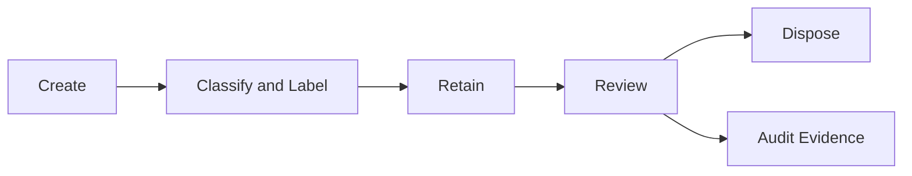

# Data Lifecycle Management

## Executive Summary

Data Lifecycle Management defines how enterprise information is created, retained, protected, reviewed and disposed across Microsoft 365.

For Microsoft 365 and Copilot readiness, lifecycle management reduces data sprawl, improves search quality and helps ensure sensitive or obsolete content is handled according to business and compliance requirements.

## 한국어 요약

Data Lifecycle Management는 Microsoft 365에 저장된 데이터가 생성되고, 보관되고, 폐기되는 전체 흐름을 관리하는 체계입니다.

Retention, deletion, records management, ownership, audit evidence를 설계하면 SharePoint, OneDrive, Teams, Exchange 데이터가 무분별하게 쌓이는 문제를 줄이고 Copilot이 참조하는 정보 품질도 개선할 수 있습니다.

## Business Scenario

- Microsoft 365 retention policy design
- SharePoint and OneDrive data cleanup
- Records management and audit readiness
- Copilot data quality improvement
- Legal hold and investigation support
- Data ownership and lifecycle governance

## Lifecycle Architecture

## Core Design Areas

| Area | Design Focus | Output |
|---|---|---|
| Data ownership | Business owner and system owner | Ownership matrix |
| Retention | Retention labels and policies | Retention schedule |
| Disposition | Review, approval and deletion workflow | Disposition process |
| Records | Regulatory and business records | Records management model |
| Audit | Evidence for policy and disposal decisions | Audit evidence pack |

## Decision Checklist

| Decision | Recommended Question |
|---|---|
| Data categories | Which content types require retention or records control? |
| Retention duration | How long must each data category be retained? |
| Disposition review | Who approves deletion or record disposition? |
| Ownership | Which business owner is accountable for each content area? |
| Legal hold | How are investigations and holds handled? |
| Copilot readiness | Which obsolete or overshared content must be cleaned up first? |

## Anti-Patterns

- Keeping all content forever because deletion feels risky
- Applying retention policies without business owner validation
- Ignoring Teams and OneDrive content in lifecycle planning
- Deleting content without evidence or approval workflow
- Treating lifecycle management separately from Copilot readiness

## Delivery Artifacts

- Data lifecycle policy
- Retention schedule
- Records management design
- Disposition review process
- Data owner matrix
- Copilot data cleanup plan
- Audit evidence package

## Customer Success Pattern

| Industry | Scenario | Pattern |
|---|---|---|
| Manufacturing | Engineering document lifecycle | Retention schedule and owner-based disposition review |
| Finance | Audit evidence readiness | Records management and legal hold operating model |
| Retail | Collaboration data cleanup | Teams and SharePoint lifecycle governance before Copilot rollout |

## 검색 키워드

- Microsoft Purview data lifecycle management
- Microsoft 365 retention policy
- records management
- data disposition
- Copilot data cleanup
- Microsoft 365 데이터 수명주기
- Purview 보존 정책

## Related Documents

- [Purview](./purview)
- [Purview Information Protection](./purview-information-protection)
- [Compliance Manager](./compliance-manager)
- [Copilot Architecture](../architecture/copilot-architecture)
